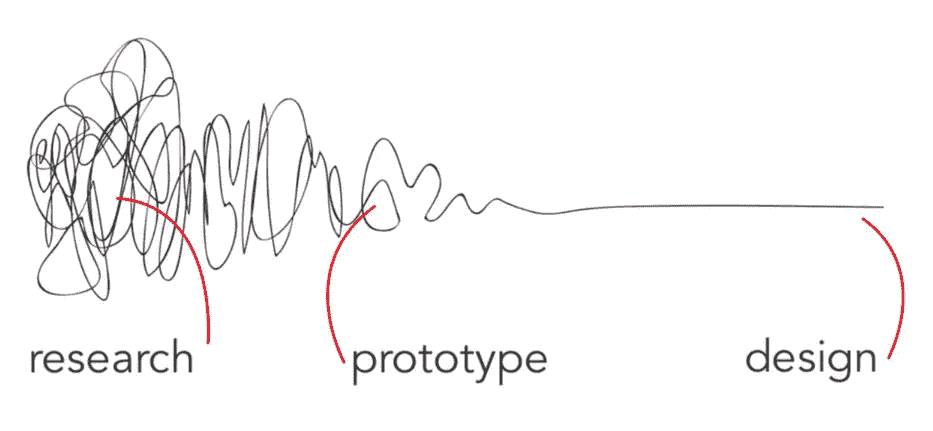

# 好的设计是好的生意

> 原文：<https://medium.datadriveninvestor.com/good-design-good-business-3fe057f8c995?source=collection_archive---------40----------------------->

Photo by [Priscilla Du Preez](https://unsplash.com/photos/nF8xhLMmg0c?utm_source=unsplash&utm_medium=referral&utm_content=creditCopyText) on [Unsplash](https://unsplash.com/search/photos/design?utm_source=unsplash&utm_medium=referral&utm_content=creditCopyText)

所有的工作都是服务。

企业为他们的顾客提供服务，以解决他们的需求、问题或要求。正如托马斯·J·沃森所说，“好的设计就是好的生意”。

不幸的是，好的设计说起来容易做起来难。解决人们的需求、问题和愿望绝非易事。企业不能只听他们的客户和设计。首先，人们不能告诉你他们需要什么或者喜欢什么。甚至有相当多的研究表明，你根本不知道为什么你会这样行动或思考。设计过程并不像人们希望的那样简单。相反，这是一张不确定性的纠结网，必须解开，剥去多余的部分。

[The Design Squiggle Defined](https://vimeo.com/5787721)

幸运的是，在更仔细的检查下，我们可以利用各种方法把它从一个不确定的地方引向焦点。通过研究、原型和设计阶段的模糊性，我们可以找到创造有意义产品的方法。

## 第一步:研究

通过研究，我们深入了解产品或服务的潜在改进之处。但是正如 Jakob Nielsen 所警告的那样，“用户访谈的关键失败在于，你要求人们要么记住过去的使用，要么推测系统的未来使用。”出于这些原因，企业必须努力真正了解他们的用户。不仅仅是问重要的问题，还通过*观察*他们的用户。通过观察和与用户交谈，我们可以找到真正的痛点并定义业务目标。

## 第二步:原型

随着对用户和他们面临的问题有了更好的理解，我们就可以开始原型制作了。早期开发原型的好处是，它可以防止我们在错误的道路上走得太远。使用像 Invision 这样的工具，一个纸质原型或可点击的原型可以快速而经济地完成。用研究结果向客户展示一些切实的东西，可以让我们快速验证我们所听到的，并继续感同身受地进行设计。

找到正确的解决方案需要时间和多次迭代。你越早将产品送到用户手中，你创造的产品就越好。如果一个产品或服务是无效的，它将不会持久，不管它可能是多么美丽和圆滑。

## 第三步:设计

细节开始发挥作用。有了坚实的基础和框架，我们现在可以在设计阶段发展细节。不要曲解我在这里说的话。正如查尔斯·伊姆斯的名言，“细节不是细节。他们负责设计。”设计阶段是一个细化阶段。设计必须简单，这就是为什么它如此复杂。

> “简单可能比复杂更难:你必须努力让自己的思维变得清晰，才能变得简单。但最终还是值得的，因为一旦你到了那里，你就可以移山。”―史蒂夫·乔布斯

今天，我们必须更进一步。面对如此广阔的市场和强大的客户，我们必须为他们提供更多。这项业务不能仅仅是另一种产品，而是要超越客户的期望。消除复杂性。通过简单可爱的经历改善他们的生活。

正如迪特·拉姆斯所说，“好的设计让产品变得有用。”