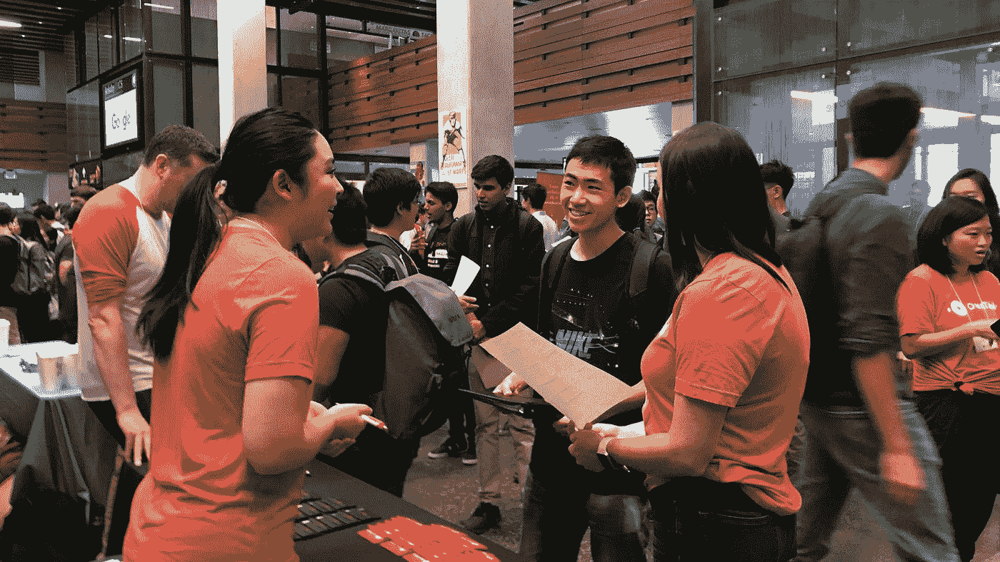
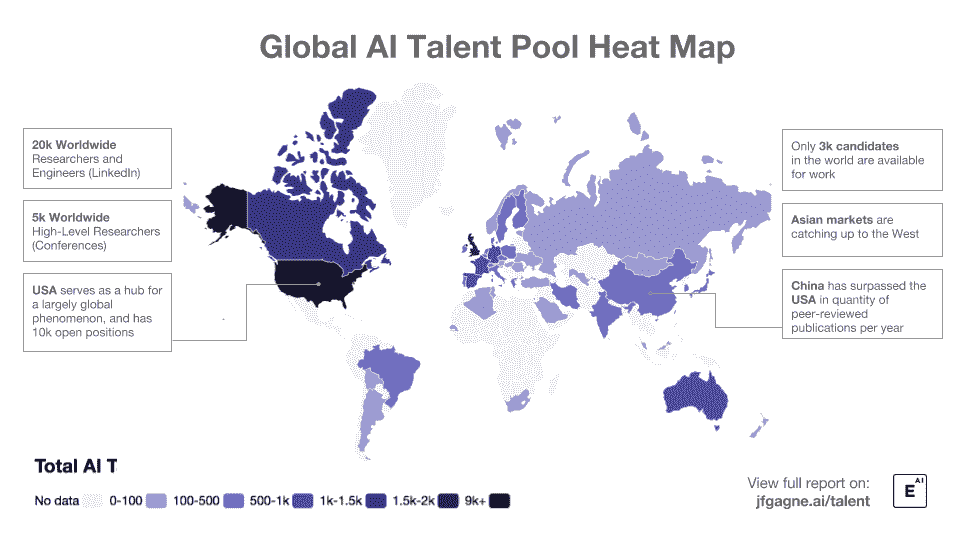

# 对于拥有机器学习技能的求职者来说，好消息是:人才短缺

> 原文：<https://medium.datadriveninvestor.com/good-news-for-job-seekers-with-ai-skills-there-is-a-shortage-of-talent-e127ae4fcb35?source=collection_archive---------4----------------------->

## 接受过人工智能培训的求职者人数不足，这减缓了一些公司的招聘速度，阻碍了它们的增长

*2018 年 10 月 19 日由史黛西·斯坦福*

Carnegie Mellon University Computer Science and Engineering Career Fair 2018 | Source: Carnegie Mellon University

9 月份，大量希望雇佣下一代科技员工的雇主来到加州大学伯克利分校和卡内基梅隆大学计算机科学学院，在计算机科学人才招聘会上与学生见面。

20 岁的鲍里斯·岳(Boris Yue)是数千名学生中的一员，他在求职者中穿行，与招聘人员见面。他选择的专业使他不太可能在找工作时遇到困难。“机器学习的机会并不缺乏，”他说。

毫无疑问，[他是对的](https://medium.com/mlmemoirs/artificial-intelligence-salaries-heading-skyward-e41b2a7bba7d#Medium)。

机器学习现在被用于越来越多的产品中:自动驾驶的汽车；识别和根除杂草的机器人；能够区分危险皮肤癌和良性痣的计算机，以及将该技术带入家庭的智能锁、恒温器、扬声器和数字助理。在佐治亚理工学院，学生们在机器学习的在线课程中与人工智能实现的数字助教互动。

AI-related jobs include machine learning engineer, predictive modeler, corporate analytics manager, data scientist, computer vision engineer, computational linguist, and information strategy manager. | Source: Indeed.com | Credits: Ann Saphir, Data Visualization Engineer, Reuters

人工智能应用的扩大也造成了该领域合格工人的短缺。尽管全国各地的学校都在增加班级，增加招生人数，开发新的项目来满足学生的需求，但在人工智能方面受过培训或有经验的潜在员工太少了。

这将产生重大影响。

招聘人员和潜在雇主告诉路透社，接受过人工智能培训的求职者太少，导致一些公司的招聘放缓，并阻碍了增长。这也可能会推迟更广泛地采用一种技术，一些经济学家说，这种技术可以通过提高生产率来刺激美国经济增长，目前的增长率只有危机前的一半左右。

EECS UC Berkeley Career Fair 2018 | Source: University of California Berkeley, Electrical Engineering and Computer Sciences

Marvell 技术集团的芯片设计经理安德鲁·希恩(Andrew Shinn)在加州大学伯克利分校的招聘会上招聘实习生和新毕业生，他说他的公司在招聘人工智能职位方面遇到了困难。

“几年来，我们一直难以招到人，”他说。“它确实会让事情慢下来。”

## **《成年了》**

许多经济学家认为，人工智能有潜力改变经济的基本轨迹，就像电力或蒸汽机那样。

“我确实认为人工智能正在……走向成熟，”圣路易斯美联储银行总裁詹姆斯·布拉德在接受采访时说。“这将扩散到整个经济，并将改变我们所有人的生活。”

然而，转型的速度将部分取决于技术人才的可用性。

芝加哥大学布斯商学院(University of Chicago Booth School of Business)教授查德·塞弗森(Chad Syverson)表示，缺乏训练有素的工人“肯定会减缓新技术的传播速度以及随之而来的生产率提高”。

美国政府数据没有专门跟踪人工智能领域的职位空缺或招聘，但包括 Indeed、Ziprecruiter 和 Glassdoor 在内的求职网站跟踪的在线职位发布显示，人工智能相关职位的职位空缺正在激增。根据该公司提供的数据，过去两年，人工智能职位招聘占整体职位招聘的比例确实增长了近一倍。与此同时，对人工智能工作的搜索量仅增长了 15%。

大学正在努力跟上。根据 Pieter Abbeel 教授的说法，10 年前，加州大学伯克利分校电气工程和计算机科学博士项目的申请人数量为 300 人，但去年激增至 2700 人，超过一半的申请人对人工智能感兴趣。作为回应，该校在 2017 年秋季将入学班级增加了两倍，达到 30 人。

在伊利诺伊大学，马克·长谷川-约翰逊教授去年将该校人工智能入门课程的招生人数增加了两倍，达到 300 人。他说，额外的 200 个座位在 24 小时内就被占满了。

卡内基梅隆大学今年秋天开始提供全国第一个人工智能本科学位。“我们强烈感觉到需求是存在的，”指导 CMU 新项目的 Reid Simmons 说。“我们正努力提供学生来满足这一需求。”

不过，Glassdoor 首席经济学家安德鲁张伯伦(Andrew Chamberlain)表示，供需错配的修复可能需要五年时间。该公司拥有在公司网站上搜索职位发布的算法，他们的数据显示，与人工智能相关的职位发布在过去 11 个月中翻了一番。“进入这个领域的人远远低于需求，”他说。

## **一个求职者市场**

需求导致工资上涨。Glassdoor 估计，在 2017 年 10 月至 2018 年 9 月期间，公司职业网站上发布的[人工智能相关工作](https://medium.com/mlmemoirs/artificial-intelligence-salaries-heading-skyward-e41b2a7bba7d)的平均工资上涨了 11%，达到每年 123069 美元。

总部位于纽约的 10X Management 将技术专家出租给公司从事特定项目，该公司的迈克尔所罗门(Michael Solomon)表示，他手下的顶级人工智能工程师现在的时薪高达 1000 美元，是 5 年前的三倍多，这使他们与区块链专家一道，成为该公司薪酬最高的两个类别之一。

卡耐基梅隆大学(Carnegie Mellon University)材料科学与工程教授利兹霍尔姆(Liz Holm)在 5 月份亲眼目睹了需求的增长，当时她的一名即将毕业的博士生在她的研究中使用了机器学习方法，他们收到了大量的工作邀请，其中没有一份是材料科学的，全都与人工智能有关。最终，这位学生在宝洁公司找到了一份工作，在那里她使用人工智能来计算全球商店货架上的商品摆放位置。霍尔姆说:“公司现在非常渴望这些人。

人工智能专家马克·梅伯里同意这一观点，他去年被聘为斯坦利·布莱克和德克尔公司的首席技术官。他说，该公司正在将人工智能嵌入工具的设计和生产中，尽管他说细节尚未公开。

“我们能够找到我们需要的人才吗？是的，”他说。[“贵吗？是的。”](https://medium.com/mlmemoirs/artificial-intelligence-salaries-heading-skyward-e41b2a7bba7d)

对于拥有人工智能技能的求职学生来说，这是一个好消息。除了提高他们的工资，给他们更多的选择，他们经常在毕业前就获得工作机会。

德里克·布朗(Derek Brown)在卡内基梅隆大学(Carnegie Mellon University)读本科时学习人工智能和认知科学，去年秋天，他在大四开学时获得了 Salesforce 的一份全职毕业后工作。他拒绝了，转而选择了脸书，并于去年 7 月开始在那里工作。

Global AI Talent Pool Heat Map | Global AI Talent Pool Report | Credits: [JFG](http://www.jfgagne.ai/talent/)

“毫无疑问，人工智能和自动化将影响社会的方方面面。展望未来，我们必须利用这些重要的技术让我们的世界变得更好，并利用它们的力量为社会公益服务，我相信麻省理工学院的开创性举措，特别是其在技术进步的同时解决政策和道德问题的承诺，将在确保人工智能得到负责任的发展并用于使我们的世界更加公正方面发挥至关重要的作用，”福特基金会总裁达伦·沃克在谈到麻省理工学院最近宣布解决人工智能人才短缺问题时表示。

人工智能发展迅速，当今企业需要人才。然而，不是任何人才。曾经编码和软件工程专业知识的短缺，现在已经演变为机器学习、机器人和算法工程技能的全面短缺。

**参考文献:**

人工智能技能危机和如何缩小差距|福布斯|[https://www . Forbes . com/sites/bernardmarr/2018/06/25/the-AI-Skills-Crisis-and-How-to-Close-the-Gap/](https://www.forbes.com/sites/bernardmarr/2018/06/25/the-ai-skills-crisis-and-how-to-close-the-gap/)

政府的下一个人才缺口:拥有人工智能技能的工人|政府 CIO Media |[https://Government CIO Media . com/governments-Next-Talent-Gap-Workers-AI-Skills](https://governmentciomedia.com/governments-next-talent-gap-workers-ai-skills)

5 万+数据科学、人工智能岗位因人才短缺而空缺:Report |经济时报|[https://Economic TImes . India TImes . com/Jobs/50000-Data-Science-AI-Jobs-Vacant-Due-Due-to-short-Report/articleshow/66230457 . CMS](https://economictimes.indiatimes.com/jobs/50000-data-science-ai-jobs-vacant-due-to-shortage-of-talent-report/articleshow/66230457.cms)

随着公司拥抱人工智能，这是一个求职者市场|路透社|[https://www . Reuters . com/article/us-USA-economy-artificial intelligence/as-Companies-Embrace-AI-its-a-Job-Seekers-Market-iduscn1 MP 10d](https://www.reuters.com/article/us-usa-economy-artificialintelligence/as-companies-embrace-ai-its-a-job-seekers-market-idUSKCN1MP10D)

卡耐基梅隆大学计算机科学与工程招聘会|卡耐基梅隆|[http://cs . CMU . edu/events/Carnegie-Mellon-Career-Computer-Science-and-Engineering-Career-Fair](http://cs.cmu.edu/#events/#carnegie-mellon-career-computer-science-and-engineering-career-fair)

伯克利| EECS |加州大学伯克利分校|[https://eecs.berkeley.edu/industries/eecs-career-fair/](https://eecs.berkeley.edu/#industries/#eecs-career-fair/)

人工智能:工资飞涨|机器学习回忆录|[https://medium . com/ml memories/artificial-Intelligence-salary-Heading-Skyward-e 41 b 2 a 7 BBA 7d](https://medium.com/mlmemoirs/artificial-intelligence-salaries-heading-skyward-e41b2a7bba7d)

麻省理工学院欲斥资 10 亿美元新建计算机科学学院|市场营销学院|[https://www . marketingiiinstitute . com/blog/MIT-Wants-to-Solve-For-AI-Talent-short-with-10 亿美元新建学院](https://www.marketingaiinstitute.com/blog/mit-wants-to-solve-for-ai-talent-shortage-with-1-billion-new-school)

《全球人工智能人才报告 2018 | http://www.jfgagne.ai/talent/ | JFG |

麻省理工学院将重塑自己以塑造未来|麻省理工学院|[http://web.mit.edu/spotlight/mit-schwarzman-college/#main](http://web.mit.edu/spotlight/mit-schwarzman-college/#main)