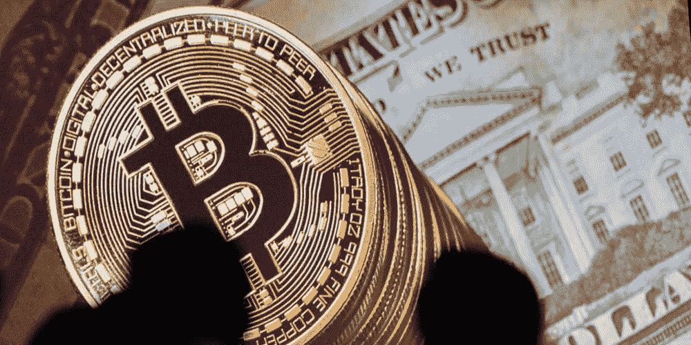

# 好消息还是更好的消息:比特币开始行动了

> 原文：<https://medium.datadriveninvestor.com/good-news-or-better-news-bitcoin-is-making-a-move-f33e833227f1?source=collection_archive---------3----------------------->

突然间，比特币涨到了近 7800 美元，现在每个人都想回到火车上，希望它能继续爬上那座山，让加密货币恢复到年初后不久就消失的昔日辉煌。

几周来，人们一直在猜测(取决于你在听谁说)加密货币将很快再次飙升，有人说比特币将在今年年底达到疯狂的高数字，但在这一点积极活动之前，水域一直相对平静和令人沮丧。那么，是什么让市场上涨，这是一些人预测的价格上涨的开始吗？

7 月 18 日，总市值达到 2950 亿美元，过去几天一直保持在这个交易范围内。由于比特币是市值最大的加密货币，当它上涨时，其他替代货币也会跟着上涨。

这是一个相当重要的事件，有些人可能想知道是什么改变了价格飙升。据《福布斯》报道，高盛(Goldman/Sachs)的新任首席执行官对加密货币持友好态度，并将在 10 月前完全控制他们的新交易台。投机者押注这将有助于将更多机构资金转移到这个领域。最重要的是，贝莱德可能发挥了重要作用，其 6.3 万亿美元的基金有兴趣启动加密货币“任务组”。

这与来自 SEC 的积极消息相结合，该消息称，现在对比特币 ETF 的兴趣比 1 月份更高，SEC 很快批准的希望很高。这令人兴奋，因为这将使传统市场的玩家接触到加密货币，时间会证明这是否会带来每个人都希望的积极结果。但这能解释价格的突然上涨吗？

考虑到最近的价格上涨发生在很短的时间内，人们不得不认为不仅仅是这些积极的投机行为将价格推高。一些人认为这次加息与“空头”的清算有关。

空头是交易员押注加密货币价格将下跌的头寸。这些类型的玩家正在与加密市场对赌，在大多数情况下，他们利用资金，就像借钱来下注一样。这迫使交易者在市场以当前市值上涨时回购空头头寸，这反过来推动价格进一步上涨。

这可以解释最近图表上的垂直线。但这种趋势会持续向上吗？有人可能会猜测，如果这种解释是价格大幅上涨的真正原因，那么价格上涨不会持续下去。然而，这要由投资者来决定。有一件事是肯定的，如果你在 16 日对比特币有大量投资，那么到 18 日你肯定是一个快乐的露营者。比特币的收益总是在一年中的少数几天产生，所以在价格飙升时建仓很重要。

—

并不是所有的区块链都将盈利，找出[投资哪种加密货币](https://cryptoinvestinginsider.com/cryptocurrency-to-invest-in/?utm_source=ddi&utm_medium=article&utm_content=goodnews)将改变未来。