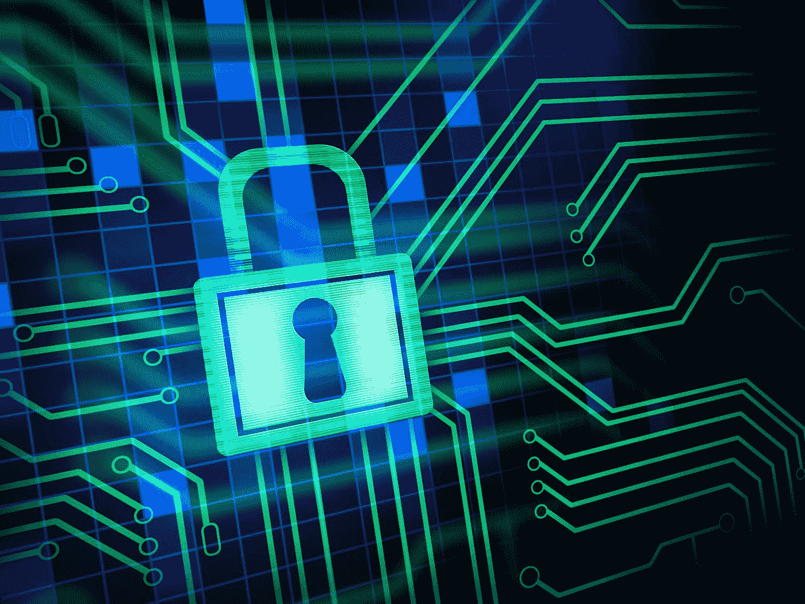

# 良好的安全保护我们免受自身伤害

> 原文：<https://medium.datadriveninvestor.com/good-security-protects-us-from-ourselves-2cc92fabbfe1?source=collection_archive---------29----------------------->

## 让数据更加安全的同时，获得更高的在线可见性

Photo by Valeriy Khan — Unsplash

你收集的数据很容易被黑客攻击。他们可能会进行直接攻击或编辑看似不相关且无威胁的信息。这最终将人们置于危险之中。

[Victor Santoyo](https://twitter.com/v_santoyo)

[Victor Santoyo](https://twitter.com/v_santoyo) 靠防范和打击网络掠夺者为生。通过清理和保护网站的 [Sucuri Security](https://twitter.com/sucurisecurity) ，他是网站安全专家。他还在迈阿密世界夏令营发表了关于网络保护的演讲。

他谈到了与卡罗尔·斯蒂芬(Carol Stephen)一起保护你收集的数据，卡罗尔·斯蒂芬是一名社交媒体营销人员和经理，帮助“希望在网上获得关注的雄心勃勃的企业主”

在特定数据领域，保护个人身份信息必须是首要任务。这不仅告诉了别人你的情况，也无意中告诉了朋友和家人。

Santoyo 说:“*你通过网站收集并传输到其他服务器的任何*数据都需要加密和保护。*任何事情*。不管是名字还是个人地址。”

 [## 网络罪犯期待您的邀请

### 您的隐私取决于坚持个人最佳实践

medium.com](https://medium.com/datadriveninvestor/cyber-criminals-look-forward-to-your-invitation-9c01640367fd) 

请记住，有一个组织和优先排序的方法是至关重要的。

“这是一个伟大的观点，”桑托约说。“互联网正在创造我们需要开始收集或创造的所有新型数据。我们真的需要盘点一下我们正在收集的东西。”

用户还必须确定谁能看到数据以及为什么能看到。

“当然，”桑托约说。“我有一篇关于[支付卡行业要求 9](https://en.wikipedia.org/wiki/Payment_Card_Industry_Data_Security_Standard) 的博客文章即将发表。”

他在另一篇关于实施强访问控制措施的博文中也提到了这个话题。

# 不仅仅是备份

备份可以帮助你恢复被黑的数据，但你不能让黑客看不到他们看到了什么。

桑托约说:“某些攻击，如勒索软件会压缩并加密数据，使其不受影响。”。“其他时候，数据可能会损坏。因此，将备份作为唯一的资源是很棘手的。

“如果你想得到保证，在事故发生前测试你的备份是关键，”他说。

 [## 网络安全威胁比恐怖更可怕

### “你是一个目标。”

medium.com](https://medium.com/datadriveninvestor/cybersecurity-threats-scarier-than-scary-60fcc2f704c2) 

斯蒂芬想知道，如果一家总部位于欧盟的公司在印度设立办事处，会发生什么。印度的员工可以查看欧盟公民的数据。印度办公室如何遵守欧盟的一般数据保护法规— [更好地称为 GDPR](https://en.wikipedia.org/wiki/General_Data_Protection_Regulation) ？

一般来说，如果欧盟标准比你的标准更严格，选择更严格的标准。在万维网中，每个人的数据都会因为违反另一个实体的严格要求而受到惩罚。

“GDPR 肯定是一个关键的东西，”桑托约说。“如果你住在美国，加州新的数据隐私法也是需要注意的。

“我们有许多远程工作的员工，我们是合规的，”他说。“所以，这肯定是可行的。您只需要确保数据位于正确的位置，并且仅在需要的基础上。”

有效的安全不会孤立地取得成功。

“在你的团队中明确期望也很重要，”Santoyo 说。“如果你在印度，不要在印度本地服务器上复制欧盟数据或记下复制的信息。”

管辖权不取决于员工所在地。

“数据的位置是开始的要点之一，”Santoyo 说。“我在迈阿密。只要我不在本地机器上存储欧盟数据，就没问题。

“不管你是在欧盟还是在欧盟之外运营，如果你从居住在欧盟的个人那里收集数据，你都需要小心，”他说。“我可能是一家美国企业，开始接受欧盟订单。在这种情况下，我需要开始遵守 GDPR。”

Santoyo 还谈到了安全的“拒绝优先”方法。

“有疑问时，拒绝访问，”他说。“选择严密的安全措施——尤其是从一开始——直到你对另一方的利益及其隐私标准有信心。

桑托约说:“这是一种先拒绝公众接触一切的想法。”“这有助于你慢慢决定你*允许什么样的访问。如果我向世界开放我的服务器，我就无法控制了。如果我先全部否定，我可以在我觉得应该的地方慢慢开放。”*

 [## 如何保护个人数据不被坏人窃取

### 隐私和社交媒体必须符合消费者的关切

medium.com](https://medium.com/datadriveninvestor/how-to-shield-personal-data-from-evil-doers-e57b2330cfa) 

这是一个通常被忽略的默认选择。

“这应该是默认的——然而，人们经常忽视这种做法，”Santoyo 说。从安全角度来看，应用程序、服务器和网络上的默认配置并不总是理想的，这就是为什么审查它们很重要

只要数据有可能对你或他人造成伤害，就要保密。对安全和隐私侵犯没有诉讼时效。

“我对此的快速回答是，只要绝对需要，”桑托约说。“如果您需要数据超过 30 到 60 天，应该有一个数据或安全策略来描述延长使用的原因，最坏的情况。

“否则，一旦你确定了最适合你公司的时间长度，就要定期清除这些数据，”他说。对于那些遵守 GDPR 的人，还要确保这些人请求清除时可以方便地访问数据

安全套接字层证书——被称为 SSL——是一种数字证书，使用 SSL 技术认证网站的身份并加密发送到服务器的信息。

“这只能保证你的数据在传输过程中的安全，”桑托约说。“一个*常见的*误解是 SSL 保护你的网站。它会在从浏览器到主机服务器的途中加密数据。这对于避免‘中间人’攻击仍然很重要。”

他补充说，谷歌正在推动[超文本传输协议安全](https://en.wikipedia.org/wiki/HTTPS)，用户知道的缩写是 HTTPS。

如果您怀疑有违规行为，请立即更改您的密码并检查您的安全设置。

“首先，通知那些受影响的人，”桑托约说。"然后采取适当的行动来了解发生了什么，在哪里，并作出这些改变."

在一篇博客文章中，他详细介绍了从数据泄露等灾难中恢复的步骤。

# 定期擦洗

并购司空见惯。它们增加了数据处理的复杂性。当公司发生任何变化时，安全专家都应该进行数据清理，以确保所有实体都按照相同的安全和隐私标准运营。

“就像印度的问题一样，浏览你获得的数据并验证其用途，”桑托约说。“如果你不打算用它，那就丢掉它。如果您确实要使用它，请设置参数，确定谁将有权访问以及出于什么目的。”

 [## 黑暗的腹部潜伏着，等待攻击

### 沉入深层网络的信息将你的身份置于危险之中

arvrjourney.com](https://arvrjourney.com/dark-underbelly-lurks-waiting-to-strike-3d38b05f54ad) 

像对待第一个孩子一样对待你的数据。

“要小心，”桑托约说。“不要在你不会撕碎的纸上复制持卡人的数据。不要在 u 盘上拷贝。你会失去他们，因为他们很小。

“就像你不希望自己的数据像烫手山芋一样被扔来扔去，也要注意他人的数据，”他说。“对如何处理以及在何处、如何和何时处置设定适当的预期。如果你从一开始就树立了榜样——并设置了提醒——你已经迈出了很好的一步。”

人就是人，要警惕那些把数据留在餐厅的人。

“这是人性最好的一面，也是最坏的一面，”桑托约说。“我知道我把钥匙忘在家里奇怪的地方了。

“想象一下，在工作场所，压力和时间是你日常生活中更重要的因素，”他说。“实践良好的安全不是责备他人，而是保护我们所有人免受自己的伤害。”

**关于作者**

吉姆·卡扎曼是[拉戈金融服务公司](http://largofinancialservices.com)的经理，曾在空军和联邦政府的公共事务部门工作。你可以在[推特](https://twitter.com/JKatzaman)、[脸书](https://www.facebook.com/jim.katzaman)和 [LinkedIn](https://www.linkedin.com/in/jim-katzaman-33641b21/) 上和他联系。

*原载于 2018 年 10 月 24 日*[*www.datadriveninvestor.com*](http://bit.ly/2CFPSHR)*。*