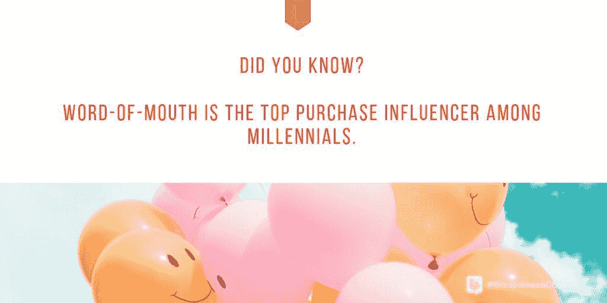
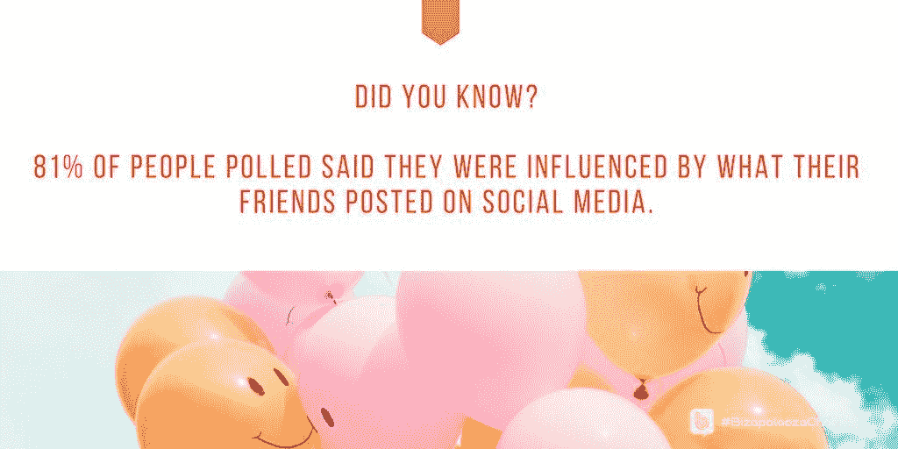
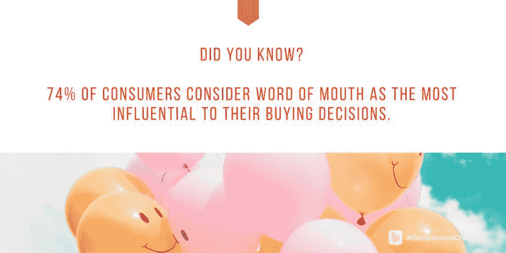

# 好的谈吐产生好的利润

> 原文：<https://medium.datadriveninvestor.com/good-talk-yields-good-profits-2cd65ccda0bb?source=collection_archive---------34----------------------->

## 在谈话触发的推动下，口碑传播得最好

谈论你的生意的人越多，你成功的机会就越大。更多的聊天转化为更多的收入。

好的口碑[通过积极的推动](https://blog.markgrowth.com/talk-triggers-spark-word-of-mouth-2d83a7c5813b)传播得最好，这也是[杰伊·贝尔](https://twitter.com/jaybaer)发挥专长的地方。他的咨询公司[说服&转化](https://www.convinceandconvert.com/)，帮助标志性的民族品牌。他的书，《T8 谈话触发 T9》，深入探究了产生令人难忘的嗡嗡声的方法和原因。

Baer 与 [Ivana Taylor](https://diymarketers.com/about/) 和 [Iva Ignjatovic](https://twitter.com/IvaIgnjatovic) 讨论了“谈话触发器”以及如何创建关于您业务的聊天。

Ignjatovic 是一名营销、战略、领导力和商业顾问，他与泰勒密切合作，泰勒拥有 DIYMarketers，这是一家“致力于帮助小企业主摆脱困境”的公司。

社交和做社交是有区别的，这不仅仅是语义上的。

“人们可以感觉到不同，”泰勒说。“社交反映了你在这个世界上是什么样的人。做社交就是为了发帖而发帖。”

Ignjatovic 认为主要区别在于主动或自动。

 [## 社交媒体收听让您随时了解|数据驱动型投资者

### 虽然社交媒体倾听是一种顶级趋势，但它应该是每个现代营销策略的一部分。保持和谐…

www.datadriveninvestor.com](https://www.datadriveninvestor.com/2019/02/26/social-media-listening-keeps-you-plugged-in/) 

贝尔说:“社交就是真正地参与进来，并在以后发现商业利益。”。“在做社交活动时，首先要搞清楚商业利益，然后相应地参与进来。我喜欢第一种方法。”

# 第一印象联系

通过打招呼和提问开始社交媒体对话。回应——如果有的话——会告诉你是否有机会互动或者更好地继续前进。正如 Ignjatovic 所解释的，参与来自于与人的实际互动。

泰勒说:“这通常是一个问题或对我钦佩的人的评论，基于他们写的、制作的或分享的东西。”

贝尔采取了不同的方法。

“我不会找很多人来开始谈话，”他说。“我发表意见，然后在评论中讨论。

“对我来说，在许多情况下，社交只是一篇超级短的博文，”贝尔说。"我不像有些人那样使用公共电子邮件等社交工具."

 [## 如果你做得对，有一个标签

### 了解标签的基本知识来推销你的业务

medium.datadriveninvestor.com](/theres-a-hashtag-for-that-if-you-do-it-right-79b9d167c86a) 

标签在社交媒体商业对话中扮演着重要的角色。他们帮助你找到社交媒体话题和对话。他们也有助于吸引他人。

“它们让对话变得更容易，就像 Twitter 聊天一样，”Ignjatovic 说。“有了标签，我们可以更容易地找到相关内容和我们想联系的人。”

从某种意义上说，标签是一种商品。

“你买不到，但你可以‘拥有’一个，”泰勒说。“更好的是，您的客户可以为您创建一个。”

贝尔描述了标签的未开发潜力。

“越来越多的公司使用 Instagram，LinkedIn 上也开始使用标签，”他说。"此外，现在有了这么多内容，标签让你更容易找到你想要的东西."

# 从古人那里继承来的

Chatter 通常与线下活动相关，但随着社交媒体的发展而发展。

“自穴居人商业时代起，人们就开始口口相传，”贝尔说。“现在，50%的口碑来自网络——大部分来自社交，但社交并不等于口碑。这是一种口碑传播的方式。”

他补充说，口碑是商业中最重要、最不受重视的东西。

 [## 谈话引发了口碑传播

### 推荐书是你最有力的推荐

blog.markgrowth.com](https://blog.markgrowth.com/talk-triggers-spark-word-of-mouth-2d83a7c5813b) 

在“[口碑营销:聪明的公司如何让人们说话](https://smallbiztrends.com/2012/05/word-of-mouth-marketing-book-review.html)”中，泰勒写道，“伟大的营销策略永远不会因为某个原因而过时——因为它们*有效*。

“口口相传是这些策略之一，”她说。“这不需要花很多钱，而且效果很好。然后，当你添加最新的社交媒体工具时，你就有了类固醇上的口碑营销。”

根据 Ignjatovic 的说法，这些单词的影响甚至更大，因为它们“以互联网速度乘以人类互动速度的速度传播。”

# 引人注目的口碑

有一些有机的方法可以为企业或品牌创造知名度。一种方法是讲故事。这是创造商业和品牌知名度的最原始和最亲密的方式。三维比二维好。

“关键是要有一个‘谈话触发器’，这是你的业务中的一个运营差异，迫使口碑相传，”贝尔说。"给你的顾客一些可以告诉他们朋友的东西."

例子包括提供巧克力曲奇的双树酒店、芝士蛋糕工厂和它的巨型菜单，以及带有欢闹等待音乐的 UberConference。

 [## 铅磁铁:吸引人的入门方式

### 有价值的赠品是营销的关键部分

blog.markgrowth.com](https://blog.markgrowth.com/lead-magnets-attractive-ways-to-get-your-foot-in-the-door-2005d8be6f96) 

“这些都是谈话触发器，你需要一个，”贝尔说。"谈话触发器可以让你有目的地而不是偶然地口口相传."

这些策略引起了泰勒的共鸣。

她说:“*这个*就是*是*和做的区别。”。“有机的方法是花时间去发现每个人都在谈论的你的与众不同之处——也许调整一下，看着它与客户一起发展。”

Ignjatovic 指出，“真诚而有价值的沟通可以引起轰动，演变成意识，创造品牌支持者。”

# 购买因素

这与[广告周刊](https://twitter.com/Adweek)的研究相吻合，该研究发现 74%的消费者认为口碑对他们的购买决定影响最大。

为了提高品牌知名度，社交媒体是广泛和即时的。此外，还有便宜的额外优势。如果你有一个好的有机接触方法，你就不必为广告付费。

“一旦你有了自己的独特之处——一个被你的客户认可的独特之处——他们在社交网站上的分享就具有感染力，”泰勒说。

贝尔告诫不要对在线结果过于兴奋。

“我不确定社交是最好的地方，”他说。“社交传播最快，但我更喜欢在线和离线对话之间的平衡。”

 [## 给顾客为你加油的理由

### 了解他人，与他们建立关系

medium.datadriveninvestor.com](/give-customers-reasons-to-cheer-you-on-ec74eafd8942) 

口碑对于推广一个企业有很大的可信度。人们更相信那些愿意并热情赞扬一家公司的人。

“对于结合社交媒体的小企业来说，绝对是这样，”Ignjatovic 说。“然而，口碑需要时间。这要求我们所做的一切都保持一致的质量。”

她补充说，口碑是千禧一代中最具购买影响力的因素。

“口碑是发展任何业务最有效和最具成本效益的方式，无论规模大小，”贝尔说。“获得新客户的最佳方式是将你的现有客户转化为志愿者营销人员。”

品牌在其社区内互动越多，口碑就越好。这向潜在客户表明，公司背后有真正关心他们的人。

“每个企业都有口碑，”泰勒说。“真正的问题是你是控制它的人，还是你的客户只是说他们想说的话。*提高的方法是意识到你的谈话触发点是什么。*

*说服研究显示，83%的美国人说，朋友或家人的口头推荐会让他们更有可能购买该产品或服务。*

*“你需要一个谈话触发器，”贝尔说。“这是你一贯故意做的事情，让客户意想不到，导致他们在线上和线下向他们的朋友谈论你。”*

# *人们欣赏努力*

*消费者看重口碑，商家相信口碑是有效的。这也需要时间和努力。很多时候，品牌或顾客说他们两者都没有。这就是为什么真正的口碑传播会引起共鸣并留下持久的印象。*

*“口碑被低估了，因为它可能有点难以衡量，在线和离线都存在，”贝尔说。“大多数公司只是假设它会发生，而不是*让它发生*。”*

*泰勒认为，这就是为什么口碑中的“存在”成分经常被忽视。*

*社交媒体是一个开始，但品牌需要用行动来支持它。社交媒体只是整体营销策略的一部分。*

*“有人说社交媒体的热度足以增加销售额，”泰勒说。“我相信一切都必须协同工作:产品、服务、体验、营销。这就是利润的来源。”*

* [## 公司啦啦队员对你赞不绝口

### 敬业的员工向公众宣传他们的公司

blog.markgrowth.com](https://blog.markgrowth.com/company-cheerleaders-shout-your-praises-b0b24ca1014c) 

Ignjatovic 将社交媒体 buzz 比作“一个起点，一个可能会熄灭的火花，如果我们所拥有的只是那一个。”

无论如何，贝尔说社交媒体只是解决方案的一部分。

“我不会建议人们仅仅依靠社交媒体来增加客户，”他说。“社交+线下+电子邮件……你需要有一个营销组合，尤其是因为社交是如此不稳定。

“不要把你的房子完全建在租来的土地上，”贝尔说。

他和泰勒在播客中更深入地讨论了创造商业聊天[。](https://diymarketers.com/how-to-create-chatter-about-your-business/)

**关于作者**

吉姆·卡扎曼是拉戈金融服务公司的经理，曾在空军和联邦政府的公共事务部门工作。你可以在[推特](https://twitter.com/JKatzaman)、[脸书](https://www.facebook.com/jim.katzaman)和 [LinkedIn](https://www.linkedin.com/in/jim-katzaman-33641b21/) 上和他联系。* 

**原载于 2018 年 11 月 15 日*[*www.datadriveninvestor.com*](http://bit.ly/2PVyl5v)*。**