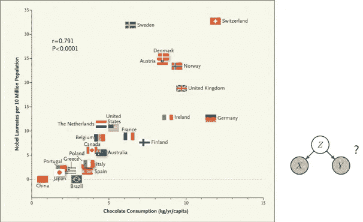
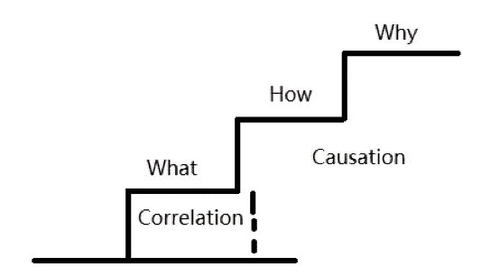
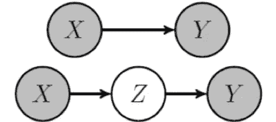
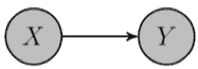
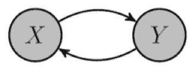
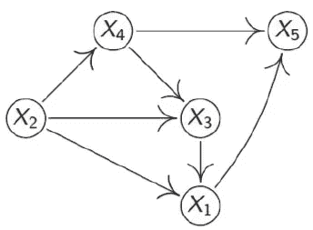
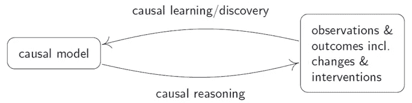
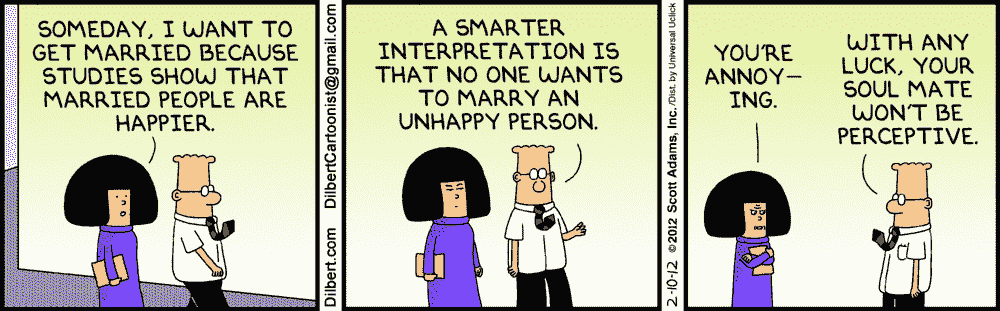

# 再见相关。向因果推理时代问好。

> 原文：<https://medium.datadriveninvestor.com/goodbye-correlation-say-hello-to-the-era-of-causal-inference-f238065c156b?source=collection_archive---------1----------------------->

这篇文章由我们的内部研究员马博文撰写。

**摘要**:文章介绍了因果关系的基本概念、现有方法和模型、主要难点、最新研究进展、应用场景以及作者的一些个人思考。

**关键词:**因果推理，因果发现，因果推理，机器学习

由于时间限制，我将只对上述不同概念之间的关系进行直观的介绍。我不会深究“大爆炸”理论的有价值的讨论。

当我们思考生活中不同实体、变量和概念之间的关系时，因果关系似乎是科学界的核心兴趣。“为什么”是我们探索自然和她与生态系统的互动时的终极问题。

> “为什么”暗示我们生活在包含自我意识的“黑箱”中。它会穿过哪个“球体”，思想受到怎样的影响，穿过“球体”后会形成怎样的结构？

*我们来看看这张图:*

*F.H. Messerli: Chocolate Consumption, Cognitive Function, and Nobel Laureates, N Engl J Med 2012*

假设有两个变量，X 和 Y，当变量 X 的值发生变化，导致变量 Y 向某一特定方向变化时，就说它们之间存在统计关系。

 [## 描述性统计与推断性统计。有什么区别？-数据驱动型投资者

### 想象一下。你拥有一家餐馆，想知道人们对你的生意有什么看法。所以，你给一个…

www.datadriveninvestor.com](https://www.datadriveninvestor.com/2019/02/28/descriptive-vs-inferential-statistics-whats-the-difference/) 

在上图中，忽略瑞典这个离群值，我们会发现巧克力的销量和诺贝尔奖获得者的数量之间存在正相关关系。相关性告诉我们线性相关性有多强，以及一个变量相对于另一个变量是如何变化的。

> 然而，相关数字未能告诉我们的是“如何”和“为什么”或两个变量之间的因果关系。

如果 X 导致 Y，那么 X 的出现导致 Y 的出现。换句话说，Y 有多“愿意”跟随 X 的变化？我们的初步直觉告诉我们，巧克力不会让人变得更聪明，也不会帮助科学家获得诺贝尔奖。这种关系一点意义都没有。然后发生了什么？

也许在这两个变量中还有其他共同的变量，如一个国家的财富(当一个国家更富裕时，允许进行更多的 R&D)。**或者，我们也可以根据 X 是否导致 Z，Z 是否导致 Y 发生来思考‘为什么’。**

我们可以说，室内温度的变化引起了温度计读数的变化。如果我们漫无目的地观察温度计，我们是否有足够的勇气声称操纵温度计会导致房子里的温度变化？虽然两个事件可能会相互影响，但*并不一定意味着*双向影响在数学上等同于等号。因此，结论是室内温度的变化导致了温度计读数的变化。

# **因果发现&因果推理**

寻找统计相关性是统计学和机器学习的核心问题。它在任务预测的研究领域中有着重要的地位，在 ML 中也有着广泛的应用。近年来，极大似然法的应用使我们能够作出相当准确的预测。然而，在某些情况下，我们想知道一个变量(即一个人是否吸烟)和另一个变量(即肺癌)**是否有相关性或存在因果关系。**

这种学术上的好奇心会让我们想到**因果发现的概念。**基本上，因果发现或因果学习试图通过变量的行为找出和/或理解变量之间的作用机制，这些行为被映射到数据库中。这种作用机制被称为**因果模型**。虽然听起来很有趣，但这种模式很难实现。

其次，我们可以实施实验，如随机试验作为干预措施。最少考虑的选择是仅仅依靠观察数据。尽管它的可靠性有缺陷，但我们不得不依赖它，因为如果涉及实验，分析中的理论空白将会溢出。在这个数据工业时代，获取大数据和发现新的统计关系变得更加容易。这种环境促使研究人员更加关注从观察数据中寻找因果关系，这验证了理论，并将其应用于其他数据驱动的学科(如 ML)。

> 赖兴巴赫早在 20 世纪 50 年代就提出了因果关系和统计相关性之间存在关系的假设，这一假设后来被称为**赖兴巴赫的共因原理。**

两个事件 X 和 y 之间存在统计相关性。

可以得出结论，以下三种情况中有一种是正确的:

**(1) X“原因”Y**

**(2) Y“原因”X**

**(3)还有一个隐藏的共同“原因”(称为混杂变量)**

让我们详细阐述第三种情况——隐藏的共同“原因”。

在给定的情况下，当混杂变量存在时，变量 X 和 Y 在条件和统计上是独立的。因此，因果假设可以在统计上得到验证。随后，当方程逼近第 n 个变量时，Pearl，Spirtes 等人提出了**因果马尔可夫假设**:在指定一个直接原因/母体后，每个变量都拥有其条件独立的非效应/非后代的规则。

如果理解了**D-分离**的概念，我们可以说，如果变量的条件独立性可以从有向无环图 G (DAG)上的变量间的有向隔离中导出，那么相关的 G-分布应该属于马尔可夫。另一方面，我们在因果发现中有一个对立的概念，叫做**忠实条件**。如果条件独立性可以用来导出图上的方向分离，则 G 分布是可靠的。

*Causal Model e.g. DAG*

> 我想强调的一点是，虽然这两个假设建立了一个双向平台，但基于这两个假设的因果发现可能会引起问题。比如**马尔可夫等价**(一组独立变量可能对应一个以上具有高独立性的因果图)，常联合分布的观测值总是独立同分布。

稍后将详细阐述更多内容。

**因果推理**，顾名思义，取决于我们的因果模型(不管它是基于基于领域的假设还是基于因果发现的结论)如何处理、分析和预测系统内发生的变化。当我们做决定时，模型在帮助我们达到我们想要的结果方面是重要的。

# 想法

研究因果关系的原因之一是，我们需要通过理解数据，从失败或成功的经验中获取知识，从而做出更好的决策。失败和成功经验之间的相互作用可以与**生成性对抗学习**相结合，以产生更准确的因果模型。

> 那么如何定义因果关系呢？什么样的关系具有因果关系？

下一篇文章再来分析吧。

# 参考

[1]朱迪亚·珀尔和达纳·麦肯齐。*为什么之书*:因果的新科学。美利坚合众国:基础书籍，2018 年。

[2]萨曼莎·克莱恩伯格。*原因:查找和使用原因的指南*。美利坚合众国:奥莱利媒体公司，2015 年。

[3]斯坦福哲学百科全书，检索自[https://plato.stanford.edu/index.html](https://plato.stanford.edu/index.html)

[4]肯尼思·博伦和朱迪亚·珀尔。"关于因果关系和结构方程模型的八个神话."《社会研究因果分析手册》,第 301-328 页。施普林格，多德雷赫特，2013。

[5]约里斯·穆伊杰、若纳斯·皮特斯、张秀坤·扬金、雅各布·兹谢施勒、伯恩哈德·朔尔科普夫。"使用观察数据区分原因和结果:方法和基准."《机器学习研究杂志》17，第 1 期(2016):1103–1204。

[6]张秀坤·扬金和伯恩哈德·朔尔科普夫。"使用算法马尔可夫条件的因果推理."IEEE 信息论汇刊 56，第 10 期(2010):5168–5194。

[7]弗雷德里克·埃伯哈特。"因果发现基础的介绍."国际数据科学与分析杂志 3，第 2 期(2017):81–91。

[8]彼得·斯皮尔特斯和张坤。"因果发现和推理:概念和最近的方法论进展."《应用信息学》，第 3 卷，第 1 期，第 3 页。SpringerOpen，2016。