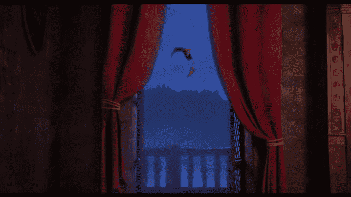
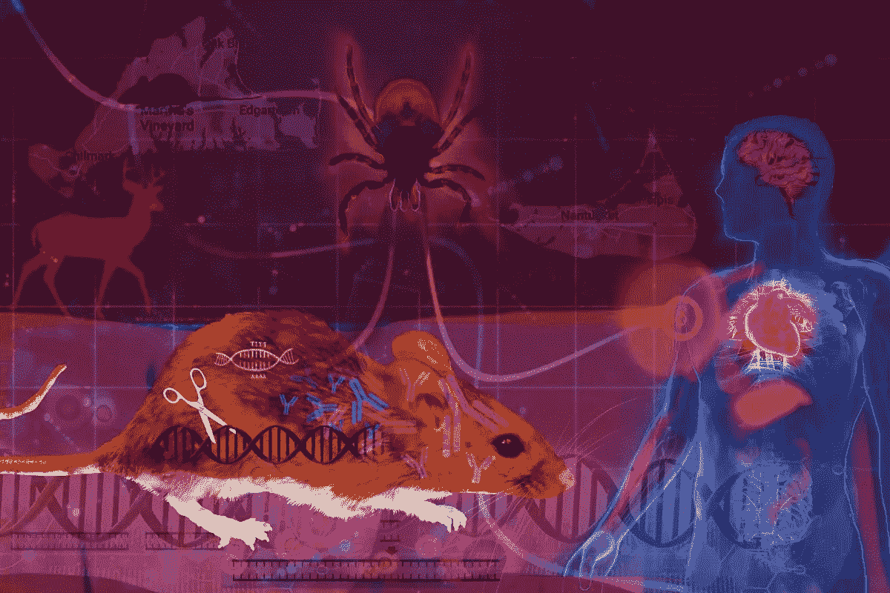
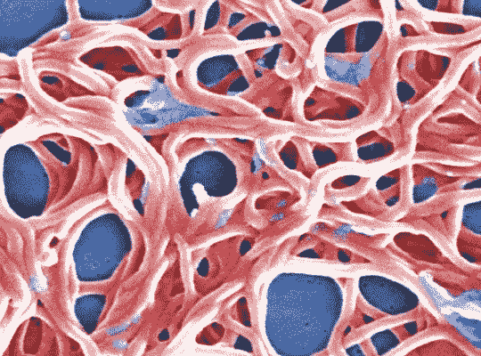
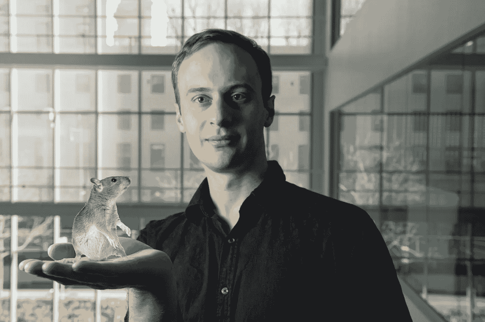
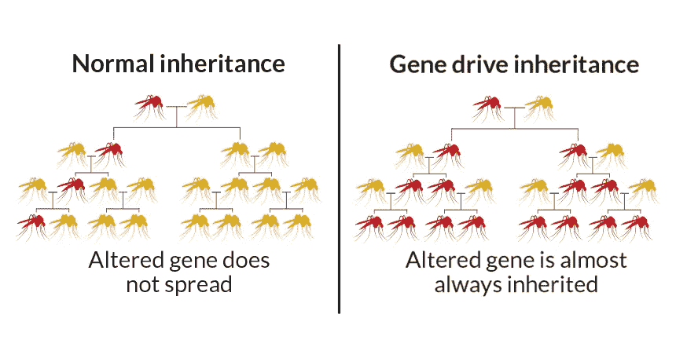
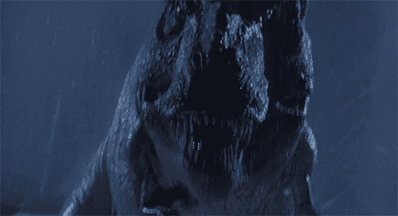
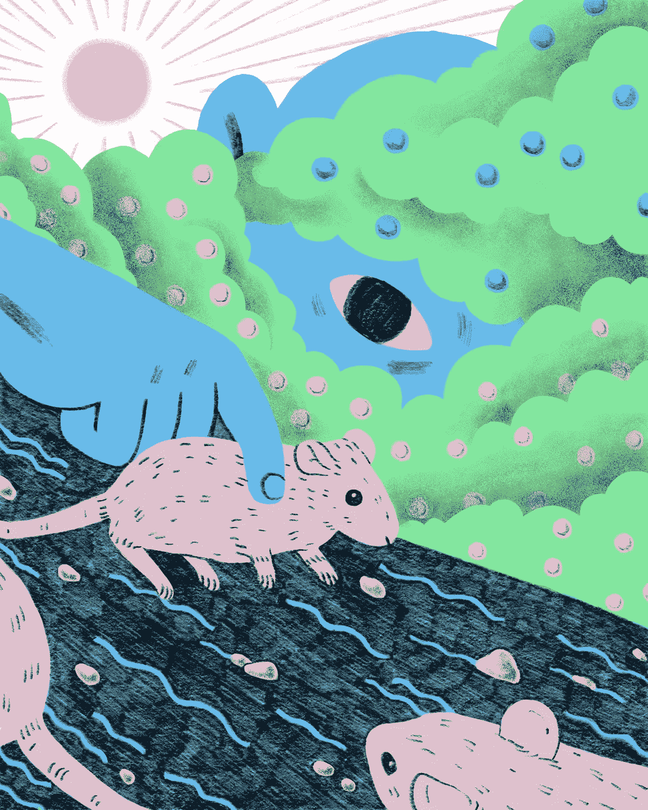

# 再见了莱姆病✌️

> 原文：<https://medium.datadriveninvestor.com/goodbye-lyme-disease-%EF%B8%8F-9628545e3825?source=collection_archive---------7----------------------->

## 👋你好生态系统工程。

# "莱姆病是我们的自然灾害."

——凯文·埃斯韦尔特

(Credit: Earth.com)

在美国西海岸，自然灾害包括:龙卷风、飓风和森林火灾。🔥

在美国东北部，

> "莱姆病是我们的自然灾害."——凯文·埃斯维尔特在接受吉纳维芙·拉杰夫斯基采访时说道

每年，超过 30 万美国人被诊断患有莱姆病。

太疯狂了。🤯

 [## 流氓基因组编辑扭曲 DNA 伦理|数据驱动的投资者

### 基因组编辑是科学的前沿。这在道德上也是有问题的，在许多方面可能是非法的…

www.datadriveninvestor.com](https://www.datadriveninvestor.com/2019/02/18/rogue-genome-editing-twists-dna-ethics/) 

但是多亏了进化生物学家和基因工程师，比如凯文·埃斯维尔特(麻省理工学院媒体实验室)，我们可以改变这种情况。

# 莱姆病是一种炎症感染。

它通过扁虱传播，扁虱是一种蜘蛛纲动物。

蜱是体外寄生虫。

他们基本上是微小的吸血鬼(像蚊子😉)因为它们靠吸食哺乳动物、鸟类和其他生物的血液为生。

被虱子咬和被吸血鬼咬的区别…

如果你被虱子咬了，你不会永远活着，也不会在阳光下闪闪发光。

You won’t have shape-shifting powers either. 😢(Credit: Universal Pictures)

事实上，如果你被携带莱姆病的扁虱叮咬，你就会患上由伯氏疏螺旋体引起的传染病。

那么，当你得了莱姆病会怎么样呢？

*   **失忆**
*   **心律问题**💔
*   **刺痛+麻木** 🥶
*   **反复出现的皮疹**
*   **对光的敏感度** ☀️ **(可能这个和吸血鬼差不多…但是不好玩)**
*   **局部瘫痪**
*   **还有更多**😤

患有莱姆病会降低一个人的生活质量，并且根据病情的严重程度，会阻碍人们的日常活动(工作、学校等)。).

我记得去过一次生态旅行🚌2018 年，在我的科学课上，我的一个同学最终被虱子咬了，患上了莱姆病。

由于光敏感、关节痛和持续头痛等症状，他在今年余下的时间里无法去学校。😔

目前对莱姆病的治疗是抗生素药丸，有时是静脉注射抗生素。💊也有一些天然药物可以杀死莱姆病，比如精油。

总的来说，生活在莱姆病中(就像生活在任何疾病中一样)并不愉快。

是时候找到一种防止莱姆病传播的方法了，这样我们就不必到了需要治疗和害怕在树林里散步的地步。

# 生态系统工程可以帮助对抗莱姆病。

There’s many parts to an ideal tick-borne disease transmission ecosystem. The white-footed mouse is abig part. (Credit: Tufts Magazine)

通过对蜱传疾病传播的最佳环境进行逆向工程，莱姆病病例可以显著减少。

这可以通过对白足鼠进行莱姆病免疫来实现。🐭

在我们深入探讨这个问题之前…

以下是美国东北部目前蜱媒疾病传播的最佳环境:

*美国东北部的森林支离破碎，这有利于蜱传疾病传播周期中的三个主要物种:

1.  **黑腿“鹿”蜱**
2.  **白足鼠**
3.  **鹿**🦌

## 不那么有趣的事实:

蜱以动物(鹿、白足鼠等)为食。)并传播疾病。

鹿身上有成千上万的虱子。

白足鼠比其他任何动物都更善于传播和获取蜱传病原体。

在这种情况下，病原体是*伯氏疏螺旋体*。

Borrelia *burgdorferi* bacterium. (Credit: Unknown)

多亏了支离破碎的森林🌳由东北部地区的人类活动引起的莱姆病可以像野火一样传播，因为所有三个物种都在一个生态系统中茁壮成长。

多亏了生态系统工程，这种情况现在可以改变了。

## 生态系统工程:

*物理生态系统工程是生物体对非生物环境进行改造的一种特殊形式，这种改造经常但不总是对生物区系(特定区域的动物+植物生命)及其相互作用产生影响。*(鸣谢:科学直击)。

通过用基因驱动免疫白足鼠来重新设计蜱传疾病循环，科学家们将从生物上设计一个生态系统。

这种类型的生态系统工程没有定义，因为它刚刚开始随着基因工程技术的新进展而被探索。

不同之处在于:科学家将介入**工程环境中的生物元素**来重建生态系统，而不是通过生物体来改变非生物环境。🌎

# 通过基因驱动控制白足鼠的免疫基因。

让白足鼠对伯氏疏螺旋体免疫的想法最初是由萨姆·特尔福德教授(卡明斯学校)在他的鼠抗蜱项目中提出的。😎

在与 Linden Hu 教授(塔夫茨学校)的合作中，Telford 设计了一种基于诱饵的疫苗来免疫这些小鼠。

唯一的问题？

捕捉树林中的所有老鼠并给它们接种疫苗需要太长的时间！⏳

Kevin + a genetically engineered mouse. 🐭(Credit: Unknown)

然后，来自麻省理工学院媒体实验室的进化工程师 Kevin Esvelt 决定利用基因工程工具 CRISPR 来提高免疫过程的效率。

他意识到，在*解码白足鼠基因组，识别+分离某些白足鼠进化出的最有效的莱姆病抗性基因*中，这个问题就可以解决了。

这可以通过基因驱动来实现。 🧬

基因驱动是一种基因工程技术，它在整个群体中传播一套特定的基因。

在这种情况下，结合最有效的**莱姆病抗性基因**并编辑到基因组中，这样它们就可以遗传给白足鼠的后代。

这些基因工程小鼠(如果安全的话)将被释放到最佳的蜱媒传播环境(玛莎葡萄园岛+楠塔基特岛)中，以*在该生态系统中的几乎所有小鼠*中产生对蜱媒疾病的强大天生抵抗力。

如果生态系统中的老鼠对莱姆病免疫，那么鹿蜱和鹿的蜱传疾病循环应该被逆转，从而减少莱姆病病例的数量。🎉

# 利用 CRISPR 基因驱动将抗体从免疫细胞编码到生殖细胞。

你可能想知道…

这种免疫力到底如何才能遗传给后代？

秘密就在我之前提到的那些基因驱动中。具体来说，CRISPR 基因驱动。

**CRISPR** 是一种基因工程工具，能够*修改生物体基因组的部分内容。*

在 CRISPR 基因驱动中， *CRISPR DNA 序列被编码到生物体的生殖细胞中*，以便物种的下一代可以在早期被编辑以表达特定的基因组。😎

How gene drives work. (Credit: Science News)

一旦发现了控制小鼠对蜱传疾病免疫力的基因组合，这种组合可以在整个种群中传播。

其工作原理是免疫白足小鼠细胞中的抗体被编码到基因工程小鼠的生殖细胞中。

能够被编码以产生针对伯氏疏螺旋体细菌的免疫力的两种保护性抗体是 ***Mus* 和 *Homo 抗体。***

当白足鼠繁殖时，控制莱姆病免疫力的抗体和基因组通过 CRISPR 基因驱动传递给下一代。😄

# 获得社区对逆向工程生态系统的认可非常重要。🔑

围绕生态系统工程有很多伦理上的争论。

这是有道理的，因为将一种转基因生物引入野外会有很多问题。

我是说，你看过侏罗纪公园吗？

🦖 (Credit: Universal Pictures).

好吧，我们还没到恐龙时代。

但关键是，我们需要确保这些基因工程小鼠被释放到的社区对此感到舒适，并且这些小鼠是安全的。

谢天谢地，这是 Kevin Esvelt 和他的团队的首要任务。他们认为，从他们为之工作的生态系统工程项目的社区获得投入+批准是至关重要的第一步。

为凯文鼓掌！👏

# 关键要点:

*   莱姆病是一个大问题，每年影响超过 30 万美国人！
*   **伯氏疏螺旋体** **是导致莱姆病的病原体。**
*   **通过逆向工程，最适合蜱传疾病传播的生态系统可以减少莱姆病病例。**
*   **基因驱动与 CRISPR 等基因工程工具相结合，可以在玛莎葡萄园岛和楠塔基特岛的几乎所有白足鼠中产生免疫力。**
*   **重要的是讨论道德含义，并寻求正在改造其生态系统的社区的认可和意见。**

# 这里有一些资源供好奇的读者查阅。😉

*   了解更多关于 Kevin Esvelt 的基因驱动。
*   了解更多关于 [CRISPR 基因驱动的信息。](https://www.nature.com/articles/d41586-018-05665-1)
*   了解更多关于[老鼠对抗蜱](https://www.responsivescience.org/mice-against-ticks)项目的信息。
*   了解更多关于凯文研究的信息。

在 CRISPR 基因驱动等新技术的帮助下，没有莱姆病的未来比以往任何时候都更近了！🎉

在得到社区的批准后，Kevin (+他的团队)希望开始老鼠的第一次试验，以期解决美国东北部的自然灾害。

如果这行得通，对当地社区来说将是惊人的！

我真正想强调的是，在这样做之前，考虑基因工程生态系统的所有影响是很重要的。

我喜欢 Kevin 在前进之前获得当地社区的意见和认可的方法。😍

为了创造一个没有莱姆病的未来，我们需要合作，并确保解决方案是合乎道德的。

Releasing the Lyme immune super-mice. (Credit: WNYC)

你好。非常感谢您阅读这篇文章。我希望你学到了新东西。

👋我是阿达拉。16 岁的革新者、作家、有抱负的基因工程师、海洋生物学家和宇航员。我的使命:*利用新兴技术帮助解决一些世界上最大的问题。*

## 想跟随我的旅程去帮助解决一些世界上最大的问题吗？

在[媒体](https://medium.com/@astronautadara)上关注我，查看[我的作品集](https://tks.life/profile/adara.hagman)，在[Linkedin](https://www.linkedin.com/in/adara-hagman-78a563171/)+[Twitter](https://twitter.com/astro_adara)上与我联系。

这就是我今天的全部内容。

下次见！

✌️Dara