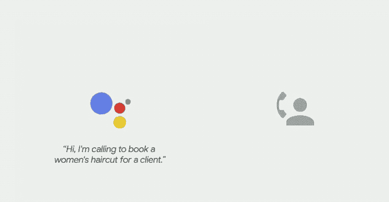
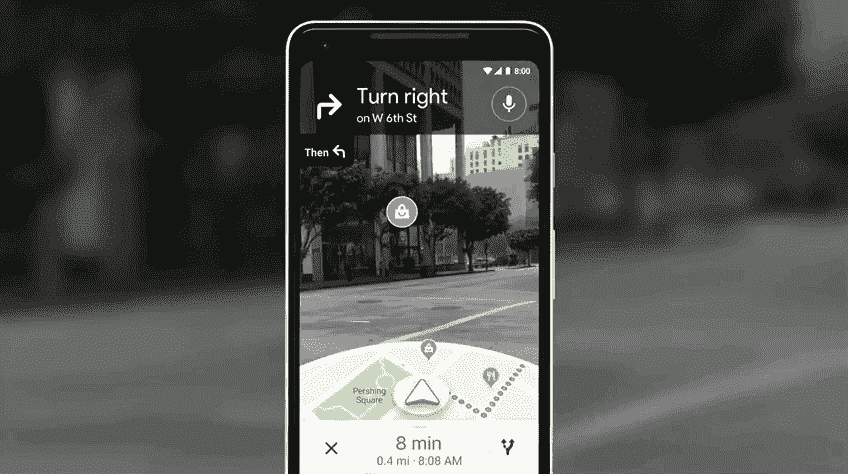

# 谷歌将人和人工智能更紧密地联系在一起(但不是你想的那样)

> 原文：<https://medium.datadriveninvestor.com/google-brings-people-and-ai-closer-together-but-not-the-way-you-think-5ba70576ed1?source=collection_archive---------2----------------------->

谷歌最近展示了很多人工智能技术，赢得了观众和科技博客的一片欢呼。例如: [Gmail 现在会自动完成您的电子邮件](https://www.theverge.com/2018/5/10/17340224/google-gmail-how-to-use-smart-compose-io-2018)。你输入:“我有”，谷歌输入“昨晚在你的派对上真的很开心”。进入。完成了。

这可能是一个很酷的应用程序，但它被误导了。多亏了自动完成功能，我们不再知道如何拼写长单词的结尾，这还不够吗？我们真的想让人类不用考虑他们句子的后半部分吗？作为一名教师，我每天都会遇到一些学生，他们很难将句子组织起来，将这些句子链接成段落，然后将这些段落组合成高中论文水平的论点。在校外，我看到咖啡师打开计算器应用程序，算出一张 5 美元的钞票换成 3.5 美元是多少。

是啊是啊。我知道。我真是个勒德派机器人专家。我应该意识到技术只会帮助我们更有效。但是我们到底有多不愿意为自己着想呢？每一个这样的功能，谷歌的人工智能只是从我们的生活中带走了一点点恼人的思考，并增加了一点点自动化。但是在这个过程中，我们忽略了一个事实:思考实际上对你有好处！

但问题不仅仅是谷歌的每一项功能都让我们变得更加迟钝。谷歌的人工智能为我们做更多思考的一个重要副作用是，它也带走了另一条思想多样性，并用更多的一致性取而代之。如果我想说一些与谷歌机器学习发现的两亿其他人在类似情况下写的略有不同的东西呢？我真的会坚持我的措辞吗？文本已经在那里了，只需要输入就可以了。太简单了！我真的那么在乎那些细微之处吗？谁有时间做那个？我有广告可以点！进入。完成了。

结果是我们越来越听起来一样。这很好。至少对机器学习算法来说是这样。我们越容易预测，预测我们就越容易，预测我们的人工智能似乎就越好！大家都赢了！🎉

在宣布 Smart Compose 的同一个 I/O 活动上，我们看到了新的 Google conversation [代理预订餐厅位置和理发](https://ai.googleblog.com/2018/05/duplex-ai-system-for-natural-conversation.html)，这让互联网感到非常惊讶(“图灵测试:[解决了](https://www.designnews.com/design-hardware-software/duplex-googles-new-ai-assistant-passes-turing-test/85110021158734)！”).这个演示既令人印象深刻又令人不安。令人印象深刻，因为他们做了一些看起来很难的事情。所以，伟大的技术工作值得称赞！

但这也令人不安，因为它如此有效的原因之一也是人们自己变得更加可预测。就像自动完成和智能合成一样，硅谷提倡的以技术为中心、以效率为导向的文化让我们打字更少、思考更少、环顾四周更少、更不自觉地浏览我们的空间(更多内容见下文)，结果是它让人们变得更相似、更可预测。这种可预测性包括电话另一端的人。

最讽刺的是。我们每天都有关于人工智能变得越来越聪明、越来越像人类的新闻报道。但同时，我们也变得越来越笨，越来越像机器人。这至少部分是因为我们主要通过技术交流，所以我们的交流变得更加适应技术。真正的中间相遇。

我越来越觉得，凭借最新的技术，谷歌只是想推广更多这方面的东西，确保我们甚至不必打电话给理发师。上帝禁止我们进行人与人之间的对话。用语音！而且停顿了！人类！这可能只会把下一个人工智能搞砸。

最后，谷歌宣布了谷歌地图的 [AR 覆盖图](https://techcrunch.com/2018/05/08/maps-walking-navigation-is-googles-most-compelling-use-for-ar-yet/)。我们为什么需要这个？听听台上的谷歌代表是怎么说的，他告诉我们当你花了 20 秒钟才意识到自己走错了方向是多么令人沮丧。是的，尽管我们的身体 24/7 都有 GPS 地图，但在我们的世界中仍然有一个令人讨厌的短暂迷路的机会。

当我听到“走错方向”时，我把它当成一个环顾四周的机会；看到我们没有明确寻找的东西；机缘巧合的最后痕迹。在效率文化中，我们不想要这些。所有这些“问题”现在都解决了！再说一次，我们更容易预测，因此人工智能可以更好地预测我们，而没有令人讨厌的四处游荡的数据噪音，这些噪音会扰乱机器学习算法。

Zeynep Tufekci 称硅谷“道德沦丧”是正确的，最新的最佳节目特写强调了这一点。[别人](https://www.amazon.com/Know-Alls-Political-Powerhouse-Wrecking/dp/1620972107)，[太](https://www.amazon.com/Reclaiming-Conversation-Power-Talk-Digital/dp/0143109790)，说得比我好，长文格式。有一点是肯定的:随着科技行业盲目前进，越来越需要学术和维权作家对这一队伍进行意识形态检查。