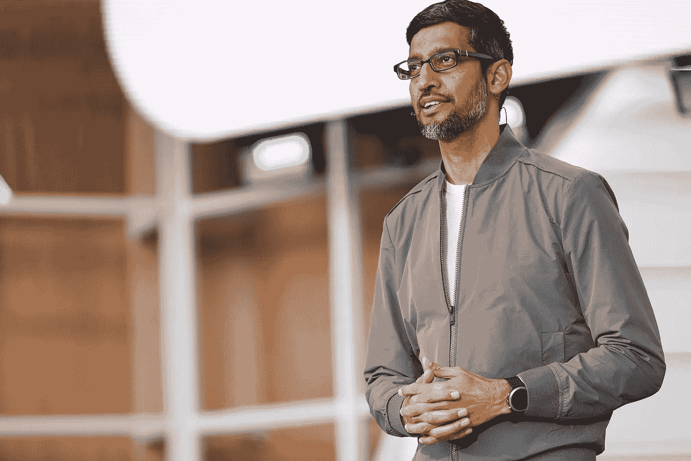

# 谷歌首席执行官 NYT 关于隐私的专栏有一个有趣的转折

> 原文：<https://medium.datadriveninvestor.com/google-ceos-nyt-op-ed-on-data-privacy-has-an-interesting-twist-2963b3b66d78?source=collection_archive---------6----------------------->

桑德尔·皮帅在《NYT》上发表了雄辩的文章，巧妙地将保护用户数据隐私的责任推给了我们——用户和其他所有人。

Source: [https://events.google.com/io/](https://events.google.com/io/)

侵犯用户隐私和滥用用户数据已经引起了许多隐私专家的强烈抗议，这是理所当然的。IBM 因在一个面部识别项目中使用 Flickr 照片而受到抨击，众所周知,[亚马逊的员工在监听你的私人谈话，脸书从一个](https://lighthouse3.com/its-not-your-imagination-amazon-employees-are-listening-to-your-private-conversations/)[隐私灾难中蹒跚而行，像酒吧爬行中的醉汉一样从一个](https://www.nytimes.com/2018/03/20/business/ftc-facebook-privacy-investigation.html?module=inline)走向另一个，甚至[政府机构](https://www.theguardian.com/us-news/2019/may/07/san-francisco-to-ban-government-from-using-facial-recognition-technology)也在为隐私担忧而挣扎。

谷歌首席执行官桑德尔·皮帅因其高智商而赢得了良好的声誉，他还对终端用户心理有着敏锐的理解。他在《纽约时报》上雄辩地写了一篇文章“隐私不应该是奢侈品”。不出所料，它的发布时间与谷歌年度开发者大会 I/O 上公布的一系列新的隐私和安全功能不谋而合。它凸显了谷歌公关机器的精湛，应该会打消人们对谷歌为何是科技界如此强大的力量的任何疑虑。

 [## 区块链驱动的社交媒体 2.0 能取代脸书吗？-数据驱动型投资者

### 到 2021 年，活跃的社交媒体用户的数量预计将达到令人难以置信的水平，超过三分之一的…

www.datadriveninvestor.com](https://www.datadriveninvestor.com/2019/03/20/could-blockchain-powered-social-media-2-0-dethrone-facebook/) 

所以还是把皮柴说的拆开吧因为有很多！

> 谷歌产品旨在提供帮助。它们消除了日常生活中的摩擦(例如，在漫长的一天结束时给你指出回家的最快路线)，让你有时间做你真正想做的事情。我们感到荣幸的是，数十亿人相信搜索、Chrome、地图和 Android 等产品每天都在帮助他们。

## 我们的产品每天都在帮助你。

皮查伊首先列出了所有谷歌最受欢迎的产品，以及它们如何帮助我们——用户。潜在信息=你喜欢我们的免费产品，所以不要这样忘恩负义，牢骚满腹，好吗？！

> 今天的人们理所当然地关心他们的信息如何被使用和分享，然而他们都以自己的方式定义隐私。

## 我们听到了。

他承认对隐私的担忧，并让用户觉得他们的担心是有根据的。谷歌明白了，各位！

> 为了实现隐私，我们为您的数据提供了清晰、有意义的选择。同时坚守两条明确的政策:谷歌永远不会向第三方出售任何个人信息；你可以决定如何使用你的信息。

## 我们给你控制你自己数据的权利…算是吧。

皮查伊接着说，谷歌永远不会向第三方出售“个人信息”。听我吼脸书和苹果！基于谷歌的[隐私政策](https://policies.google.com/privacy?hl=en#infosharing)，[非个人身份信息](https://policies.google.com/privacy?hl=en#footnote-info)是公平的游戏。此外，私人数据可以通过其他直接/间接的方式传输，这在技术上不是“出售”，但我们会让法律专家来解决这个问题。

> 即使我们提供像 YouTube Premium 这样的付费产品，其中包括无广告的体验，普通版本的 YouTube 也有很多内置的隐私控制。

## 你可以控制自己的隐私，你知道的。提示。提示。

注意从“我们听到你的声音，我们给你控制权”到“你尽你的责任了吗？”值得称赞的是，谷歌确实引入了许多隐私控制措施，但专家们认为这是不公平的，因为最近的许多变化让[把责任推回给了用户](https://www.wired.com/story/googles-new-privacy-features-put-the-responsibility-on-users/)

> …数据让你使用的产品和服务对你更有帮助。

## 好吧，所以我们用了你的一些数据，但这是为了你好。

一次又一次，谷歌依靠“我们为你创造伟大的产品”的旋转，他们确实提出了一个公平的观点。普通用户理解准确性和隐私之间的权衡。也就是说，使用你的位置来获得准确的方向和让广告商跟踪你是有很大区别的。

> …产品总体上使用匿名数据，以便为每个人提供更多帮助。

## 即使当我们使用您的数据时，我们也会考虑周全。

这里是皮查伊做推介的地方——相信我们。我们是谷歌。我们会尽一切努力保护您的隐私(但有一些警告)。隐私专家指出，即使有了聚合和匿名化，谷歌数据集中的偏见也可以并且正在被用来对付少数群体。

> …一小部分数据有助于提供相关的广告，并提供保持谷歌产品免费和可访问的收入。

## 提醒—我们可能会使用您的一些私人数据，但至少我们的产品是免费的。

用户可以选择。我们都可以使用无广告的付费产品，但相反，我们有意或无意地选择放弃一些隐私来获得免费产品。但是，让隐私和消费者权益专家夜不能寐的是，用户正在放弃越来越多的隐私，因为咄咄逼人的广告资助公司欠广告商和股东的人情。保护消费者的界限不断被推至消费者不再知道他们放弃了什么的程度。

> 八年前，我们推出了一种简单的方法，可以从谷歌服务中导出你所有的数据，甚至可以带到其他地方。

## 是的。你可以带着你的数据离开。但我们都知道这是不可能的，宝贝！

鉴于科技界顽固的达尔文主义，许多伟大的产品没能进入黄金时间，或者被谷歌等科技巨头收购。所以，理论上，你可以选择离开你控制欲极强的男朋友，但他已经杀了你所有的潜在对手，所以你可能会和那个混蛋在一起一段时间。

> 上周，我们宣布了重要的新隐私功能，包括一键访问我们所有主要产品的隐私设置，以及允许您选择数据保存时间的[自动删除控件](https://www.androidcentral.com/google-auto-delete-feature-announced)。

## 看啊！更多专为您打造的亮丽新功能。

这就是了。皮查伊巧妙地将责任推给了用户，让他们追踪自己的个人数据是如何被追踪的，这些数据会被保存多久，如何被使用，等等。普通用户甚至不知道在他们需要扔掉冰箱之前，中国外卖需要多长时间才能开始发臭，更不用说试图计算他们的私人数据在被滥用之前应该存储多长时间。这是谷歌的一些真正的天才策略，但有一个[可能已经适得其反](https://www.wired.com/story/googles-new-privacy-features-put-the-responsibility-on-users/)。

> 我们也在努力挑战产品需要更多数据才能更有帮助的假设。

## 我们将减少使用您的数据。(我们已经有很多了)

谷歌和其他科技巨头已经拥有大量关于我们的数据。他们用我们的数据训练了人工智能机器，这就是它们如何能够自动填充、自动纠正任何问题。因此，未来的隐私问题很可能不仅仅是如何收集或存储数据，而是如何被用来操纵用户做出对他们不利的决定。

> 尽管我们在自己的产品中取得了隐私和安全方面的进步，但我们知道，作为个人，我们都想要的隐私依赖于许多机构的合作和支持，如立法机构和消费者组织。

## 这不仅仅是谷歌的问题。这是每个人的问题。

有没有过这样的经历:在一次小组会议上，某个非常聪明的人请你分享你的想法，你非常兴奋，但随后你发现他们甚至在你刷牙之前就已经做出了决定？！但在那短暂的一瞬间，你感到被包容和被赋予了力量，对吗？！谷歌在这个问题上已经有了自己的观点，他们应该有。通过让它成为每个人的问题，谷歌将自己定位于问题的中心，并巧妙地利用其他不情愿的参与者对其“团队项目”的善意来保护自己。

> 立法将有助于我们努力确保世界各地更多的人能够获得隐私保护。但我们不会等待。我们有领导的责任。我们将秉承一贯的精神，通过提供让每个人的隐私成为现实的产品来做到这一点。

## 在没有立法的情况下，我们会自己写。

这一切都归结于一点——感谢像谷歌这样的公司，用户可以免费使用伟大的产品，公司通过货币化我们的私人数据来获利。谷歌和其他公司将积极尝试制定立法来保护他们的底线，同时希望美国国会不会突然良心发现，试图保护消费者。我们可以围绕什么是或什么是我们的数据可接受的使用划定严格的界限，但针对财大气粗的企业游说者的力量实施这一界限仍将是一场艰苦的战斗。

## 无需向我们发送反馈，我们有人工智能来自动填充您的想法。爱你的谷歌。