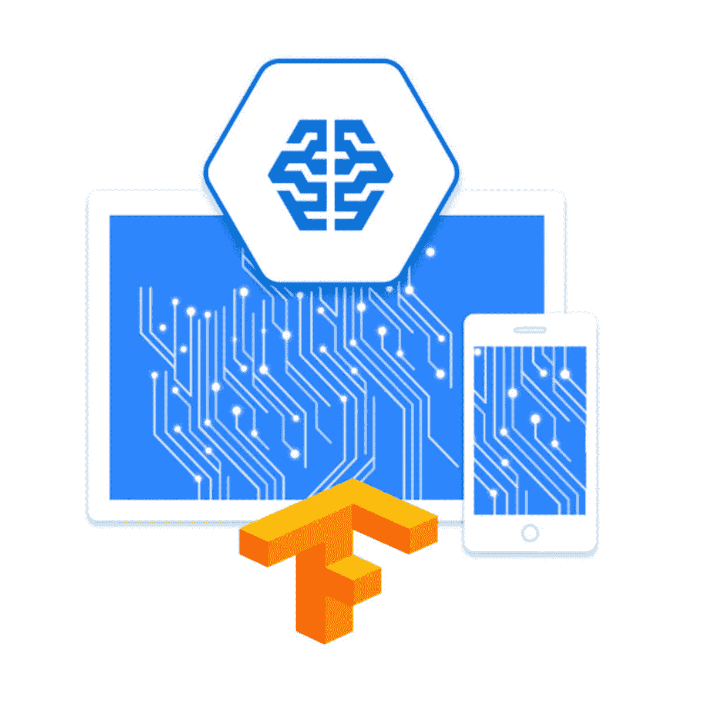
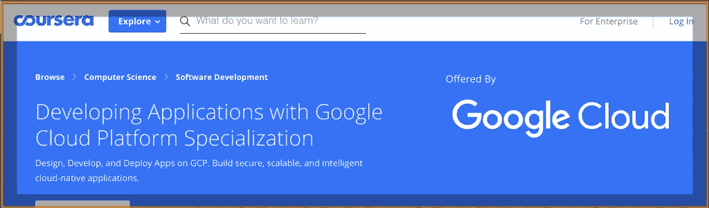
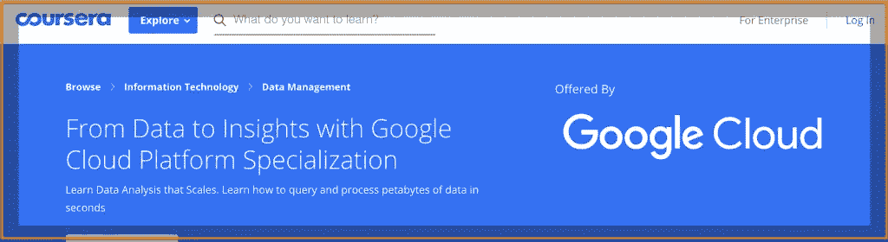
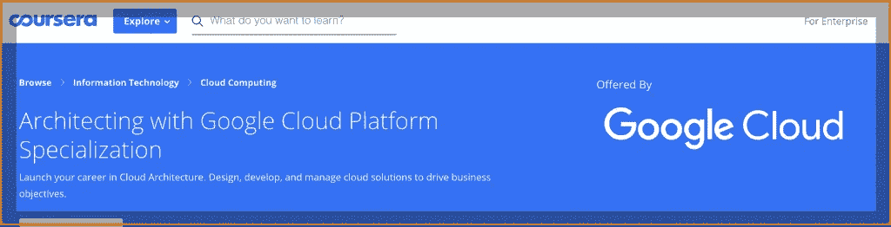
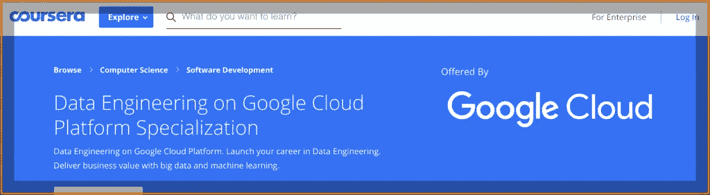
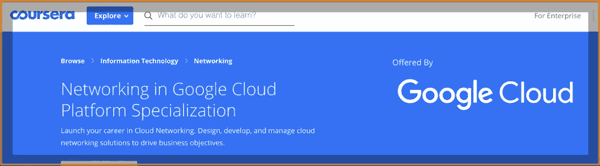
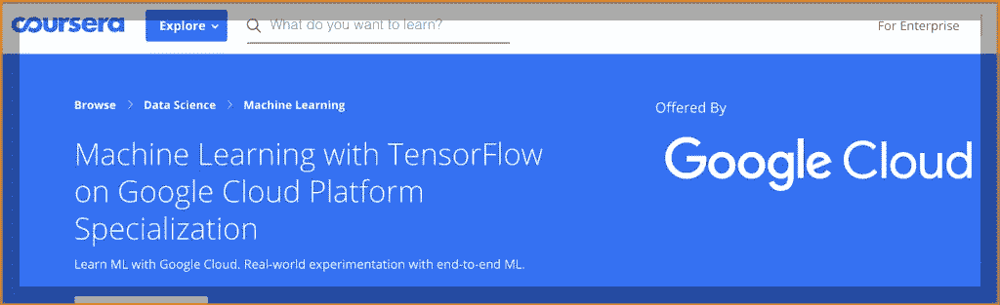
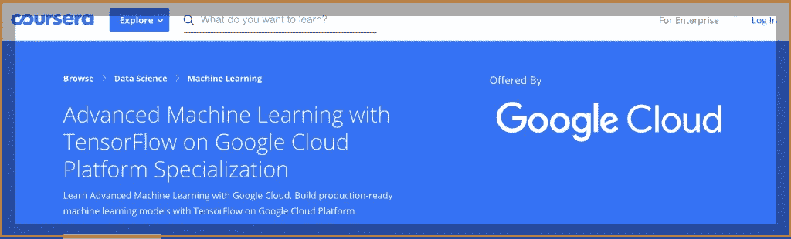
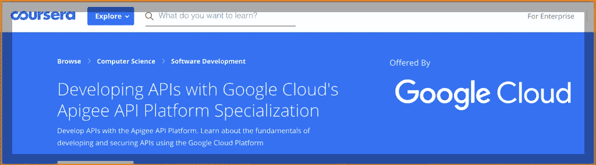

# 如果你正在准备谷歌云认证，从这些课程中的一个开始

> 原文：<https://medium.datadriveninvestor.com/google-cloud-certification-training-courses-b3feec317606?source=collection_archive---------30----------------------->

Google Cloud Certification Training Programs

如果您已经在使用 Google Cloud，准备认证有助于通过澄清关键概念、理解共享术语来强化您的知识，并获得一定水平的使用 Google Cloud 技术的专业知识，从而加快云项目的价值实现。

# 谷歌云提供的谷歌云认证培训计划

谷歌认证本身以其评估候选人技能的严格性和彻底性而脱颖而出，强调在谷歌云技术上设计、开发、管理和实施应用基础设施和数据解决方案的实践经验。

## 1.[使用谷歌云平台开发应用](https://sinxloud.com/fly/developing-applications-with-google-cloud-platform-specialization-google-cloud-coursera/)

**使用谷歌云平台**开发应用是一项专业课程，由四门课程组成，结合了演示、演示和与 [qwiklabs](https://qwiklabs.com/) 的实践，让应用开发人员学习如何使用谷歌云平台服务和预先训练的机器学习模型和 API 来构建可扩展、安全和智能的云原生应用。

Developing Applications with Google Cloud Platform

***适合你吗？***

这种专业化适合于**应用程序开发人员**学习如何设计、开发和部署无缝集成组件的应用程序，以及构建高效的云原生应用程序或重新设计将在 Google 云平台上运行的现有应用程序。 [***了解更多***](https://sinxloud.com/google-cloud-certification-courses-specialization-training-classes/#1-developing-applications-with-google-cloud-platform)

## 2.[借助谷歌云平台从数据到洞察](https://sinxloud.com/fly/from-data-to-insights-with-google-cloud-platform-specialization/)

**使用谷歌云平台从数据到洞察**是由四门课程组成的专业化课程，教授开发人员如何使用谷歌云平台通过数据分析和可视化获得洞察。也让学习者能够从不同的 Google BigQuery 数据集中探索、挖掘、加载、可视化和提取见解。

From Data to Insights with Google Cloud

***适合你吗？***

这种专业化适合于**数据分析师**、**商业分析师**、**商业智能专业人士**、**云数据工程师**希望在谷歌云平台上构建可扩展的数据解决方案。如果您精通 ANSI SQL，那么这种专业化非常适合您。 [***了解更多***](https://sinxloud.com/google-cloud-certification-courses-specialization-training-classes/#2-from-data-to-insights-with-google-cloud-platform)

## 3.[使用谷歌云平台进行架构设计](https://sinxloud.com/fly/architecting-with-google-cloud-platform-specialization-google-cloud-coursera/)

**使用谷歌云平台进行架构设计**是由六门课程组成的专业课程，旨在向开发人员介绍谷歌云平台提供的全面、灵活的基础设施和平台服务。该专业提供对网络、系统和应用服务等基础设施组件的广泛学习，您将学习部署实用的解决方案，包括安全互连网络、客户提供的加密密钥、安全性等。

Architecting with Google Cloud

***适合你吗？***

这种专业化适合想要创建新的解决方案或将现有系统、应用环境和基础设施与谷歌云平台集成的**云解决方案架构师**和 **DevOps 工程师**。 [***了解更多***](https://sinxloud.com/google-cloud-certification-courses-specialization-training-classes/#3-architecting-with-google-cloud-platform)

## 4.[谷歌云平台上的数据工程](https://sinxloud.com/fly/data-engineering-on-google-cloud-platform-specialization-google-cloud-coursera/)

**谷歌云平台上的数据工程**是一个为期五周的专业课程，为开发人员提供在谷歌云平台上设计和构建数据处理系统的实践介绍。这个专业将帮助你设计数据处理系统，建立端到端的数据管道，用于分析数据和应用机器学习。

Data Engineering on Google Cloud

***适合你吗？***

这种专业化适合负责处理数据、创建和维护机器学习和统计模型的**开发人员**。本专业结束时，您将具备使用 Google 云平台处理 TensorFlow、Bigquery、Bigtable 和 Dataflow 的技能。 [***了解更多***](https://sinxloud.com/google-cloud-certification-courses-specialization-training-classes/#4-data-engineering-on-google-cloud-platform)

## 5.[谷歌云平台中的联网](https://sinxloud.com/fly/networking-in-google-cloud-platform/)

**Google 云平台中的网络**是一个由三门课程组成的专业，让学员广泛学习 Google 云平台上的核心基础设施和网络选项。本专业的主题还将涵盖常见的网络设计模式和使用 Google 云平台中的部署管理器进行自动部署。

Networking in Google Cloud

***适合你吗？***

本专业面向使用谷歌云平台的**网络工程师**、**管理员**或任何有积极性的**个人**，并希望了解更多关于谷歌云平台的软件定义的网络解决方案。 [***了解更多***](https://sinxloud.com/google-cloud-certification-courses-specialization-training-classes/#5-networking-in-google-cloud-platformhttps://sinxloud.com/google-cloud-certification-courses-specialization-training-classes/#5-networking-in-google-cloud-platform)

## 6.[Google 云平台上 TensorFlow 的机器学习](https://sinxloud.com/fly/machine-learning-with-tensorflow-on-google-cloud-platform/)

**在谷歌云平台上使用 TensorFlow 进行机器学习专业化**是一系列课程，将教你关于谷歌如何进行机器学习的艺术和科学。您还将获得对 TensorFlow 的介绍，并了解更多关于机器学习实验的基本技能，以微调和优化您的机器学习模型以获得最佳性能的技术。

Machine Learning with TensorFlow

***适合你吗？***

如果你有一些 Python 编程的经验，这个专业化将使你具备使用 TensorFlow 在谷歌云平台上进行**特征工程**的技能，tensor flow 是一个 Python 友好的开源数值计算库，使机器学习更快更容易。 [**了解更多**](https://sinxloud.com/google-cloud-certification-courses-specialization-training-classes/#6-machine-learning-with-tensorflow-on-google-cloud-platform)

## 7.[在谷歌云平台上使用 TensorFlow 进行高级机器学习](https://sinxloud.com/fly/advanced-machine-learning-with-tensorflow-on-google-cloud-platform-specialization-coursera/)

**在谷歌云平台上使用 TensorFlow 的高级机器学习**是一个五门课程的专业，专注于使用谷歌云平台的高级机器学习主题，在这里，您将通过使用 [qwiklabs](https://qwiklabs.com/) 的实践，获得优化、部署和扩展各种类型的生产 ML 模型的实践经验。

Advanced Machine Learning with TensorFlow

***适合你吗？***

这种专业化适合于**机器学习**和**数据科学爱好者**理解为结构化数据、图像数据、时间序列和自然语言文本构建可扩展的、精确的和生产就绪的模型的过程。这是使用 Tensorflow 构建推荐系统的高级专业化认证。 [***了解更多***](https://sinxloud.com/google-cloud-certification-courses-specialization-training-classes/#7-advanced-machine-learning-with-tensorflow-on-google-cloud-platform)

## 8.[用谷歌云的 Apigee API 平台开发 API](https://sinxloud.com/fly/developing-apis-with-google-cloud-coursera/)

**使用 Google Cloud 的 Apigee API 平台开发 API**是一个包含三门课程的专业课程，介绍了 Google Apigee 平台的独特功能，以及如何将它们应用到您的 API 中，以正确实现和保护它们。您还将学习如何使用 Google Cloud Platform 上的服务来设计、构建和部署您的 API 解决方案。

Developing APIs with Apigee on Google Cloud

***适合你吗？***

这种专业化适合于 **API 设计人员**和**开发人员**学习如何开发第一套 API，因为讲师会在一个特定的真实场景中进行讲解。你也可以建立自己的自由环境，更加了解 Apigee Edge 中的各种工具和现成的政策。 [***了解更多***](https://sinxloud.com/google-cloud-certification-courses-specialization-training-classes/#8-developing-apis-with-google-clouds-apigee-api-platform)

**出发前**

通过学习这些专业，您将对使用谷歌云技术有一个高层次的理解，并展示最新的谷歌云平台服务的最佳实践的持续专业技能和知识。

*原载于 2018 年 11 月 13 日*[*sinxloud.com*](https://sinxloud.com/google-cloud-certification-courses-specialization-training-classes/)*。*