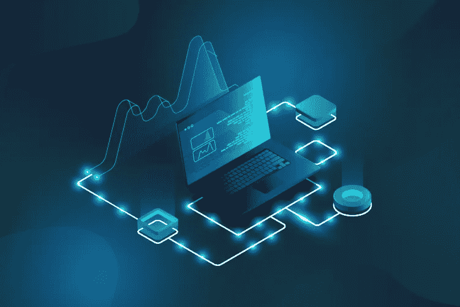
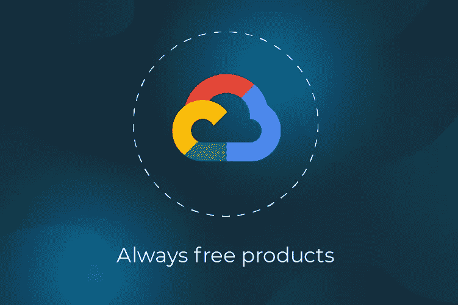

# Google 云平台免费层与初创公司的物理和云服务器

> 原文：<https://medium.datadriveninvestor.com/google-cloud-platform-free-tier-vs-physical-and-cloud-servers-for-startups-9212dad69421?source=collection_archive---------8----------------------->

十多年前，在专用的私有服务器上托管服务器软件是一种常见的做法。在云计算时代，这并没有发生很大的变化，因为许多企业继续使用云服务作为常规服务器。典型的场景是，每当一个项目需要新服务时，在 Amazon 上配置一个 EC2 实例。

因此，虽然这对于懒惰的开发人员来说很方便，但这种情况最终会导致为一个中等规模的项目运行大量这样的实例。而且，跑步意味着付出。

另一方面，主机提供商给了我们大量的组件，可以减少项目中使用的服务器数量。

# 托管您的应用程序的 4 个选项

## 选项#1:自我管理的物理服务器托管。

**优点:**即使使用低预算的硬件，通常也可以处理大量数据/请求。硬件是你的，你只需要让它运行。

**缺点:**你的团队需要一个 DevOps。以及一些有可靠的互联网连接和电力供应的地方或办公室来放置您的服务器。

该选项包括专用服务器、虚拟主机、EC2 和任何其他类型的服务，在这些服务中，您不拥有服务器，但仍然负责在目标机器上配置操作系统。

 [## 2019 年最值得学习的编码语言|数据驱动的投资者

### 在我读大学的那几年，我跳过了很多次夜游去学习 Java，希望有一天它能帮助我在…

www.datadriveninvestor.com](https://www.datadriveninvestor.com/2019/02/21/best-coding-languages-to-learn-in-2019/) 

## 选项 2:托管提供商托管的虚拟或物理服务器。

该选项包括专用服务器、虚拟主机、EC2 和任何其他类型的服务，在这些服务中，您不拥有服务器，但仍然负责在目标机器上配置操作系统。

**优点:**您的提供商保证互联网连接、电力供应和物理位置的可靠性。

缺点:你仍然需要一个 DevOps。

除了计算/执行环境，该选项还包括各种数据库、集成和数据处理组件。主要思想是，您只需要配置组件，而不用考虑 DevOps。

## 选项 3:来自云提供商的无服务器技术。

除了计算/执行环境，该选项还包括各种数据库、集成和数据处理组件。主要思想是，您只需要配置组件，而不用考虑 DevOps。

**优点:**通过适当的软件设计，可以免费或以比其他选择低得多的成本托管您的软件。

**缺点:**您可能会被特定云提供商的服务所困，很难迁移到另一个环境。

就人力资源而言成本高昂，但结合了上述所有方法的优点。使用该选项，您可以同时以不同的方式托管软件。您可以将大量操作转移到物理服务器上，从 Lambda/Cloud 函数中为大多数 API 请求提供服务，并为流量突发提供 EC2。

## 选项 4:混合云。

就人力资源而言成本高昂，但结合了上述所有方法的优点。使用该选项，您可以同时以不同的方式托管软件。您可以将大量操作转移到物理服务器上，从 Lambda/Cloud 函数中为大多数 API 请求提供服务，并为流量突发提供 EC2。

**优点:**对于一个大项目来说，这可以为基础设施提供最优的账单。

**缺点:**同样，你需要一个 DevOps。然而，与其他方法相比，DevOps 的工作量要大得多。

根据项目的规模，您可能更喜欢这些方法中的一种。两者都不好也不坏。这完全取决于你的具体业务目标。

# 谷歌云平台免费层优势

在本文中，我们不讨论企业和过于复杂的解决方案。所以让我们跳过选项 1 和选项 4。让我们也跳过选项#2，因为它太普通了，因此没有给人留下深刻印象。

我们的目标是充分利用无服务器技术和混合云，同时让一切免费。幸运的是，谷歌云平台为特定范围内的项目提供了大量免费服务。您可以在谷歌云平台免费层页面获得最新信息:【https://cloud.google.com/free/】T4。

谷歌云平台免费层提供:

*   12 个月，300 美元免费试用。这是谷歌给想要评估付费服务的开发者 12 个月试用期的费用；
*   永远免费的产品。从我们的角度来看，这是最令人兴奋的事情。有可能设计出允许特定项目永久免费运行的架构。对于开发者来说，这需要一些谷歌云技能和正确的心态。然而，从长远来看，这是值得的。

300 美元的奖金很酷，但你可能会花得太快。

理想的目标是构建一个使用自由层产品的架构，使业务不消耗或消耗有限的基础设施资源。

# 哪些项目可以永久完全免费托管在 Google Cloud 上？

嗯，这取决于你的团队的编程技能。今天，即使是最便宜的计算机也足以完成大量的工作。你只需要应用最有效的方式来使用这些资源。在 90%的情况下，你可以很容易地用简单的架构或软件开发缺陷来解释巨大的基础设施账单。

谷歌云平台工程师做了一项出色的慈善工作，设计了谷歌云平台免费层。有了一个对平台有很好理解的熟练团队，就有可能完全免费地主持中小型项目。

# 面向创业公司的谷歌云平台

在创业公司工作，最关键的是时间。因此，让我们描述一个从谷歌云平台中获得最大收益的场景，特别是对初创公司而言。

# 对于牵引前的创业公司

在早期阶段，在获得牵引力之前，必须考虑基础设施的成本。处理的数据量和请求量很小。在这个阶段，团队主要使用他们的产品向测试者和潜在投资者展示产品。这个阶段可以持续相当长的时间，对于很多项目来说，这个阶段也是最后一个。为了更快地上市，并让最初的创业团队在预算有限的情况下生存下来，可以:

# 对于正在获得动力的创业公司来说

当第一批用户开始使用项目时，提供积极的产品体验是至关重要的。您的第一批用户应该不会看到任何崩溃、中断、DDOSes 或损坏的页面。很多时候，这个项目由于愚蠢的错误而没有得到投资者，尽管它有一个聪明的商业想法和一个非常复杂的最先进的产品。相反，您需要跟踪各种业务标准。您需要跟踪任何事故，以便快速解决事故。

综上所述，您将受益于:

*   除非有一个不花钱的好朋友，否则不要使用 DevOps
*   基于面向文档的数据库构建数据库架构。然后，使用云 FireStore 数据库，它免费提供 1GB 的数据存储。
*   对于计划任务和数据聚合，您可以使用免费提供的 Google 计算引擎 F1-micro 实例。您可以使用基本的 Linux 设置。但是配置最小 Docker 布局要好得多。f1-微实例提供 0.2 个虚拟 CPU 和 0.60 GB。在启动生命周期的初始阶段，这样数量的 CPU 资源足以完成许多任务。但是 600 MB 内存可能是启动几个 Docker 容器的限制因素。尽管如此，如果项目堆栈包含 Node.js 或 Golang，在这样的机器上运行几个容器还是可能的。当然，这用 Golang 来完成更简单。在项目中使用 Docker 对架构来说是非常好的，因为以后，这样的布局可以无限制地扩展。
*   项目 API 可以通过 200 万次免费调用谷歌云功能来构建。花费免费的 Google 计算引擎内存资源在 Docker 容器中托管 API 是没有用的。相反，API 可以作为 lambda 函数部署，同时为计划任务保留计算引擎资源。未来，当你超过谷歌云功能免费层限制时，很容易扩展到付费版本或将云功能迁移到 Docker 容器或 Kubernetes 引擎，玩[https://github . com/Google Cloud platform/Functions-framework-nodejs](https://github.com/GoogleCloudPlatform/functions-framework-nodejs)。
*   使用 Google Cloud 发布/订阅实现集成。每月 10 GB 的消息是免费的。即使对于一个大型项目来说，这个数量也足够了。当然，架构不应该让你太快耗尽这个极限。通过以减少总消息长度的方式设计消息格式，很容易实现这一点。反过来，这种减少可以通过使用 GRPC 协议和谷歌协议缓冲区而不是 JSON 来实现。此外，您应该注意集成协议的消息设计。发布/订阅方法最适合连接 API、用于数据处理和聚合的 Docker 容器以及数据库端。

# 牵引后启动增长

你可以从小处着手。但是突然之间(这应该有一天会发生)，你得到至少五千个用户生成数据。这是向大投资者展示你的创业公司，为项目成功欢呼的最佳时机。但是重要的资源意味着重要的责任。

开发团队应该为项目的成功做好准备。现在是思考的时候了:

获得牵引力后，您的基础架构目标是使项目回到自由层限制。当不可能时，您需要使用付费云或物理服务器，这取决于您是愿意租用服务器还是拥有服务器。

对于与基础架构相关的每个决策，您需要评估:

*   创建项目中使用的资源的摘要。最好跟踪过去 3 个月的使用情况，尝试预测使用增长的趋势。
*   监控日志中的崩溃，并消除它们。最后，日志不应该包含崩溃，从而减少日志存储的使用。不要在日志中跟踪常规活动，只跟踪对事件调查有意义的事件。
*   优化 CPU 使用。当然，在系统运行缓慢的情况下，更改云设置以授权更强的资源要简单得多。但这最终会导致启用越来越多的资源，直到您解决了 CPU 技术债务。尽管如此，在许多情况下，即使很小的代码优化也足以解决大多数 CPU 资源问题。
*   优化数据库和磁盘使用。这与 CPU 优化的执行方式相同。但是分析的参数是磁盘空间量。通常，很容易发现您的产品试图保存大量不必要的数据。
*   启用数据库索引。清理完数据库后，您可以分析查询性能。不要试图到处创建索引。索引本身会消耗计算机资源。最有用的方法是创建一个索引，以方便读取数据的方式来组织数据，并且不需要经常更新索引。否则，性能会比没有索引时更差。
*   优化计划任务。业务目标可能不需要系统中的一些预定操作。您应该写下执行的操作列表，并估计每个操作在资源方面的成本。然后，可以针对 CPU 使用率和磁盘存储进行优化。
*   优化，然后才付费或迁移。对于每个基础设施决策，您都应该考虑软件性能优化选项。升级服务器很容易。但是你可以在优化上花些功夫，赢得更多。每次都尝试优化，直到不可能为止。
*   迁移和优化速度慢的部分，而不是其他部分。最有可能的是，对于一个高负载的系统，没有必要迁移和优化所有组件。您应该找到瓶颈，并集中精力优化它们，或者在优化没有带来更多好处时进行迁移。

没有什么灵丹妙药，只有在当前条件下适合您的解决方案。

# 你的额外收获:谷歌云平台免费层的几种架构模式

*   如果您不投资优化软件，您将支付多少资源？
*   资源比软件开发更贵还是更便宜？这里还要考虑你要么永远为资源付费，要么只做一次优化。
*   你能合理快速地进行优化而不破坏你的产品吗？

# 静态网站托管

对于内容网站、登陆页面、早期创业公司，你很可能需要一个静态网站，它包含少量的 JavaScript，没有后端功能，但它是高度 SEO 优化的。您可以使用以下方式有效地托管此类网站:

# React.js 单页面应用程序托管

当您用特性扩展您的项目时，您最终添加了用 React.js 编写的类似仪表板的东西。此类应用程序的托管方式与静态站点相同。除了网站，您还有一个 API，它使用:

# WordPress 网站托管

*   谷歌云存储用于保存你的网站文件。空闲层包括 5 GB 的文件存储。对于大多数小网站来说，这是一个巨大的空间。
*   谷歌公共 DNS 是你需要的域名。专有域名从来都不是免费的。我们会说谷歌域名比其他域名要贵一些。所以，这就是你不应该(或不能)削减成本的地方。
*   您需要配置一个负载平衡器来将所有这些链接在一起。负载均衡器也是免费的，不像其他一些云。

最流行的建站方式怎么样？34%的网站是基于 Wordpress 的。它可以是个人博客，项目的技术博客，甚至是企业业务的网站。

WordPress 网站消耗的服务器资源完全取决于访问这个网站的访问者数量。因此，你可以在免费层提供的免费虚拟机上轻松托管一个 WordPress 博客。

要在谷歌云平台免费层上托管 WordPress 网站，你需要:

# 为移动应用程序托管 REST API

REST API 可能是您在制作单页面应用程序时创建的。移动应用程序 API 与单页面应用程序(SPA)API 没有什么不同。

托管 REST APIs 的最佳选择:

*   在谷歌云平台注册；
*   在 Google 计算引擎中创建一个项目并安装 WordPress。
*   在部署时，您需要选择“微型”服务器实例以保持在空闲层中。
*   配置负载平衡器和 DNS 服务器。

# 物联网集成 MVP

营销人员试图从物联网中挤出更多宣传。从技术上讲，物联网集成是一种基于消息、基于事件的 API，能够可靠地处理来自各种传感器的数据。没那么难。又来了一位来自自由层堆栈的优秀玩家:

物联网集成的架构应该是:

*   API 端点实现的谷歌云函数。免费层每月包含 200 万个 API 调用。
*   但是您可能希望使用 Google Compute Engine 免费实例来托管 API 的一些高负载部分。尽管如此，在大多数情况下，您并不需要这样做。

# MVP 人工智能团队的数据科学工作空间

对于一个数据科学家来说，拥有一个预装库、免费 GPU、快速互联网连接和强大 CPU 的云服务器是很好的。

# 语音和自然语言处理工具

*   使用云发布/订阅实现的消息总线，用于连接此类系统的所有部分。
*   物联网传感器要么直接与 Pub/Sub 对话，要么通过连接到外部域的云功能进行对话。
*   云功能或计算引擎组件处理设备数据。

对于许多初创公司来说，语音识别和 NLP 就像一个奇迹，拥有它很好，但很难实现。在这里，Google 让一切变得像两个 API 调用一样简单:

# 结论

*   Google Colab 来了。
*   它是一个基于 Jupyter 笔记本的 IDE，涵盖了数据科学基础研究的大部分任务。
*   更重要的是，这是一个免费使用[谷歌张量处理单元](https://en.wikipedia.org/wiki/Tensor_processing_unit.) (TPU)的绝佳场所，它使大多数神经网络的学习速度加快了 28 倍。

创业是一场艰苦的游戏。你的盔甲越多，就越容易赢得比赛。这篇文章是你创业的廉价基础设施决策世界的瑞士刀。很难在一篇文章中分享我们所能分享的一切。因此，请随时联系我们，了解每个基础架构场景的更多详细信息。

还有最后一笔奖金。创业总结清单:

*   [云自然语言](https://cloud.google.com/natural-language/)工具将你的文本转换成软件可理解的项目，可以被任何定制软件处理。这就是所谓的文本标记化，实体提取，语义分析。无论如何，这样的解决方案很难自制，但它有时为企业提供了相当好的机会。
*   [云语音转文本](https://cloud.google.com/speech-to-text/)引擎以及文本转语音引擎与谷歌 VOIP 和智能助手产品(Dialog Flow、谷歌助手、谷歌 Home)高度集成。您可以使用它们来启用项目的语音功能。

还在吗？太好了！那么我们肯定有东西要讨论，并把你的项目带到下一个层次！[现在就和我们的专家](https://www.zfort.com/contacts)谈谈。

*   您是否为云支付了大量费用？
*   明天你将为云支付多少钱？
*   你能把你的项目放入谷歌云免费层吗？
*   你能在业务的后期继续使用免费层吗？
*   你的架构能够在基础设施上省钱吗？
*   您的开发人员是否正在执行软件优化以消耗更少的资源？
*   您的开发人员会担心您的基础设施的成本吗？

*原载于*[*https://www.zfort.com*](https://www.zfort.com/blog/google-cloud-platform-for-startups)*。*