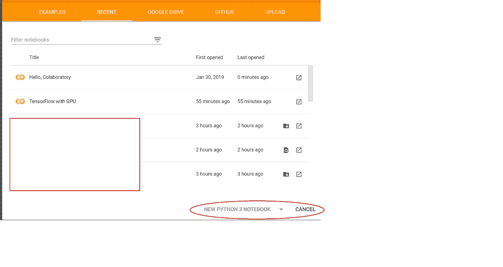
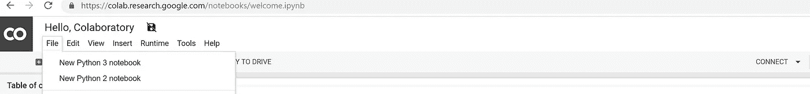
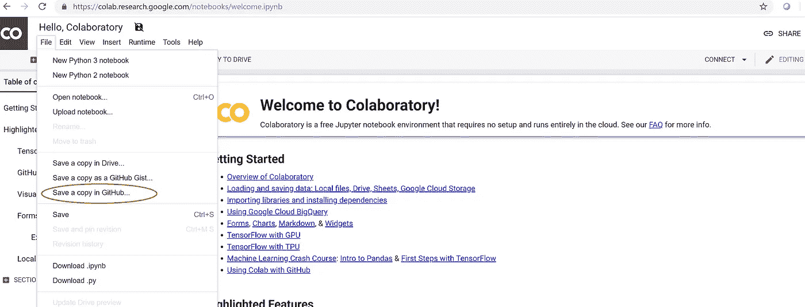
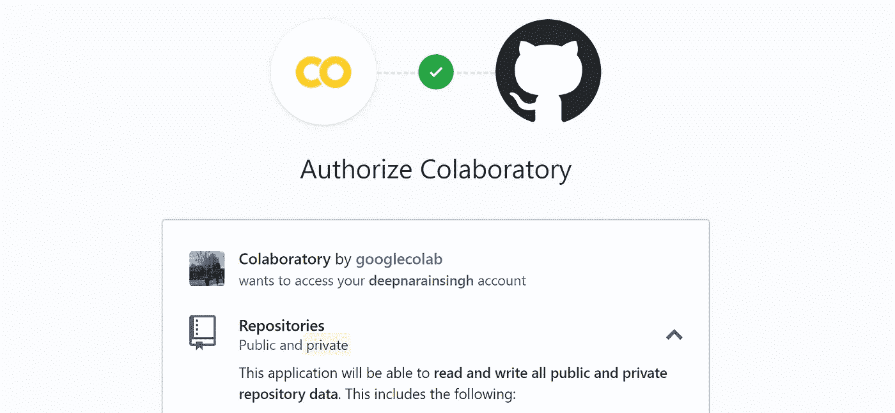

# Google 协作笔记本并在 Github 上分享

> 原文：<https://medium.datadriveninvestor.com/google-colaboratory-notebooks-and-sharing-it-on-github-a01b51ec6da8?source=collection_archive---------3----------------------->

最近开始使用 Google Collaboratory 笔记本做一些机器学习相关的工作，非常喜欢它的易用性。这是谷歌为支持机器/深度学习开发而构建的工具，它附带了 GPU 支持，其中人们可以免费在 GPU 上训练深度学习模型。它类似于 jupyter，但可以在线获得，并且是基于云的服务。

添加了一个如何创建 collaboratory 笔记本并在 github 上分享的快速指南，因为我不得不在 github 上为移动 collaboratory 项目做一些搜索。

# 新笔记本在哪里创建。

*   打开 colab.research.google.com，在页面的右下角会提示使用 python2 或 python3 创建一个新的笔记本。如果提示被取消，那么可以选择转到文件并创建一个新的 python2/3 笔记本。

Create Colab Notebook

Create Colab Notebook

*   Google Colab 笔记本被创建并保存在您的 Google Drive 中。

# **在 Github 知识库上共享协作笔记本**

*   最初，我不知道如何将 Colab 笔记本添加到我的私人 github 存储库中。
*   以下是将笔记本添加到您的私有 github 存储库中的步骤。
*   打开笔记本，转到文件。
*   将会有一个**在 github** 中保存副本的选项。

Save Notebook to github

*   一旦点击，它将要求您的 git 帐户的授权。还有一个包含您的**私有存储库的选项，如果您想要包含它，请单击它。**

Authorize the github access

*   完成后，它将列出您所有的公共和私有存储库，然后您可以将 collaboratory 笔记本保存到相应的存储库中。