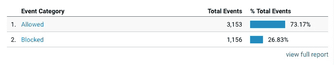
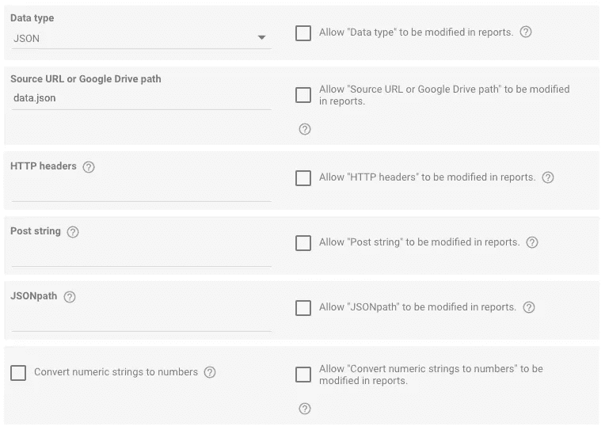
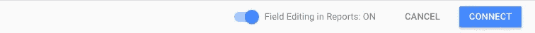
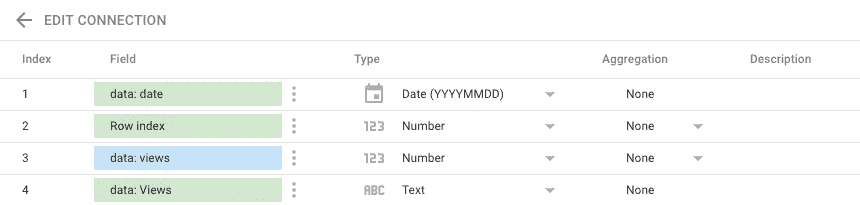
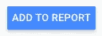
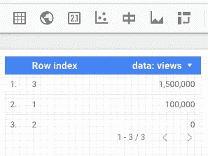

# 使用 JSON 的 Google Data Studio 教程

> 原文：<https://medium.datadriveninvestor.com/google-data-studio-tutorial-with-json-eba62ab660ea?source=collection_archive---------5----------------------->

## 谷歌数据工作室，像谷歌分析，是一个仪表板和报告工具，以聚集重要的数据。


使用网络追踪信息时，为什么要使用 Google Data Studio 而不是 Google Analytics？

不幸的是，谷歌分析*可以*不可靠。随着广告、跟踪和 cookie 拦截的增加，Google Analytics 可能会遭受 25%到 50%以上的数据(如事件、页面浏览量等)被跟踪。

这可以通过各种方法来解决，如像素生成，以找到阻止谷歌分析和/或谷歌标签管理器执行的广告拦截器的用户百分比，从而进行跟踪。

在我的例子中，我有 Google Analytics 和一个外部来源，这两个来源有超过 40%的差异。这听起来是一个很大的数字，但很可能偏低，尤其是取决于网站的年龄目标。



2 day period results of tracking allowed and blocked GA and GTM scripts.

我沿着这个[指南](https://marthijnhoiting.com/detect-if-someone-is-blocking-google-analytics-or-google-tag-manager/)去寻找真正的数字。

**TL；DR** (太长，没有读):这个脚本生成一个透明的 1x1 像素的图像，然后将数据发送到一个内部 PHP 脚本。根据 Google Analytics 或 Google Tag Manager 是否正确加载，事件将分别填充。

从 PHP 脚本，它将发送一个事件(阻止或允许)到一个指定的谷歌分析帐户。

Google Data Studio 提供了各种连接器，我将在本文后面提到这些连接器。

# 数据结构

有多种方法可以让 Google Studio 使用结构化数据。对于我的例子，我将使用 JSON，因为它是最容易理解的独立实体。

## 数据

来看看一些现实生活中的数据吧！我们看到下面的数据有一个对象数组，这些对象带有与其日期相关的升序时间戳。

```
{  
  **"data"**:[  
    {  
      **"date"**: "20181201",
      **"views"**: 100000
    },
    {  
      **"date"**: "20181202",
      **"Views"**: 120000
    },
    {  
      **"date"**: "20181203",
      **"views"**: 150000
    }
  ]
}
```

稍后，我们可以选择一个. json 文件进行读取，或者选择一个提供应用程序/json 内容的外部源。

现在，复制上面的代码，在你的计算机上创建一个名为 *data.json* 的新文件，然后粘贴*。*接下来，转到 [Google Drive](https://drive.google.com/drive/u/0/my-drive) 并将该文件上传到您的；任何子文件夹都可以，只要确保记住文件的完整路径。

## 设置

开始之前，在这里建立一个空白的数据工作室项目。

在右下角，您会看到一个按钮[ **创建新数据源** ]。点击之后，您可能会被大量不同的连接器选项所淹没。

听我说，事情没有你想的那么复杂。我们要的叫做 [**自定义 JSON/CSV/XML**](https://supermetrics.com/blog/custom-json-data-studio) **。**接下来，单击[ **选择]** ，然后我们进入创建数据连接器的最后步骤。

## 选择

不幸的是，谷歌数据工作室和它的新产品可能会让新来者不知所措。

您只需要选择 **JSON** 数据类型和您存储 **data.json** 文件的 Google Drive 路径。



## 连接

最后，连接你的数据！这允许 Google Data Studio 通过各种方法对数据进行子查询，例如所有视图的总和，以及通过日期过滤数据。



假设您完成了每个步骤，您应该会看到最后一个屏幕，其中显示了关于您的数据的信息，包括字段和数据类型。



*最后*，将数据添加到您的报告中:



既然我们的数据已经连接到报告，我们需要一种可视化的方法。

通过选择表格并拖动到您喜欢的大小，数据会自动填充，并允许您使用向上/向下箭头进行交互。



这是一个非常基本的连接数据的例子。正如您所想象的，您可以过滤日期范围，使用自定义计算和警告，为您的自定义仪表板提供更具分析性的方法。

感谢阅读，如果你喜欢这类内容，请给我一些掌声。

关注我关于新技术和教程的未来文章！