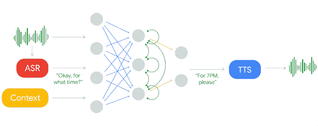

# Google Duplex——拟人化的最佳表现

> 原文：<https://medium.datadriveninvestor.com/google-duplex-personification-at-its-best-1ee2ec828b1a?source=collection_archive---------21----------------------->

多年来，谷歌一直以其尖端技术和开箱即用的实验让我们惊叹不已。他们一直是第一个获得新兴技术的组织。谷歌已经成功地将人工智能、神经网络、高级语音识别集成到他们的系统中，使他们比竞争对手更有优势。

在 2018 年 5 月的 I/O 开发者大会上，谷歌公布了他们在神经网络领域的最新进展，即 Google Duplex。Duplex 是 Google Assistant 的附加功能，它使交互更加流畅和自然。他们已经成功地摒弃了文本到语音转换技术的大部分缺点，除了发音之外，他们还专注于一个人的措辞和对话的上下文。

Duplex Working Diagram

虽然谷歌助理是一个通用的通信代理，但 Duplex 是为满足特定的对话道德而开发的。由于助理不能完全在整个对话之间建立逻辑连接，因此双工通过评估特定语句并将其与交互的其余部分相关联来填补空白。它能充分理解字里行间的含义，因此能更好地解读信息。与助手不同，Duplex 并不严重依赖自然语言处理(NLP)，而是利用递归神经网络和 WaveNet 技术。

递归神经网络是神经网络的一部分，其在一段时间内表现出节点之间的直接相关性。这使网络有资格在小的时间间隔内动态运行，也称为序列学习。rnn 在处理来自用户的输入时可以参考它们的存储器。这使得网络能够提供与当前主题相关的有根据的响应。WaveNet 技术是伦敦领先的人工智能公司 DeepMind 的一项创新，它增强了交互的声音方面。这是一个深度神经网络，可以生成令人惊讶的真实原始音频，让你感觉你在和一个人而不是一个人工智能交谈。这些网络通过使用真实语音的录音样本并分析其波形来训练，这是对文本到语音模型的重大改进。

在展示这一新功能的同时，谷歌对升级后的助手的一些实际对话进行了演示，其中包括在发廊预约和在餐厅预订桌子。人们对助理的熟练程度和认知思维感到惊讶，因为它能够在没有丝毫人类参与的情况下预订现实生活中的约会。互动是如此的流畅，以至于接听者根本不知道他们不是在和一个真实的人说话。虽然这可以被认为是虚拟助手发展的一大步，但许多人表达了他们对这项技术的担忧。事实上，人工智能可以像人类一样顺利地交谈，而另一个人却不知道现实，这真的令人生畏。这可能真的会危及人们的安全和个人空间，而他们甚至不会意识到这一点。针对人们的沮丧，谷歌表示，当他们与助手交谈时，他们会让人们知道，所以他们可能会做出适当的回应。

开发者们正在讨论 Duplex 是否已经通过了图灵 Test⁴.艾伦·图灵提出的图灵测试是一种测试机器执行与人类没有区别的动作的能力的测试。尽管 Duplex 激发了流畅的对话，但它仍远未掌握人类行为的动态本质，因此未能通过图灵测试。我们不可能估计技术会有多进步，我们所能做的就是为未来做好准备！

***引文-***

[1] — [谷歌双工](https://ai.googleblog.com/2018/05/duplex-ai-system-for-natural-conversation.html)

[2] — [对用于序列学习的递归神经网络的评论](https://arxiv.org/pdf/1506.00019)

[3] — [WaveNet:原始音频的生成模型](https://arxiv.org/pdf/1609.03499.pdf)

[4] — [计算机械&智能](https://www.csee.umbc.edu/courses/471/papers/turing.pdf)