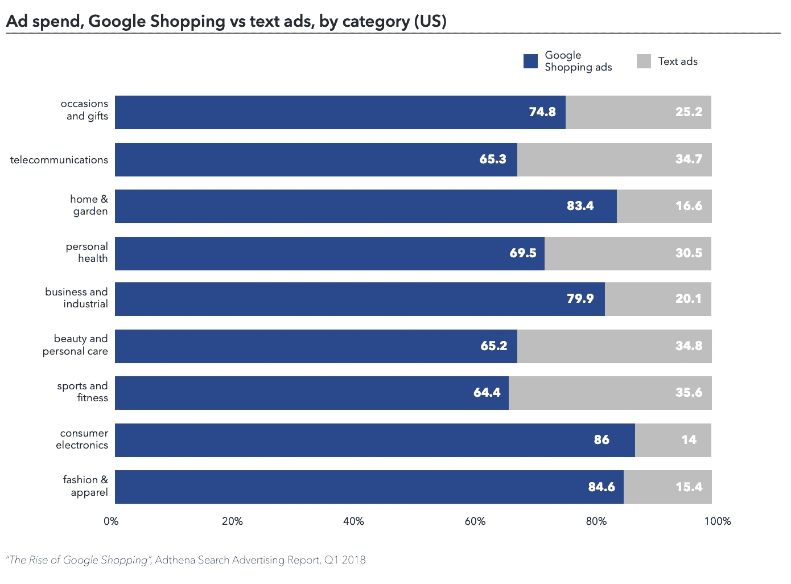
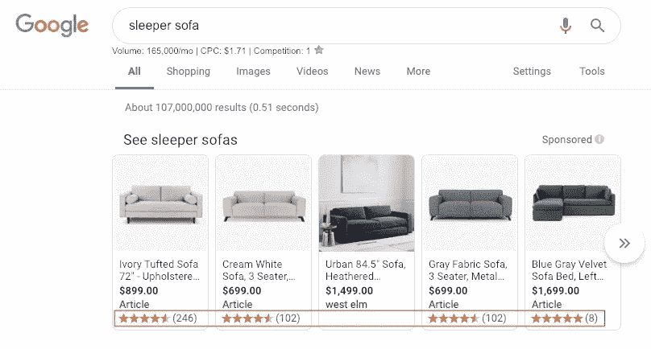

# 谷歌零售 101:产品列表广告值得投资吗？

> 原文：<https://medium.datadriveninvestor.com/google-for-retail-101-are-product-listing-ads-worth-the-investment-7b0c1c939503?source=collection_archive---------14----------------------->

谈到电子商务，你的产品必须脱颖而出，只有最好的广告才能赢得点击。如今，在线营销种类繁多，因此，识别最佳营销策略并把预算投入到渠道和营销活动中至关重要，这些渠道和营销活动经过精心设计，能够为您的公司带来最大的投资回报。

谷歌产品列表广告(PLAs)在 2018 年第一季度引导了 76.4%的零售搜索广告支出，并且在此前几年一直是一项出色的投资。如果你的公司有足够的资金来为在线营销分配资金，PLA 已经被证明可以增加网站流量、品牌曝光率和收入。

 [## 2019 年需要关注的 20 个数字营销趋势和技术——数据驱动的投资者

### 展示本周的电子学习模块。做一个终身学习者！关于技术、金融、工作场所的每日剂量…

www.datadriveninvestor.com](https://www.datadriveninvestor.com/2019/02/04/20-digital-marketing-trends-techniques-to-watch-out-for-in-2019/) 

# Google PLAs 是如何工作的？

在引入 PLAs 之前，一个零售商对搜索结果页面的影响力是非常低的。供应商唯一能控制的是他们销售的商品和每种商品各自的数据源。现在，供应商可以发挥更大的作用。他们可以控制什么样的产品出现以及在哪里出现在潜在消费者面前。

PLAs 的基础来自于[谷歌商业中心](https://blog.metricstory.com/blog/getting-started-with-google-merchant-center)的数据反馈。你可能会问，什么是数据馈送？谷歌[将其](https://support.google.com/merchants/answer/7439882?hl=en)定义为“一个由使用属性分组的产品列表组成的文件，[它允许用户]更容易地搜索和找到你的产品。”在线商家在区分他们的产品和其他产品时使用的一种技术是从搜索中排除某些术语。例如，如果你是一家专门销售男鞋的零售商，你可以在你的产品描述中去掉“女人”这个词。这使得零售搜索结果对于消费者来说更加准确和有效，并且对于零售商来说更加有利可图。

Google PLAs 出现在搜索结果中，无论是图片结果、购物结果还是基本的 Google 搜索。

# PLA 的最佳实践

在线参与是电子商务团队的一个关键指标，可以使用谷歌的内置分析功能或更高级的外部服务来衡量，如 [Metricstory](https://metricstory.com?utm_medium=referral&utm_source=medium.com&utm_campaign=plas+worth+101) 。收集的关于 PLA 使用的数据一直显示出较高的用户参与度。这是因为产品的整体描述。产品列表广告旨在向用户展示比标准文本广告更详细的信息。

*Source:* [*Adthena*](https://www.adthena.com/insights/google-shopping-report/)

由于产品列表广告向消费者提供了大量的信息，因此您提交给 Google Merchant Center 的数据馈送必须准确和最新，这一点至关重要。PLAs 显示产品图片、价格和基本的文字描述。这使得所有必要的信息都放在最前面和中心。总体而言，互联网上更高的用户参与度往往与媒体相关，包括照片或视频，而不仅仅是纯文本。投资于准确描述你所销售产品的优质媒体是很重要的，尤其是如果你正在考虑将 PLAs 作为你在线营销策略的一部分(你应该这样做！).

图像的大小应该适当，以免重要信息被截断。此外，你的网站和产品页面需要维护良好和用户友好。随着越来越多的用户转向谷歌进行搜索，你的公司应该考虑为每种产品提供一个评论区。随着越来越多的人使用互联网进行协作购物和产品比较，用户希望看到其他购物者对他们的购买感到满意。如果你的评论是基于 1 到 5 星的评级，谷歌将允许你的公司在其 PLA 显示屏上显示你的产品的平均评级。你的产品评论越多越好。想象一下，如果你的产品评级在谷歌搜索中立即出现在用户面前，会产生怎样的影响？

*Screenshot from* [*this Google Search*](https://www.google.com/search?ei=n9RRXKntI--Ak-4PoJ61wAo&q=sleeper+sofa&oq=sleeper+sofa&gs_l=psy-ab.3..0i67l2j0l2j0i67j0l5.7348.8514..8760...0.0..0.63.624.12......0....1..gws-wiz.......0i71j0i131._wV_ytp_I_4)

作为在线流量和订单的重要来源，产品列表广告是当今在线分销的主要渠道之一。与其他电子商务平台不同，谷歌为供应商提供必要的组织、优化和分析工具，使 PLAs 成为值得的在线营销投资。但是为了充分利用它，零售商必须了解并利用整个[谷歌零售平台](https://blog.metricstory.com/blog/getting-started-with-google-merchant-center?utm_medium=referral&utm_source=medium.com&utm_campaign=plas+worth+101)的独特功能。

我们还建议投资 Metricstory 的分析[工具](https://metricstory.com/product?utm_medium=referral&utm_source=medium.com&utm_campaign=plas+worth+101),不仅可以了解什么在为你的电子商务业务服务，还可以根据这些数据做出有利可图的决策。如果您需要帮助，请联系我们的团队！

*最初发表于*[T5【blog.metricstory.com】](https://blog.metricstory.com/blog/google-for-retail-101-are-product-listing-ads-worth-the-investment)*。*