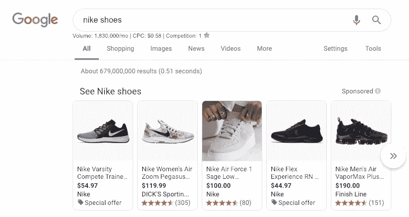
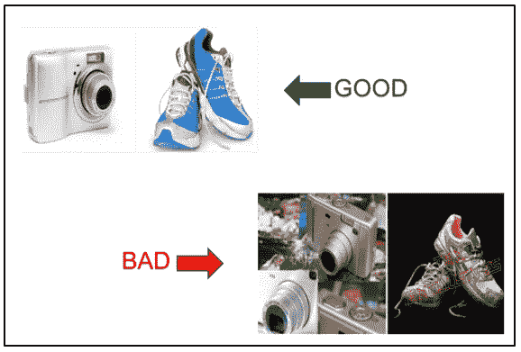

# 谷歌零售 101:谷歌商业中心入门

> 原文：<https://medium.datadriveninvestor.com/google-for-retail-101-getting-started-with-google-merchant-center-b23f1e644142?source=collection_archive---------18----------------------->

在线零售正在兴起和发展。根据 eMarketer 的数据，2019 年全球电子商务销售额预计将增长 15.1%，达到 6053 亿美元。虽然网上购物的出现可能会威胁到传统的实体店，但零售商正在传统的面对面购物和网上购物的结合中看到了一个新的意想不到的机会。例如， [RetailDive](https://www.retaildive.com/news/why-researching-online-shopping-offline-is-the-new-norm/442754/) 发现，超过 65%的消费者在去实体店之前(甚至当他们在那里的时候)会在网上搜索他们的产品。

这种现象促使零售商优化他们的数字体验，并使他们的产品和品牌更易于在线搜索。考虑到当今网络消费者的注意力持续下降，这似乎是一项艰巨的任务。困难，但不是不可能。

# 谷歌零售

进入:[谷歌零售](https://www.google.com/retail/)——一个强大的发现和在线库存管理系统，帮助零售商通过谷歌搜索向购物者展示他们的产品。结合众所周知的谷歌解决方案，如谷歌分析和谷歌广告，谷歌零售推出了新的零售解决方案，包括[谷歌商业中心](https://www.google.com/retail/solutions/merchant-center/)、[购物活动](https://www.google.com/retail/solutions/shopping-campaigns/)等。从购物者的角度来看，当他们购物时，你创造了显示在他们的谷歌搜索结果中的产品广告。

*Source: Screenshot from* [*this Google Search*](https://www.google.com/search?source=hp&ei=_P9FXMicIeTs9APE1ofwAw&q=nike+shoes&oq=nikie+shoes&gs_l=psy-ab.1.0.0i10l10.104.1273..3412...0.0..2.226.1530.4j7j1......0....1..gws-wiz.....0..0i131j0j0i3.Z2zrAt9MR8s)

换句话说，这个系统允许在线购物者直接在他们的搜索结果中看到你的产品，而不需要访问你的网站。谷歌内部针对零售的独特解决方案，如 Merchant Center，可以帮助企业主适应在线购物习惯的变化趋势，如在他们亲自购物时查看产品，扫描类似产品以及在旅途中购买。许多企业都在利用这个机会。例如，[施华洛世奇](https://www.swarovski.com/en-US/)仅仅通过投资当地库存广告，就将其销售额提高了 150%,这些广告向网上购物者展示产品广告，并贴上“距离”标签，标明离最近的施华洛世奇商店。

[Target](https://www.target.com/) 将谷歌零售业务向前推进了一步，并分析了客户搜索数据，以寻找内部团队的改进机会。通过[利用谷歌搜索](https://www.youtube.com/watch?v=gSHoZgFoVEY)优化塔吉特百货的网上库存展示，这些团队了解了更多关于他们尊贵客户的信息，并提出了更有创意的网上购物体验。Target 在线库存展示的优化促使公司结构进行了一些重组。这导致了传统组织结构中从未有过的效率和增长目标的领导。

谷歌零售可以打开我们在电子商务中不常想到的机会。为了开始从谷歌零售中获益，熟悉[谷歌商业中心](https://www.google.com/retail/solutions/merchant-center/)至关重要——这是谷歌上所有在线产品库存的基础。我们收集了一些提示和技巧，告诉你如何最大限度地利用它，即使你以前从未使用过它。

# Google 商业中心入门

根据[解决方案本身](https://www.google.com/intl/ru/retail/solutions/merchant-center/#?modal_active=none)，谷歌商业中心是“一个帮助你上传你的商店、品牌和产品数据，并使其可用于谷歌购物和其他谷歌服务的工具。要在谷歌上为你的产品做广告，你需要一个商业中心账户。

基本上，它允许你做两件主要的事情:吸引更多的潜在买家，并通过直接通过谷歌管理你的库存来控制你的产品如何在网上出现。要开始，请完成以下步骤:

1.  [注册](https://www.google.com/retail/solutions/merchant-center/#?modal_active=yt-how-to-sign-up):创建账户。
2.  通过将验证文件上传到您的 CMS 来验证您的帐户。
3.  链接您的商业中心帐户，以验证您的网站，并开始您的第一次活动！

像许多工具一样，谷歌商业中心取决于你对它的理解。所以，重要的是，在你成立之后，你要开始挖掘细节，让你的公司走向成功。

# 在商业中心优化您的产品集合

**1。首先优化产品名称。** 拍出以下特点:简洁、简单但尽可能具体、有描述性。不同的产品类别可能需要一些独特的描述，但普遍接受的公式是品牌(苹果、Sleepcountry、美国之鹰)+性别(如有必要)+产品类型(t 恤、鞋子、椅子、智能手机)+属性(尺寸、状况、颜色、重量、数量)。更重要的是，从产品名称优化开始，将允许购物者准确地找到*他们正在寻找的*，并点击与他们的搜索关键词最相似的产品。

**2。注意滤镜。当你在 Google Merchant Center 中设置你的库存时，打开一个新的标签，看看“购物”提要中的过滤器。购物者可以过滤一切，从到商店的距离到颜色、尺寸、品牌、卖家甚至状况。虽然其中大部分是不言自明的，但检查正确的类别以使您的项目尽可能可搜索是很重要的。随着购物者细化他们的搜索并经历他们的[消费者决策之旅](https://www.mckinsey.com/business-functions/marketing-and-sales/our-insights/the-consumer-decision-journey)，你希望你的产品成为他们的最终选择。**

**3。记住你的顾客旅程。** 查看您的分析，了解更多关于客户如何选择产品的信息。例如，刚刚开始寻找完美运动鞋的顾客会用谷歌搜索一些模糊的东西，比如“运动鞋”。如果他们已经在周围搜索了一段时间，想找到一个特定的品牌或活动，他们会寻找“耐克篮球鞋”。最后，如果他们已经完成了调查，并想知道在哪里可以买到 10 码的白色耐克女子空军 1 '07，那么这正是他们要寻找的。这些准备购买的购物者可能会专门搜索，但他们也会注意他们搜索的零售商和距离特征。作为在线零售商，你希望你的产品尽可能容易被发现。通过记住你的典型客户旅程，并根据定义的搜索查询进行定制，你可以增加你的点击机会。

当你执行这些步骤时，记得重新访问它们，看看使用谷歌的内置分析对活动最有效。为了更深入地了解，您可以尝试 Metricstory 的[搜索查询审计](https://metricstory.com/product?utm_medium=referral&utm_source=medium.com&utm_campaign=merchant+center+101)，它可以识别搜索查询在整个购买过程中的表现(和表现),解释所有的归因模型。

**4。不要忽视摄影。** 他们说一张图片胜过千言万语，网购者每天都能看到它的证据。一张产品照片(或任何照片，真的)可以在不到一秒的时间内为客户带来成功或失败。这就是为什么在线零售商必须选择从最佳角度展示产品的照片。最常见的是一个白色背景的英雄形象和全尺寸产品。产品照片没有篮球鞋在球场上的照片有创意也没关系。过多的细节或多彩的背景会分散顾客的注意力，让他们看不到一张更清晰的照片，更准确地展示他们正在寻找的东西。

*Source:* [*WordStream*](https://www.wordstream.com/blog/ws/2015/03/04/google-shopping-campaigns-tips-tricks)

**5。登陆页面** 最后，每个产品都需要在你的网站上有自己的登陆页面。请记住，谷歌零售不是一个购物平台，而是一个分销工具，帮助客户快速找到产品，而不用从一个网站跳到另一个网站。为了最大限度地利用它，确保你的上市产品广告准确地引导到他们展示的产品，以避免客户困惑或沮丧。

最后，设置产品广告没有正确的“公式”，因为谷歌的购物算法一直在变化。作为一名数字营销人员和内容优化人员，你必须不断为你的电子商务业务寻找机会。 [Metricstory](https://metricstory.com?utm_medium=referral&utm_source=medium.com&utm_campaign=merchant+center+101) 警报可以通过查找表现良好或需要关注的登录页面、产品和活动来帮助识别此类机会。

如果您需要帮助，或者只是需要一些关于优化您的谷歌商业中心的提示，[今天就联系我们](https://go.metricstory.com/contact-us?utm_medium=referral&utm_source=medium.com&utm_campaign=merchant+center+101)。

*原载于*[*blog.metricstory.com*](https://blog.metricstory.com/blog/getting-started-with-google-merchant-center)*。*