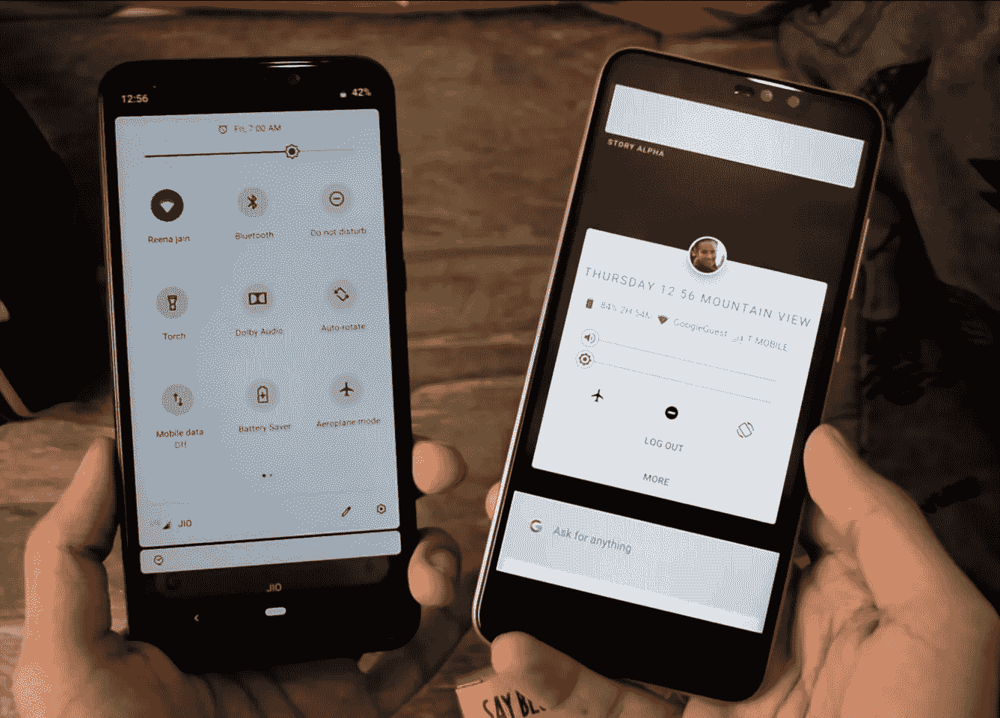
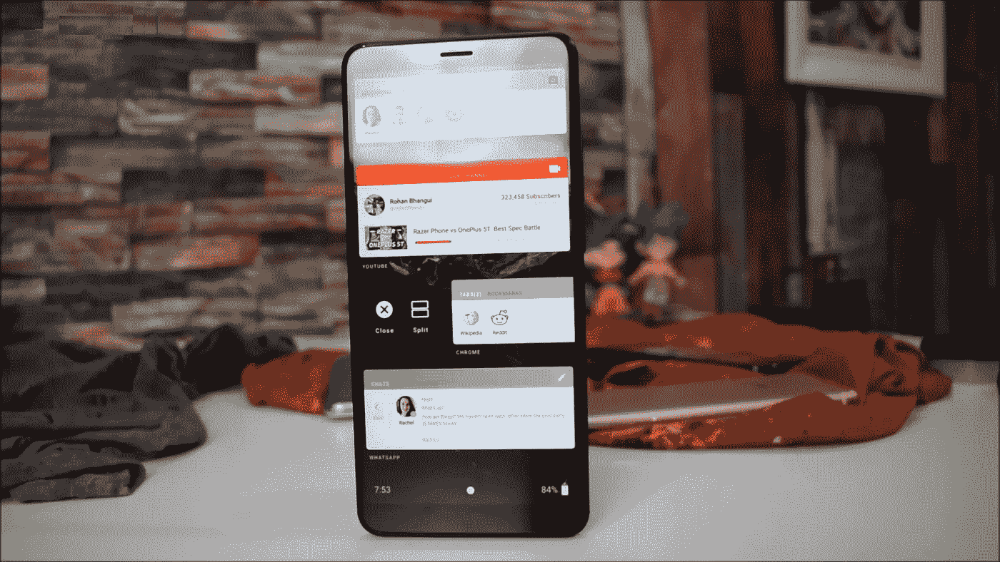

# 谷歌 Fuchsia:一款新的手机软件

> 原文：<https://medium.datadriveninvestor.com/google-fuchsia-a-new-phone-software-89f4dd46e5c4?source=collection_archive---------5----------------------->

谷歌的 Android 已经是手机操作系统的市场主导者，但是为什么谷歌要创造一个更新的软件，或者他们只是把 Android 的名字改成 Fuchsia。

Android Left side and Fuchsia Right Side

在我深入探讨这个主题之前，我们应该先谈谈内核，内核是操作系统的核心，它们提供了构建操作系统的基本机制。我用的是安卓手机，在过去的 8 年左右的时间里，我已经换了 15 部手机，遇到了各种各样的问题，从突然关机到性能下降。拥有相同处理器但不同制造商的 Android 手机提供了不同的体验我第一次注意到这一点是在 Galaxy Fit 和 Galaxy Pop 等老一代三星手机上，它们使用相同的处理器，但安装了一些第三方应用程序，两者的处理方式不同，可能是内存管理问题或图像分辨率问题或许多其他问题， 首先，我的想法是三星这样做是因为他们想推动他们更昂贵的手机的销售，但这并不简单，因为我做了更多的研究，我发现 Android 操作系统的复杂性，许多 Android 问题来自于它基于 Linux 内核，而 Linux 内核最初并不是为手机设计的，事实上 Android 软件本身最初是为数码相机设计的。 所以从它的核心来看，它并不是专门为手机需要做的事情而设计的。

Incomes Fuchsia 专为手机打造的新操作系统将 Android 视为新操作系统的测试版，它取代了 Linux 内核，成为一个全新的内核，具有两个关键优势。它的设计考虑到了*智能互联的未来*，其代码没有那么具体，因此可以在*更广泛的设备上工作*，新内核被称为**锆石**。Fuchsia 操作系统之所以受欢迎，是因为它的内核可以让它在几乎所有东西上运行，从小型手机和个人电脑到智能冰箱和交通灯，一个操作系统可以处理所有事情，因此随着越来越多的智能设备进入人们的家庭，单个操作系统基本上意味着它们之间的完全无缝集成，以一个场景为例，你在手机扬声器上播放音乐，然后手机检测到智能扬声器，然后音乐在智能扬声器上播放，当你走向汽车时，当你进入汽车时，相同的轨道会恢复。谷歌助手绝对是一个好的语音助手，但只有极少数人在 android 上充分利用这一功能，这感觉像是一个噱头，但 Fuchsia OS 似乎坚持让语音命令和语音助手成为一个原生功能，这将最大限度地利用这些功能，从而使语音命令操作比用手指操作手机更容易，安全性也将是 Fuchsia 的另一个关键方面。 如果被证明是真的，更严格的安全性将是最值得注意的特性，因为安全性可能是 androids 最大的缺点。

Android 手机的另一个最大缺点是更新，并不是所有的手机制造商都在推更新的更新。目前最新的 Android 操作系统是 Android Pie (9 ),用户最多的操作系统是 6.0 Marshmellow，为什么会这样。

在 Android 手机中，它们主要由驱动程序、内核和软件组成。如上图所示，不同的制造商会有所不同。因此，谷歌不能在所有安卓手机上统一推送更新，谷歌能直接控制的手机不到 5%。这些手机制造商可以向我们推送更新，但他们没有动力进行这些更新他们没有动力在两年内保持性能你使用手机，如果他们想让你当前的设备过时，你就会购买新的硬件，这就是他们的利润所在。Fuchsia 更干净、更简单，它是在考虑更新的情况下构建的，这也是谷歌重新控制最终用户软件体验的方法之一。此外，Fuchsia OS 是在 Flutter 软件开发工具包上编写的，这很重要，因为它也适用于 android，所以 android 应用程序很可能能够在其上运行。

Fuchsia 是不是要取代 Android，这是不是要走向终极手机软件。当然，也许几年后，谷歌已经为这个项目投入了足够的资源，他们现在已经有超过 100 名工程师在从事这项工作，这表明这不仅仅是一个小把戏。

# 参考

*   [https://en.wikipedia.org/wiki/Google_Fuchsia](https://en.wikipedia.org/wiki/Google_Fuchsia)
*   https://github.com/fuchsia-mirror
*   developer.android.com/about/dashboards
*   【https://flutter.io/docs 
*   https://www.youtube.com/watch?v=83SDXL65W9k:最新开发者预览版
*   [https://www.youtube.com/watch?v=K8e7uR1-Vdc](https://www.youtube.com/watch?v=K8e7uR1-Vdc):深度分析
*   [https://www.youtube.com/watch?v=FhX6cANaJ6o](https://www.youtube.com/watch?v=FhX6cANaJ6o):在 pixelbook 上测试