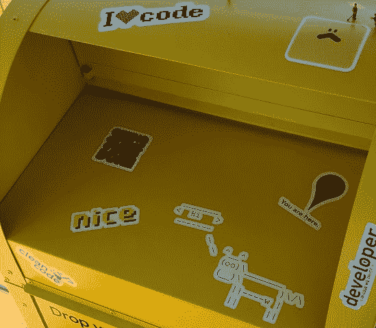
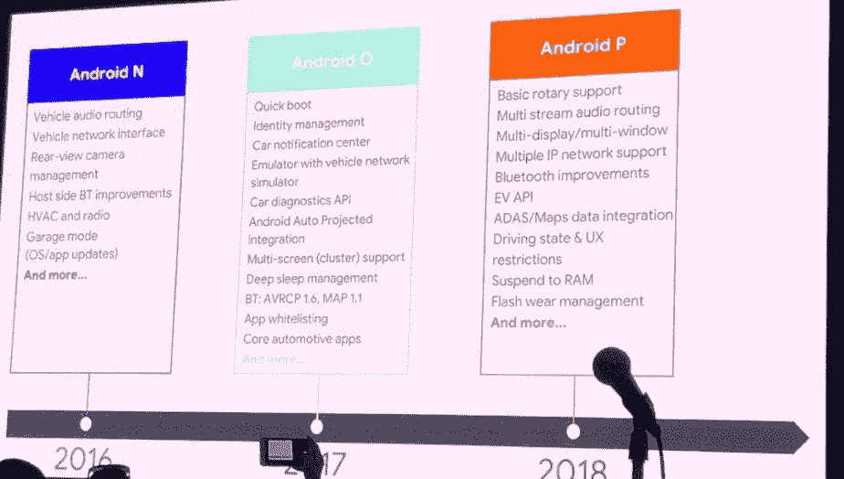
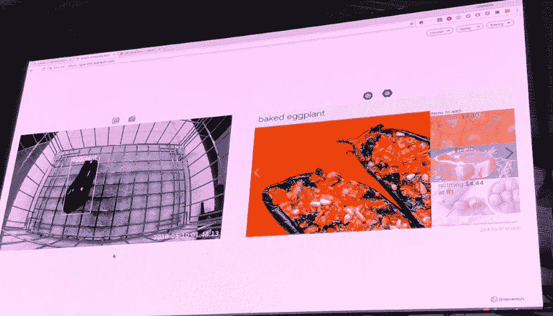
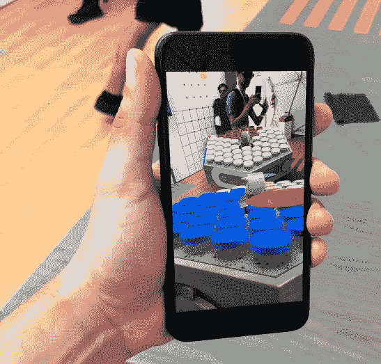
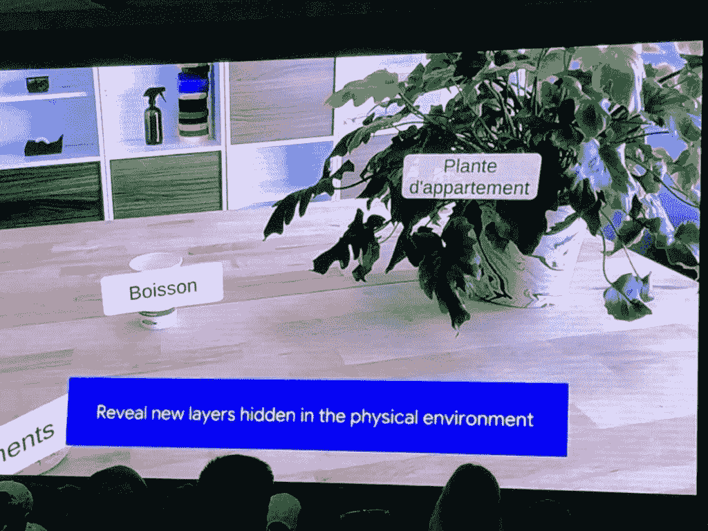
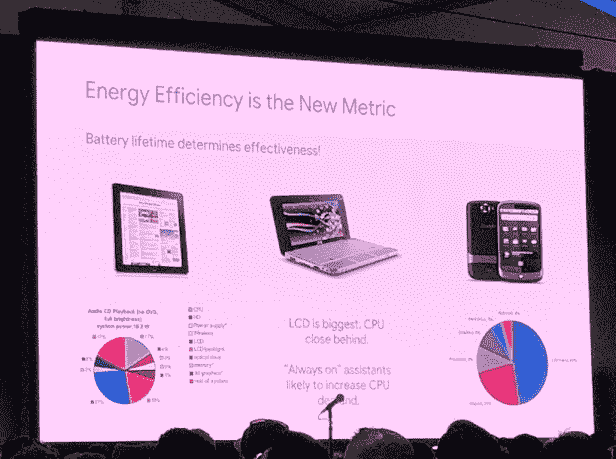

# Google I/O——从山景城获得更多信息

> 原文：<https://medium.datadriveninvestor.com/google-i-o-more-learnings-from-mountain-view-e08d4263e2e9?source=collection_archive---------30----------------------->

作为 Google I/O 2018 上 Google keynotes 的[早期报告的后续，在本文中，我们来看看 Google 在会议和演示中提出的一些其他主题。](https://3ss.tv/news/details-page/google-i-o-first-summary)

Stickers at Mountain View

谷歌汽车有一个永久的演示，其中谷歌展示了 Android Auto 的当前状态，以及一个概念实现，表明它在未来会是什么样子。在一次小组讨论中，谷歌报告称，自 2016 年以来，谷歌汽车活跃用户增长了 300%，应用商店中可用的以汽车为中心的应用增长了 200%。Google Auto 现在与 Assistant 进行了更深入的集成，增加了基于语音的消息传递(包括群发消息)功能，并更新了一组 UI 组件，这些组件在不同屏幕上与 mobile 保持一致。

## DIY AI

在几个会议和演示中，谷歌展示了使用简单的硬件组件和现有服务来创建基于现实世界人工智能的应用程序的可能性，这些应用程序使用语音和/或图像识别以及云服务，只需几行代码。

一个非常好的例子展示了购物车摄像头的概念验证，该摄像头可以自动检测购物车中放置的物品，并根据购物车中的内容推荐餐点和指示所需的额外食谱配料。

事实上，今天要创造这样的想法只需要几行 python 代码和硬件，只需要几美元的成本，这表明了什么已经是可能的，并让我们一瞥在不久的将来有足够的硬件和资源将是可能的。

了解更多:【https://aiyprojects.withgoogle.com/vision/ 

## AR 互动和创作

发布的更有趣的开发工具之一是 Google Sceneform。有了 Sceneform，AR 和 3D 体验可以不用 OpenGL 而只用 Java 开发。它附带了一个 Android Studio 插件，允许你使用与设备上相同的渲染引擎来预览 3D 模型。新 AR 体验的另一个使能是“云锚”——这允许用户共享基于位置的标记和体验。

在一个演示游戏中，用户可以玩一个虚拟的“乒乓”游戏。每个运动员的场被定位使用云锚并且在每个人的相同位置上。特别好的是:谷歌在 iOS 和 Android 上提供了这个功能——这个演示可以在两个平台上同时播放。

其他演示使用身体姿势作为输入(类似于微软 Kinect ),并展示 ar 对图像的操作来创建虚拟艺术。

除了技术方面，还有一些有趣的讲座，解释了设计师和开发人员如何才能最好地应对新环境，并创造出真正连接物理世界的沉浸式体验。

讨论的两个主要方面仍然是“共享增强”，它允许一组用户在同一地点拥有单独或共同的体验，每个用户都知道其他用户的位置。体验位置和“表情输入”能够通过手势、运动、位置、声音等自然地输入命令。而不会感到被一组预定义的命令所限制。因此，探索和使用体验或应用程序是“自然”的。

了解更多信息:

*   [https://blog . Google/products/Google-VR/experience-augmented-reality-together-new-updates-arcore/](https://blog.google/products/google-vr/experience-augmented-reality-together-new-updates-arcore/)
*   https://developers.google.com/ar/develop/java/sceneform/

## 无服务器节点。谷歌云平台上的 JS

除了一些关于如何选择和利用最佳产品以获得最佳性能和成本效益的有趣见解，Google Cloud 团队的一个看似微小但很棒的更新是对 Node 的原生支持。Google App Engine 上的 JS serverless 即将到来！

## 计算的未来

在一次有趣的专题演讲中，谷歌母公司 Alphabet Inc .的董事长约翰·汉尼斯给出了他对“计算未来”的看法和展望。他的主题是，我们将看到“摩尔定律的终结”，因为基于硅的当前处理器一代已经达到了其最大潜力。与此同时，效率和扩展的主要因素不再是实际增加的计算能力，而是产生计算能力所消耗的能源。

*原载于 2018 年 6 月 2 日*[*LinkedIn*](https://www.linkedin.com/pulse/google-io-more-learnings-from-mountain-view-stefan-blickensd%C3%B6rfer/)*。*