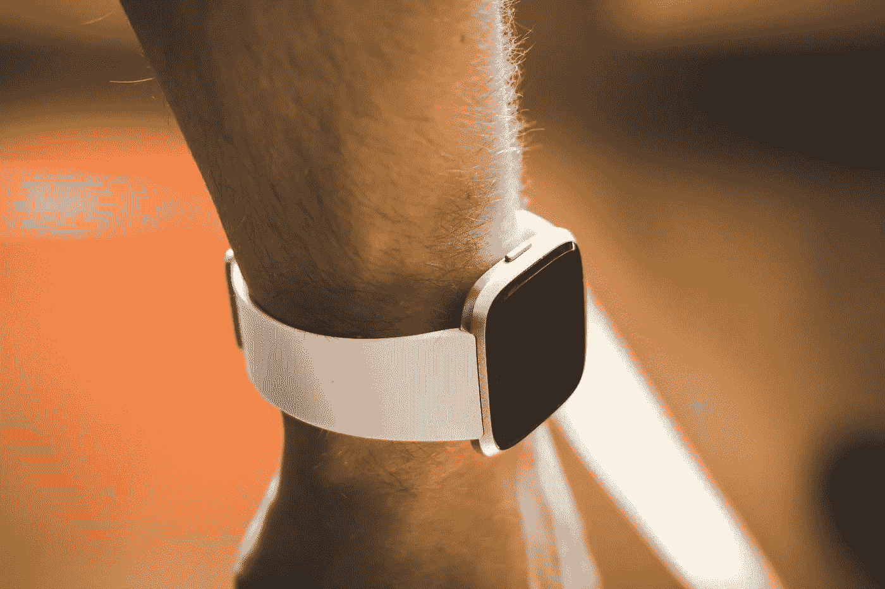

# 谷歌正在收购 Fitbit。为什么

> 原文：<https://medium.datadriveninvestor.com/google-is-buying-fitbit-what-for-a95e56c6b92c?source=collection_archive---------10----------------------->

## 路透社称，谷歌正在就收购知名可穿戴电子产品制造商 Fitbit 进行谈判。而且，虽然目前还没有确认购买将会发生，但这种谈判正在进行的事实几乎 100%得到了证实。

Photo by [Kamil S](https://unsplash.com/@16bitspixelz?utm_source=unsplash&utm_medium=referral&utm_content=creditCopyText) on [Unsplash](https://unsplash.com/s/photos/fitbit?utm_source=unsplash&utm_medium=referral&utm_content=creditCopyText)

# 谷歌为什么需要收购 Fitbit？

正如你知道的，谷歌除了 Android 之外，还开发 Wear OS 并授权给其他公司，比如 Fossil(Fitbit 品牌的所有者)。反过来，他们已经在生产运行这种移动操作系统的智能手表和健身追踪器。但是谷歌自己并没有在 Wear OS 下开发自己的产品。是的，根据一些传言，这家搜索巨头仍在开发智能手表。然而，与 Fossil 的交易将使谷歌能够更好地与苹果竞争，苹果目前凭借其 Apple Watch 主导了智能手表市场和智能追踪器市场。

收购 Fitbit 可以让谷歌销售运行 Wear OS 的智能手表，如果这是一个 Fitbit 品牌，一个已经有数百万消费者知道和信任的品牌，它有可能真正拉回一些 Apple Watch 的观众。Fitbit 的一些尖端技术，如睡眠跟踪和其他未经宣布的公司开发，将使谷歌立即向前突破，而不是像该公司在“pre-pixel”智能手机时代那样迎头赶上。

# Fitbit 为什么要把自己卖给谷歌？

这还是比较容易的:Fitbit 将拥有开发所需的资源。这两种资源都是金钱和智力。因为在合并的情况下，一家公司的成就和专家总是会流向另一家公司。分析师表示，苹果在 2018 年占据了全球智能手表市场的大约一半，而 Fitbit 最近的销量低于预期。与谷歌的合并可能会给 Fitbit 带来急需的推动，并有助于在推出新设备和开发老产品方面达到一个全新的水平。

# 这次采购会对可穿戴电子产品市场产生怎样的影响？

目前，还很难说，因为还没有官方证实这笔交易。但是假设它刚刚发生，这张照片会变得非常有趣。首先，旧设备不太可能被废弃。所以 Fitbit 线会发展的更密集，因为 Wear OS 小工具现在会直接接收。

 [## 2019 年即将改变世界的技术|数据驱动的投资者

### 很难想象一项技术会像去年的区块链一样受到如此多的关注，但是……

www.datadriveninvestor.com](https://www.datadriveninvestor.com/2019/01/17/the-technologies-poised-to-change-the-world-in-2019/) 

但这还不是全部。很可能该公司的后续设备将进行品牌重塑，并与其中一个系列保持一致。这很可能是谷歌像素线。考虑到谷歌很有可能在假设的 Pixel 手表领域有所发展，与 Fossil 结合将使他们既有可能在智能手表中实现的一些功能，又有可能在最短的时间内发布产品的生产设施。

# 谷歌 Pixel Watch。目前已知的一切

最近，谷歌一直在密切合作，以改善其 Wear OS 移动电子产品的操作系统。这是否意味着搜索巨头正在致力于人们期待已久的智能手表，这是由谷歌 Pixel Watch 这个名字激发的？很有可能。

> 毕竟，一些泄漏已经告诉我们这些手表可能是什么。一些内部人士甚至声称，这一宣布将很快举行——连同智能手机谷歌 Pixel 4。我们决定让你为这一事件做好准备，并把目前已知的关于谷歌 Pixel Watch 的一切都放在一起。

# 谷歌 Pixel Watch。发布日期和价格

我们已经通知了可能的宣布日期，但是关于进入销售，一切都不是那么明显。从今年 10 月的假想公告(据一些内部人士称)到进入商店货架之间不应有“超过 6 个月”的时间。这在某种程度上与谷歌的声明一致，谷歌一年前表示，2018 年我们将不会看到新的小时数。

同时，还没有收到关于 2019 年和 2020 年的申请。WinFuture 门户网站的一份报告称，谷歌 Pixel Watch 设备已经达到第二级设计验证。这一系列测试意义重大，因为它允许在大量进入市场之前测试设备，并相应地发布产品。

至于价格，目前还不知道这些手表会花多少钱。鉴于 Pixel 系列的设备范围通常相当大，您可以预期不同价格的不同配置的小工具。同时，不要期望价格会高于 Apple Watch 的主要竞争对手。

# 从 Google Pixel“填充”智能手表

在规格方面，对谷歌 Pixel 手表了解不多。然而，在内部，我们有望看到来自高通的骁龙 Wear 3100，以及内置于芯片本身的“电源管理集成电路”。它将允许时钟在不耗尽电池的情况下不断听取语音命令。尽管更方便的选择是将手势控制系统结合到时钟中。

> 但谷歌 Pixel Watch 中出现 Project Soli 的可能性极小。

一些泄漏表明，你可以期待至少有一个版本的时钟具有 1g 的 RAM，以及 LTE 模块和 NFC 芯片的存在，可用于支付。

# 谷歌像素手表控件

我们已经说过手势控制的可能性。然而，谷歌 Pixel Watch 可以获得一个同样有趣的功能——屏幕周围的特殊边框。三星 Gear Sport 使用了类似的东西。但是如果有这个边缘，可以说是“物理的”也就是说，它旋转，这是用于控制，然后谷歌，根据一些数据测试触摸边缘。当使用智能手表时，这样的管理选项将给予更多的自由。

## 谷歌 Pixel Watch 的其他功能

如果谷歌确实使用 LTE 和 NFC 模块进行支付，他们也应该考虑设备的安全性。理想的选择是使用内置在显示器中的指纹扫描仪。通过内置的指纹扫描仪，生物识别技术将很容易融入可穿戴设备的概念。完全防尘和防潮的技术也值得期待，因为所有竞争对手长期以来都提出了允许在游泳池中使用时钟而不会出现问题的解决方案。