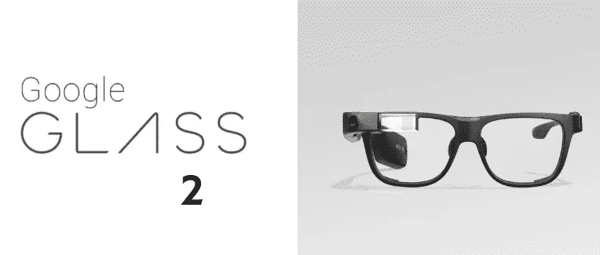
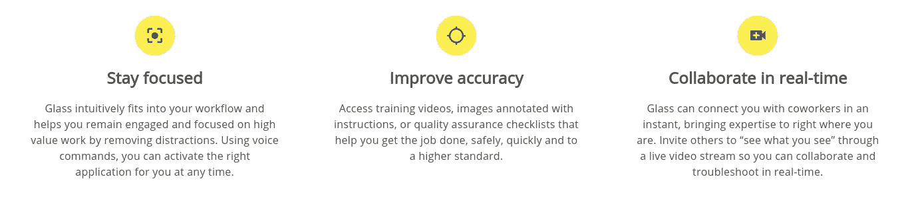
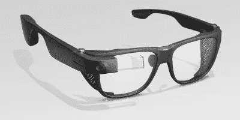
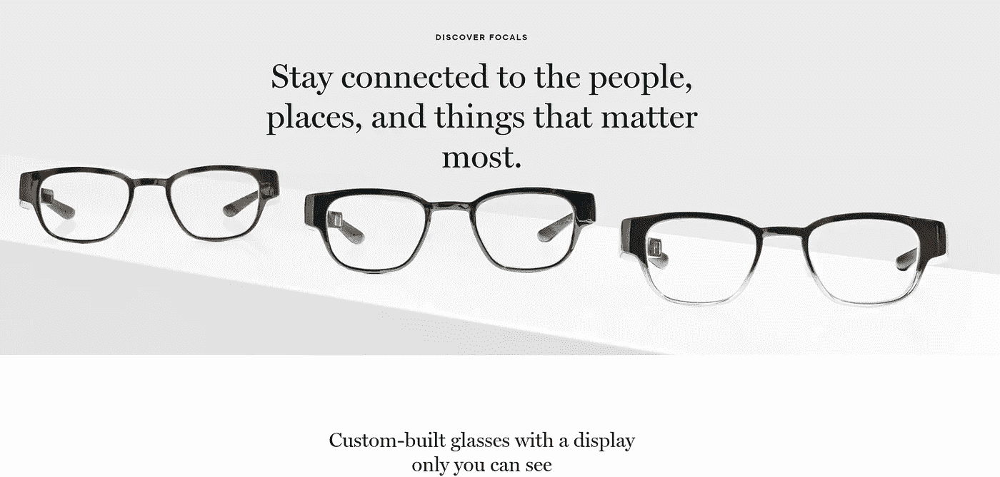
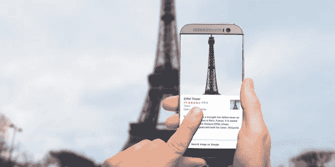
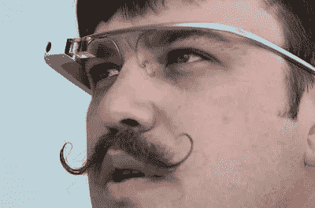

# 谷歌推出谷歌眼镜企业版 2

> 原文：<https://medium.datadriveninvestor.com/google-launches-glass-enterprise-edition-2-a119e2922fff?source=collection_archive---------8----------------------->

Google Glass 2 Enterprise Edition

## 是的，玻璃依然存在。它可能会在街上重现。

## 2018 年 9 月， [1843 杂志将公众对谷歌眼镜 1.0 的反应与 11 世纪对不起眼的叉子的粗暴对待进行了比较。](https://www.1843magazine.com/technology/rewind/waiter-theres-a-fork-in-my-soup)

数百年来，用叉子吃饭被认为是笨拙的，甚至是可耻的，尽管它似乎有明显的好处。用叉子意味着一个人的手太脏了，不能用它吃饭。

 [## 人工智能和虚拟现实的融合-你能期待什么-数据驱动的投资者

### 在技术领域，融合是合乎逻辑的一步。就在几十年前，你可能需要一个专门的…

www.datadriveninvestor.com](https://www.datadriveninvestor.com/2018/08/30/the-convergence-of-ai-rv-what-you-can-expect/) 

正如文章总结的那样，“使用它的尴尬超过了它的实用性。”

**所以，回到谷歌眼镜。**

本周，谷歌发布了[眼镜企业版 2](https://www.google.com/glass/start/) ，这个产品名称应该清楚地表明，它完全是为商业目的而开发的。

Glass 从谷歌的 X 部门转到了公司的 AR/VR 部门，这是一个有意义的变化。

x 是为实验概念保留的，而 AR/VR 是为 Daydream 和 ARCore 这样的市场现成产品保留的。

> Glass 2 运行 Android Oreo，拥有改进的摄像头，充电速度更快。

下面的精美视频展示了谷歌眼镜 2 的使用场景，重点是它可以为制造业和医疗保健工作者带来的免提优势。

在视频中，企业领导人报告说，使用谷歌眼镜后，培训时间减少了 50%，而一名医生表示，他现在可以花更多时间与病人在一起。

## 这里的附加值很大。

论点大概是这样的:

*   技术可以解放工人，让他们更人性化，专注于应用他们的技能，而不是浪费时间搜索信息或做笔记。
*   数字革命已经发生。我们依赖互联网来交流、研究和工作。
*   谷歌通过谷歌眼镜以具体的方式承认了这一现实，因为它将技术的力量置于员工的视线之内。现在可能感觉不自然，但好处应该是不言而喻的，任何行为上的不适都会很快消失。
*   如果我们要花时间在网上工作，为什么不在我们工作的时候腾出手来做其他事情呢？

## 在这种世界观中，技术和人类的两股力量不是对立的，而是融合的。事实上，它们是相辅相成的。

The business benefits of Google Glass 2.

从美学角度来看，Glass 2 企业版看起来肯定不像是你在酒吧会见朋友时会愉快地穿着的东西，但在这个工作场所版本的产品中，实用主义胜过了设计。

“安全框架”是由史密斯光学公司为一系列工作环境开发的，产品售价为 999 美元。

## 这又把我们带回了尴尬/效用比。

当在重工业领域工作时，可以在工作中提供重要信息的智能眼镜的用例非常有说服力。

事实上，很少有人会穿它们去参加家庭婚礼。

谷歌在这种背景下找到了谷歌眼镜的位置，这并非偶然。

当在压力下快速完成一项重要工作时，功能性总是比艺术性更重要。

如果我正在逃离一只河马，谷歌眼镜可以指引我一条逃跑路线，同时还可以释放我的手臂来提供急需的动力，我会毫不犹豫地把这些怪物粘上。

如果我去参观动物园，想了解更多关于河马的信息，我会更乐意在我的智能手机上查找它们。我只是不需要那些信息在我的视线里，当然也不需要大众的嘲讽。

当谈到消费者版本的谷歌眼镜时，这些动态仍然对谷歌不利，但趋势正在转变。

不说别的，从最初的产品遭遇不光彩的结局开始，我们已经走了很长一段路。

# 最初的谷歌眼镜怎么了？

谷歌眼镜于 2013 年在惯常的喧嚣中推出，并于 2014 年 5 月以 1500 美元的高价提供给消费者。

玻璃有它的粉丝，但他们很快就被快乐的诽谤者超过了。佩戴者被称为“玻璃洞”，有些人甚至在酒吧和街上遭到袭击。

公平地说，社会还没有为智能眼镜做好准备，持续视频记录的选项引起了特别的愤怒。

Google Glass attack in a San Francisco bar

该产品于 2015 年 1 月停止流通。

坦率地说，使用谷歌眼镜的尴尬远远超过了它的实用性。

后来发布了一个企业版，富有想象力的名字是“谷歌眼镜企业版”。

## 然而，公众意见很少是固定的。从 2015 年 1 月到今天，情况发生了很大变化。

[爱普生](https://www.engadget.com/2019/05/08/epsons-500-smart-glasses-are-literally-powered-by-your-phone/)、 [Bose](https://www.esquireme.com/bose-frames-smart-glasses-now-available-in-the-uae) 和 [Magic Leap](https://www.magicleap.com/) (等等)都推出了对“智能眼镜”的诠释，而初创公司 [North](https://www.bynorth.com/) 刚刚宣布获得 4000 万美元的新资金。

North smart glasses.

当涉及到在社会上规范智能眼镜时，这些公司正在帮助完成繁重的工作。

与此同时，谷歌正在制造车间的无尴尬区改进其产品。

# 谷歌眼镜+谷歌镜头:视觉搜索的未来？

视觉搜索是谷歌越来越关注的领域，也是亚马逊、Instagram 和 Pinterest 等竞争对手越来越关注的领域。

在一个受图像力量支配的社会里，我们通过视觉媒体搜索信息是合情合理的。

谷歌已经把 Pinterest 作为这一类别的跟踪马，就像它很高兴让 Bose 和 Epson 这样的公司带着智能眼镜面对公众法庭一样。

Pinterest 正在慢慢鼓励用户使用智能手机摄像头的图像进行搜索，而谷歌则通过其镜头产品跟上新的创新步伐。

Google Lens

谷歌对谷歌眼镜 1.0 的公关灾难记忆犹新，因此它正在尽可能降低风险。

Pinterest 正在成长，但距离对谷歌广告业务构成真正威胁还有很大距离。

**视觉搜索的逻辑终点是将搜索技术放在用户的视线范围内。**

就目前的情况而言，拿起智能手机，将相机对准一个物体，然后等待屏幕上的结果，这一过程有点麻烦。

然而，“略显笨重”往往足以让用户望而却步。

我们更喜欢无摩擦的体验，这可以通过将镜头放在谷歌眼镜产品中来提供。

就目前的情况来看，当产品受到公众的注视时，摩擦就产生了。

Google Glass 1

谷歌很乐意等待，并将抓住机会，在这些趋势在一个方便的时间点相遇时，发布一款消费者版本的谷歌眼镜。目前，企业版有一个重要的用途。

毕竟谷歌眼镜一直都有用。它只是不够有用，不足以证明它带来的社会贱民地位和沉重的价格标签。

**当尴尬退去的时候，效用就会凸显出来。**

叉子花了许多世纪才获得可接受的社会地位。谷歌将希望谷歌眼镜能比这更快地恢复正常。