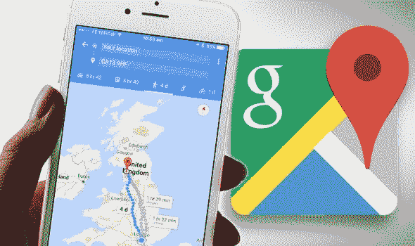
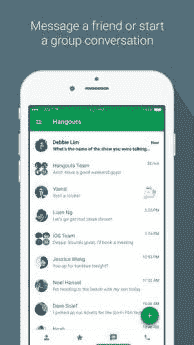

# 谷歌地图:新功能让你可以直接与商家聊天

> 原文：<https://medium.datadriveninvestor.com/google-maps-new-feature-lets-you-chat-with-businesses-directly-f202927e9a43?source=collection_archive---------43----------------------->

阅读时间:2 分钟

据 9to5Google 报道，谷歌将在谷歌地图中宣布一项新功能，允许用户向商家发送信息。

当这项功能推出供 iOS 和 Android 用户使用时，你会在左侧滑出抽屉中看到一个*新消息*按钮，允许你给你在谷歌地图上寻找的任何企业发送消息。

另请阅读:[2019 年如何变酷的终极指南](https://garimashares.com/2018/11/18/the-ultimate-guide-on-how-to-be-cool-in-2019/)

为了利用此功能，必须首先验证业务。通过验证后，企业可以通过谷歌地图应用程序直接与他们的潜在或现有客户沟通。

有了这个功能，用户就不必走到商店去寻找网站上没有列出的问题的答案。甚至给商店打电话有时也很混乱，因为谁有时间打电话解释呢？

与电话交谈相比，给公司发短信无疑是一个更可靠、更简单的选择。这对顾客和店员都有好处。

## 记得常去的地方吗？

但是，是的，我们不能忽视这样一个事实，谷歌以前的聊天工具并不成功。记得常去的地方吗？是的，那是模糊的记忆。还有，谷歌暂停了 *Allo。*

随着谷歌地图增加新功能，它会失去它的简单性吗？也许，会的。由于可用的选项不同，有时很难获得最简单的方向，因为探索，ETA，共享选项堵塞了你的手机屏幕。

顺便问一下，你知道吗，你可以聪明地使用谷歌地图，并在上面保存你的停车位，这样你就不用到处找你的车了。[阅读此处了解如何操作！](https://garimashares.com/2017/11/22/never-forget-where-you-parked-again-use-google-maps-smartly/)

我不知道你的情况，但最近，我在谷歌地图上导航时遇到了一些问题。不知何故，感觉它不再那么精确了。你也经历过这种变化吗？请在下面的评论中告诉我。

此外，现在它加载有点慢。我想这是加载新功能的结果。

让我们在[脸书](https://www.facebook.com/GarimaShares/)、[推特](https://twitter.com/GarimaBhaskar)和 [Instagram](https://www.instagram.com/garimashares/) 上连线

*订阅永不错过帖子！*

*原载于 2018 年 11 月 22 日*[*【garimashares.com】*](https://garimashares.com/2018/11/22/google-maps-new-feature-lets-you-chat-with-businesses-directly/)*。*