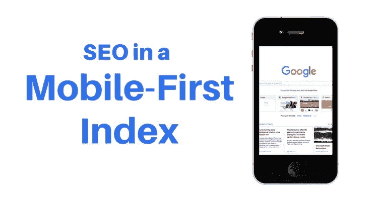

# 谷歌移动-第一索引功能:轻松索引

> 原文：<https://medium.datadriveninvestor.com/google-mobile-first-indexing-feature-index-with-ease-7733c38ea4e1?source=collection_archive---------48----------------------->

科技巨头谷歌的最新更新和创新每次都出现在新闻中。无论是技术创新、产品更新还是算法更新，它总是站在客户的角度思考问题。然而，谷歌是我们用来获取信息的最好的搜索引擎之一。一去不复返了，我们在桌面上工作，谷歌爬行机器人相应地工作。尽管有搜索查询，它还是会抓取、索引和排列有相关内容的网站。但是，现在，随着智能手机的出现，用户的搜索行为发生了巨大的变化。

Source: SearchEngineJournal

对于每一点数据，我们都使用智能手机搜索相关信息。早在 2018 年 3 月，谷歌就发布了一个更新，用移动友好的响应/设计来索引网站。谷歌将其吹捧为移动优先的索引功能。

**为什么移动第一索引功能变得如此重要？**

值得注意的是，在过去几年里，智能手机的使用在全球范围内呈指数级增长。随着手机使用率的上升，谷歌改变了策略，以直观的方式抓取和索引网站。谷歌移动优先的索引功能将极大地改变我们索引内容的方式，但不会改变我们对内容的排名。

很大程度上，移动优先的索引功能将为您提供超越桌面索引因素的竞争优势。它将抓取和索引网站的响应设计超过其他人。你可以有不同的桌面和手机网址，但这不会影响你的排名因素。谷歌将为移动搜索获取移动网址，而桌面搜索获取桌面**网址**。

**如果你没有手机网址模式会怎样？**

不过，谷歌会为你的移动搜索获取桌面网址。为桌面和手机设计单一 URL 结构的网站不需要担心这个问题。最终，许多网站正在从桌面迁移到移动友好的版本，以提高索引。网站所有者将通过搜索控制台警报得到通知。一旦成功迁移，你可以从智能手机**谷歌机器人**获得比以前更多的抓取。

然而，如果你没有移动索引页面，不要惊慌。尽管如此，谷歌还是会抓取和索引你的网页上的相关内容。话虽如此，**[**Google Mobile-first indexing 特性**](https://searchengineland.com/googles-mobile-first-indexing-now-powers-over-half-of-googles-search-results-309650?utm_source=twitter&utm_medium=social&utm_campaign=socialflow) 并不是为了冲击排名因素。最重要的是，移动优先索引功能将有利于非 AMP 网页，而不是 AMP 网页。**

****

**SearchEngineJournal**

# **以下是谷歌移动优先索引功能的一些要点:**

1.  **移动优先索引功能将改变智能手机谷歌机器人抓取和索引页面的方式。**

**2.它不会改变基于移动索引功能的网页排名因素。**

**3.它将索引移动版本的网址相比，桌面网址。**

**4.如果你的网站迁移到手机友好的版本，自然会增加每天的抓取率。**

**5.确保你的移动版本在内容加载和抓取方面更快。自定义您的内容以获得更好的搜索结果。随着加载时间的增加，它将对**停留时间**产生不利影响。**

**6.如果你的页面没有迁移到移动优先索引，可能是谷歌还没有开始评估。或许，你的桌面版可以表现的很好。**

****移动优先索引功能缺点:****

****结构化数据缺失:****

**如果您在桌面版本上使用结构化数据，那么您应该在移动版本上反映相同的内容。否则，您最终将会丢失移动页面上的结构化数据。确保在模拟移动版本时测试每个页面。**

*****缺少 Alt 标签:*****

**图像 Alt 标签对于识别图像的上下文是必不可少的。这将使搜索变得简单易懂。如果您对桌面版本的图像使用“ [***Alt 标签***](https://www.searchenginejournal.com/google-explains-the-2-most-common-issues-with-mobile-first-indexing/284035/) ”，请确保您对移动友好版本使用相同的标签。搜索“ **img** ”标签源代码，并检查适当的图像 Alt 属性。**

**最重要的是，它是移动优先索引功能，而不是仅移动索引功能。**

**更多 [***点击***](https://twitter.com/ClickonGadget)**