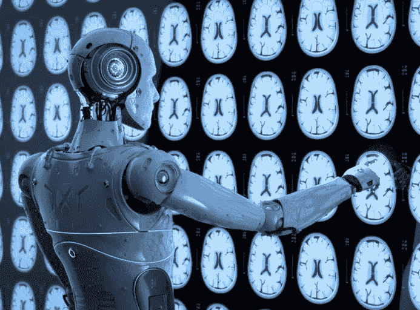

# 谷歌新闻 09/26:人工智能和医学

> 原文：<https://medium.datadriveninvestor.com/google-news-09-26-artificial-intelligence-and-medicine-88cb24d8ee1e?source=collection_archive---------6----------------------->

## 有希望但不确定的关系

最近的一篇科学评论得出结论，人工智能(AI)能够以与医生相当的速度识别疾病，尽管证明这一点的高质量研究数量仍然很低。

人工智能已经在诊断[视网膜病](https://static.googleusercontent.com/media/research.google.com/en//pubs/archive/45732.pdf)——眼睛后表面的疾病——和检测[医学扫描](https://www.ncbi.nlm.nih.gov/pmc/articles/PMC6268174/)中的异常方面显示出潜力。在这些情况下，它并不能取代医生的判断，而是一个补充工具，可以用来做出更明智的决定。

 [## 人工智能与创造力:梦想成真|数据驱动的投资者

### 人工智能总是让我着迷。不仅作为一套有用的工具，不断发展，而且作为一个…

www.datadriveninvestor.com](https://www.datadriveninvestor.com/2019/01/28/ai-creativity-deep-dream-comes-true/) 

对于担心人工智能可能会像自动化对工厂工作所做的那样对医学产生影响的医生来说，这是一个好消息。但是，像所有技术一样，人工智能的发展提出了新的问题和挑战，医学必须能够应对这些问题和挑战。

广义而言，人工智能是使用计算机程序来进行计算、做出决定和解决问题——这些事情我们通常会用人类的智力来做。它的应用范围从监控交通到制定数学方程到寻找正确的棋步。

人工智能有两种一般类型:

基于规则的技术顾名思义，是建立在一套固定的规则基础上的，这些规则指导计算机解释数据并给出输出。

**机器学习**依赖于在一组给定的输入和输出中检测到的推理和模式，并可以根据其性能实时改变其方法。

为了说明这两种人工智能的区别，我们可以想象一个放射学家在一些 x 光片上看到异常。

如果我们开发一个基于规则的人工智能来帮助他，我们将了解他用来做出诊断的所有因素:一个区域的形状、大小、相对于周围环境的对比度等等。然后，人工智能将使用这些规则，将它们应用于图像，并得出其输出。从本质上来说，这将是医生决策过程的一个完美无误的版本——当然，不包括他的直觉可能产生的任何影响。

相比之下，如果使用机器学习算法，那么人工智能将处理一系列图像及其正确的诊断。随着时间的推移，这个系统在评估图像时变得更加准确，但程序开发的规则仍然未知:它仍然是一个“黑盒”，我们只能知道给出了什么输出。

机器学习是一种较新的技术，最近已经成为一个时髦词汇。文献综述中回顾的研究使用了机器学习的形式:这是当今人工智能技术的最先进水平。

有一个很好的理由来降低我们对人工智能的期望。对其潜力的过度热情导致了 20 世纪 70 年代所谓的人工智能冬天，这削减了研究，并导致对新技术的投资下降。

但是除了这些实际的考虑，我们应该注意人工智能是如何影响医学哲学的。

我们已经倾向于通过科学的镜头来思考这个领域——例如，我们认为尖端手术和药物是现代医学的代表。

但是所有这些都是以医学作为一种实践为代价的:也就是说，作为与病人互动的艺术，不管我们的科学能力如何。

这些人工智能诊断工具无疑就是如此:随着我们技术能力的增长，“患者结果”的定义将越来越多地由准确的诊断和治疗来定义，而不是患者满意度或任何更深层次的福祉。

人工智能无法告诉我们病人结果的正确定义应该是什么，也无法解决永远是医学特征的道德问题。

我们不应该让人工智能在考场上的崛起强化医学作为一门科学的流行观念。否则，我们有可能让病人远离他们的治疗，让医生远离他们的工作。