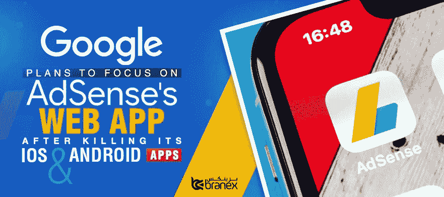

# 谷歌计划在终止 iOS 和 Android 的 AdSense 应用后，专注于网络应用

> 原文：<https://medium.datadriveninvestor.com/google-plans-to-focus-on-web-app-after-killing-its-adsense-apps-for-ios-android-6b51d1d34f0?source=collection_archive---------17----------------------->

告别令人心碎。不管是人还是你这么多年努力的一个产品。拔掉插头是令人心碎的。然而，有时候，这是正确的做法。

[谷歌放弃了超过 251 款表现不佳的产品](https://www.minterest.com/google-products-services-you-probably-dont-know/)。你能想象谷歌告别 AdSense [iOS](https://www.branex.ae/ios-app-development/) app 和 Android app 吗？

 [## 2019 年移动应用开发之路|数据驱动的投资者

### 任何在移动应用程序开发行业工作的人，无论他们是专注于在伦敦开发 iOS 应用程序还是…

www.datadriveninvestor.com](https://www.datadriveninvestor.com/2019/01/15/the-path-of-mobile-app-development-in-2019/) 

Google AdSense 是最大的广告平台，支持每个网站展示自己的广告。Android 和 iOS 应用程序都让用户可以方便地随时查看收入和其他数据。然而，现在，谷歌对继续移动应用有点动摇。

[**相关:如何在谷歌搜索上有效搜索？**](https://www.branex.ae/blog/effective-ways-to-google-search-that-more-than-90-people-are-unaware-of/)

谷歌计划专注于其进步的 web 应用程序，这就是为什么目前杀死 Android 和 iOS 的 AdSense 应用程序是一个合理的决定。

# 根据谷歌的说法:

> **“我们将把投资重点放在 AdSense 移动网络界面上，淘汰当前的 iOS 和 Android 应用。通过投资一个支持所有平台的通用 web 应用程序，我们将能够比现在更快地提供针对移动设备优化的 AdSense 功能。”**

此外，Google AdSense 团队暗示，在未来的服务中，将会有一个更具互动性——可能更主动——的体验:

***“我们的愿景是做更多的事来保持你的帐户健康，让你专注于创造伟大的内容，并在问题或机会需要你注意时来找你。”***

谷歌有一段扼杀有用服务的历史，却没有给出任何替代品。

据说这些应用程序将在年底前从 Play Store 中移除，无论如何，这些应用程序可能会在那个时候停止工作。

谷歌的一个小小的令人失望的举动，当它发生时，许多博客、网站所有者和自由职业者都会感到非常难过。然而，既然老爸已经做出了决定，我们就不得不接受后果。

原文来源:[https://www.branex.ae/blog/google-killing-adsense-apps/](https://www.branex.ae/blog/google-killing-adsense-apps/)