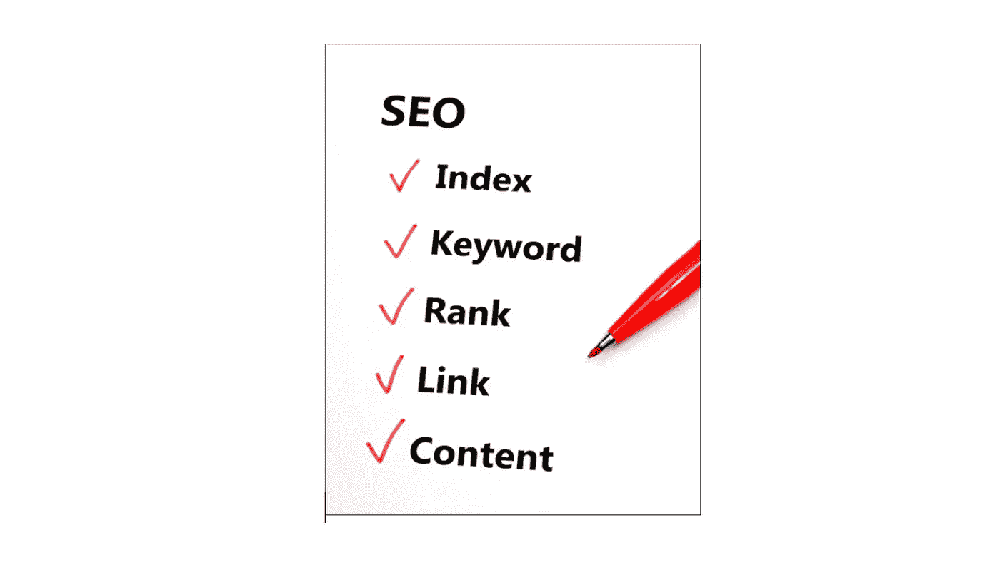

# 谷歌排名信号及其对 2019 年的意义

> 原文：<https://medium.datadriveninvestor.com/google-ranking-signals-and-what-they-mean-for-2019-d4087e00ecaa?source=collection_archive---------7----------------------->

谷歌实际上有数百个排名因素，并且每年都在增加新的排名因素。好消息是，这些因素适应用户，这意味着新的 SEO 趋势植根于当前的算法。换句话说，通过记住一些关键的排名因素，你可以确保你的网站保持可抓取性，你的在线形象保持强大。

虽然你应该考虑所有因素，但专注于以下因素可以帮助你在 2019 年的 SEO 战略上有一个良好的开端。

 [## 描述性统计与推断性统计。有什么区别？-数据驱动型投资者

### 想象一下。你拥有一家餐馆，想知道人们对你的生意有什么看法。所以，你给一个…

www.datadriveninvestor.com](https://www.datadriveninvestor.com/2019/02/28/descriptive-vs-inferential-statistics-whats-the-difference/) 

1.  ***干净且可抓取的代码***

即使你的网站从外面看起来很惊人，如果它没有一个干净的代码，它将消失在网上默默无闻。这几乎是谷歌“阅读”你网站的唯一方式。被设计用来读取代码的机器人会忽略有劣质代码的页面。换句话说，如果你有很多与页面内容无关的代码，谷歌机器人可能会完全忽略它。

当然，这并不意味着你应该用代码填满每一页或者选择一个华丽的主题。这只会降低下载速度，进而降低你网站的排名。你应该考虑雇佣一个精通 HTML 和 CSS 代码的开发人员来解决这些问题，而不是自己尝试。从最小化 HTML 到消除不必要的脚本，任何事情都会带来巨大的不同。

如果你决定自己修改代码，在使它生效之前，一定要让一个 SEO 专家来看看。与他/她一起找出潜在的问题并解决它们。这将有助于你实现在线营销和搜索引擎优化的目标。

**2*。域安全***

如果一个网站的 URL 以“https”开头，这意味着该网站使用了 [SSL 证书](https://comodosslstore.com/blog/how-do-ssl-certificates-works.html)进行保护。HTTP 代表超文本传输协议，这就是谷歌区分安全网站和非安全网站的方式。HTTPS 是这种协议的一个更安全的版本，它帮助搜索引擎确认它索引的数据对搜索者来说是安全的。

尽管这种安全协议可能不会立即提高网站的排名，但它会使网站更加可行和值得信赖。

***3。入站链接***

这些也被称为“反向链接”，它们基本上是从你的页面链接回你正在参考或推广的其他页面的超链接。这些会对你的排名产生巨大的影响，甚至会影响你的网站在哪个页面上的排名。

那么，为什么谷歌会关心你从哪里获得参考呢？入站链接告诉搜索引擎用户信任你网站上的内容。链接来源越可信，对你排名的影响就越大。

当然，这并不意味着你可以作弊。例如，如果你添加一个链接到你自己的博客文章，它不会做任何事情。反向链接只有来自外部域时才有影响。换句话说，为了让你的网站在网上受欢迎，尽可能多地从其他出版商那里赚取反向链接。例如，你可以为另一个网站写一篇客座博文，然后链接回你的网站。

***4。话题权威***

你为你的博客选择的主题或者你的网站的主题为它的页面权威奠定了基础。你在一个主题上发布的内容越多，该内容在 SERPs 上的排名就越高。

假设一个网站有大约 10 篇关于园艺的文章。当这些帖子被发表和阅读时，谷歌将会知道这个网站是这个特定主题的权威。这就像是搜索引擎的一个触发器，搜索引擎会在搜索结果中提高网站的排名。事实上，它会优先考虑属于权威网站的内容，即使它不包含相关的关键字。

***5。内容一致性***

即使你的网站访问者在你的网站上找到了他们想要的内容，这也是不够的。如果另一个网站提供了相同的答案，但以更连贯的方式提供了相关的关键词，他们就会转向该网站。这是决胜局。

我们所说的一致性是什么意思？根据谷歌的说法，好的内容被分成标题和副标题，这样读者可以快速浏览和消化。它还必须有要点、支持图片、引用研究和编号列表，以确保读者从头到尾都参与其中。

内容越吸引人，用户在你的网站上停留的时间就越长。这就是所谓的“会话持续时间”，这是另一个排名因素，你可以通过在你的网站上发布研究充分、关键词丰富、相关的内容来提高排名。

**smart cut Marketing LLC 如何提供帮助**

让我们面对现实吧。你真的知道如何修复你的网站代码并更新其内容来吸引那些谷歌机器人吗？这就是 SmartCut Marketing LLC 可以帮助你的地方。我们是一家位于新泽西州的企业，我们专门提供创造性和战略性的在线营销解决方案，可以将您的网站放在地图上。

我们只推荐对你有用的策略，帮助你提升你的网络形象和声誉。这包括社交媒体营销策略，可以增加你的追随者，并在各种平台上建立一致的品牌声音。我们还可以撰写高质量的以品牌为中心的帖子，以便您可以专注于您的核心业务需求。[今天就与我们联系](https://www.smartcutmarketing.com/contact),让您的网站在排名中飙升，而不会让您倾家荡产！