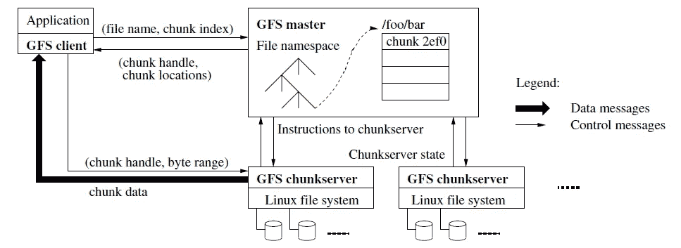

# 谷歌研究论文评论

> 原文：<https://medium.datadriveninvestor.com/google-research-papers-review-d62fff7d0789?source=collection_archive---------40----------------------->

对我寒假期间读过的几篇研究论文的简短回顾。

研究论文的链接:

*   [谷歌文件系统](https://static.googleusercontent.com/media/research.google.com/en//archive/gfs-sosp2003.pdf)
*   [大桌子](https://static.googleusercontent.com/media/research.google.com/en//archive/bigtable-osdi06.pdf)
*   [MapReduce](https://static.googleusercontent.com/media/research.google.com/en//archive/mapreduce-osdi04.pdf)

 [## 为什么数据将改变投资管理——数据驱动的投资者

### 有人称之为“新石油”虽然它与黑金没有什么相似之处，但它的不断商品化…

www.datadriveninvestor.com](https://www.datadriveninvestor.com/2019/01/25/why-data-will-transform-investment-management/) 

# **谷歌文件系统**

这篇文章讨论的主要问题是:

**1)容错**

*   谷歌文件系统需要继续运行，即使有一个小的系统错误。例如，如果一个小分区崩溃，它不应该影响系统。Google 文件系统采用了一种效果大小与分区错误大小成正比的方法。
*   这在高可用性系统中非常有用，因为拥有一个随时可用的所有内容的实例对于需要随时可用的所有内容的站点来说非常重要。
*   Eric Brewer 提出的 CAP 定理认为，一个数据存储设备不能同时以良好的水平提供以下三项中的两项以上:
*   **C** 一致性， **A** 可用性， **P** 分割公差。
*   不同的系统可能希望将某些系统置于其他系统之上，以便更好地支持它们的受众。也有系统旨在模仿有 3。卡桑德拉就是一个例子。

**2)对读者和作者的可用性**

*   GFS 分离文件系统控制，以便它通过主服务器。现在数据传输直接在服务器和客户端之间传递。由于每个数据块的复制系数为 3，因此即使某个数据块因不可预见的情况而关闭，系统也可以对其进行备份并重新加载更新版本。
*   看起来 Google 的文件系统与 HDFS 非常相似，它存储了复制和实现良好的容错功能。主/从系统的使用类似于 HDFS 中的数据/名称节点。我认为 GFS 关注一致性和可用性是为了吸引公众。通过拥有高容错能力，我们可以保证数据始终可用。通过对每个块进行版本编号备份，可以通过将旧版本自动回收到新版本来保持一致性。

# **大桌子**

*   BigTable 是 Google 使用的一种存储方法。它将数据存储在三维绘图系统中。想象一个传统的 HashMap，有 ***(value: key)*** 。Google 的 BigTable 非常类似，使用的是一个三维地图，按照 ***(行，列，时间)*** 排序，其中行和列用字符串表示，时间用不超过 64 位的整数值表示。
*   这个系统被进一步分割成每个 200 兆字节的平板电脑。为了容纳不断增长的数据集，一旦达到平板电脑的最大大小，它就会被压缩或重新分配，以保持一致性。
*   乍一看，谷歌的大桌子似乎有很多类似 Apache HBase 的特质。这两个系统都设计用于预先开发的文件系统(HDFS 和 GFS)之上。虽然 Google 在 Big Table 中使用了一种不太受支持的文件存储格式，但它获得了更好的内部可伸缩性和控制性能。