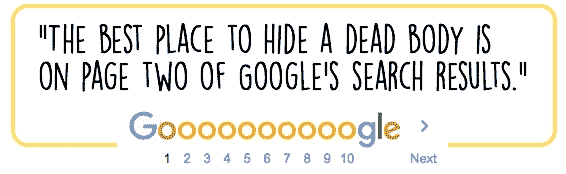

# 谷歌、搜索引擎优化和信任

> 原文：<https://medium.datadriveninvestor.com/google-seo-and-trust-67a25b8201f6?source=collection_archive---------15----------------------->

你信任谷歌。你可能不喜欢谷歌，但你信任谷歌。

这个笑话管用，因为我们都信任谷歌。如果谷歌说你的网站值得出现在他们搜索结果的第一页，我们都会同意这是值得的。**肯定是**。这个笑话有趣的是，它在 SEO 专业人士中很受欢迎，SEO 专业人士是一群工作是弄清楚如何让网站出现在谷歌搜索结果的第一页的人。

我们谈论的是在某种程度上以操纵谷歌为生的专业人士。他们精心制作和调整内容，使其对谷歌友好，这样它就能出现在搜索结果的第一页。他们不仅知道香肠是如何制作的:他们是制作香肠的人。然而，即使他们知道魔术是如何运作的，他们仍然相信魔术，就像你一样，他们信任谷歌。

我们都生活在人们的周围，其中一些人是我们所爱和信任的。然而有时，当他们与我们分享信息时，我们会通过谷歌进行核实，以确保万无一失。比起信任我们信任的人，我们更信任谷歌。

 [## 不开玩笑:营销是为了搞笑|数据驱动的投资者

### 当你把幽默和营销结合在一起时，这是一件有趣的事情。当然，马克·安德森希望如此。别叫他雪莉。相反…

www.datadriveninvestor.com](https://www.datadriveninvestor.com/2019/02/25/no-fooling-marketing-goes-for-laughs/) 

然而，前几天发生了一些事情；这让我重新思考这个问题。事情是这样的:在一次群聊中，有人问是否有人听说了乌拉圭选举的结果。我首先想到的是“*嗯，你为什么不去谷歌一下呢？*”，然后我意识到，这是一件不同寻常的事情: ***我们被委托这个问题*** 。

> 我不想看谷歌对这个话题的说法，
> 我想知道你们中是否有人听说过这个话题。

信任就像一座纸牌搭的房子:需要大量的时间和耐心来建造，但稍有风吹就可能分崩离析。但是当它矗立的时候，它确实是一个美丽的奇观。

有时候我们太忙了，忙得不可开交，以至于我们忘记停下来欣赏那些有人信任我们的时刻。有时，我们忙于自己的工作，结果让人们觉得我们不受打扰，好像我们不在身边。就这样，只要有一丝风，信任就会瓦解。

如果我可以问的话，你在做什么来建立我们称之为信任的微妙而脆弱的东西？还有保养的怎么样？