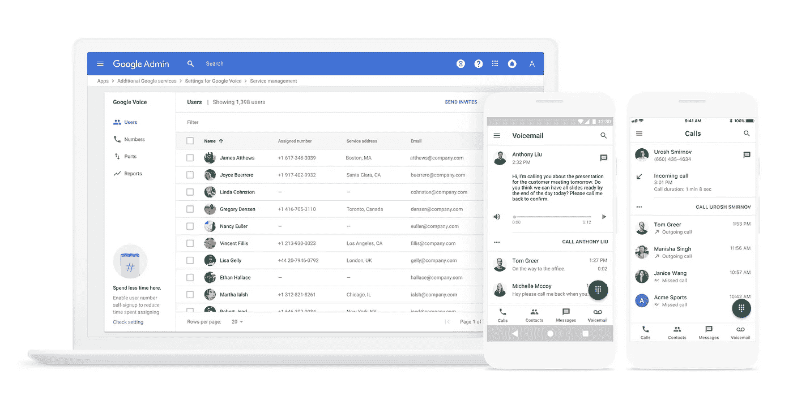

# Google Voice for Business:企业 VoIP 选项指南

> 原文：<https://medium.datadriveninvestor.com/google-voice-for-business-a-guide-to-voip-options-for-your-business-526502abbd0d?source=collection_archive---------1----------------------->

良好的沟通是任何现代企业的基本特征之一，这就是为什么所有公司都自然而然地希望采用最好的技术特征，以实现全天候最平稳的运营。鉴于谷歌是一家全球科技巨头，几乎影响着你数字通信的方方面面，谷歌语音立即脱颖而出，成为领先的候选人之一。然而，正如任何软件或商业投资一样，为了你的企业、政府或学校系统的利益，你必须权衡利弊，做出明智的决定。

说到你的网络电话业务系统，这些天你有很多选择。一些小企业正在转向的最新产品之一是谷歌商务语音。虽然中型和大型组织倾向于获得专用 VoIP 服务，但企业家和预算紧张的人发现免费(或每月最低成本)服务的诱惑尤其诱人。但是 Google Voice(现在也提供 VoIP)确实提供了一些功能，对于那些刚刚起步的人来说，这是一个不错的选择。但是，在决定将它用于您的业务之前，您需要记住几件事情。你只需要知道这些。

 [## 模式和机器人:复杂的现实|数据驱动的投资者

### 哈耶克的名著《复杂现象理论》(哈耶克，1964)深入探讨了复杂性的话题，并断言…

www.datadriveninvestor.com](https://www.datadriveninvestor.com/2019/03/04/patterns-and-robotics-a-complex-reality/) 

# 谷歌语音是做什么的？

谷歌语音是 2009 年推出的 VoIP(互联网协议语音)服务，面向所有谷歌账户持有人(个人和企业)。它为用户提供一个免费的电话号码，然后可以用来收集电话，短信和其他形式的电话通信。

这项服务不会取代你的智能手机或固定电话，但允许几个设备使用同一个电话号码。这允许您在将号码连接到您的所有设备之前为所有联系人提供相同的号码——作为一家企业，这可能意味着将 Google Voice 号码关联到几个员工的设备。

已连接的设备仍将接收拨打到其个人号码的呼叫。因此，在许多方面，它只是在他们的个人设备上增加了一个额外的联系号码。

# 谷歌语音一览

第一印象在现代商业中很重要，对于任何给定软件的基本特性的最初想法通常是相当准确的。在与 Google Voice 的第一次交互过程中(甚至在下载软件之前)，应该注意以下几点。

# 积极的一面

## 数字一致性

也许谷歌语音应用程序最明显的卖点是，你分配的号码可以跟随你一生。例如，如果你刚刚开始一个以家庭为基础的业务，最终将过渡到商业场所，这可能特别有用。这将节省时间，金钱和麻烦通知您的联系人名单的变化细节。

***本地区号***

谷歌语音允许用户选择一个与你的地理位置相关的号码。如果你的公司是一个有虚拟办公室地址的小型家庭企业，这是一个将号码与更有声望的位置联系起来的好方法。你可能遇到的唯一问题是寻找一个时髦的数字，比如以 000 结尾的数字。

***号码移植***

如果你已经有了一个你喜欢的号码(或者已经在商业中使用了很长时间)，失去它的想法就不会有吸引力了。Google Voice 允许您将旧号码转移到 VoIP 平台，尽管会收取少量费用。尽管如此，这使您可以继续您的业务活动，而无需通知客户或同事任何变化。

***简单 app***

无论号码是在一台设备上使用还是在几台设备上使用，谷歌语音应用程序都可以轻松掌控局面。你的员工都不需要特殊培训，这使得团队可以享受使用谷歌语音应用程序的好处，而不需要太多的麻烦或适应。

## 它几乎是免费的(免费计划和付费计划，每月 10-30 美元)

选择免费的选项并不总是对你的企业最好的解决方案，但是真正起作用的免费产品可以对你的底线产生重大影响。无论节省下来的钱是用于增强你的沟通功能的其他方面，还是投资于企业的其他方面，它都有助于加快你的进步。每个人都喜欢免费赠品。谷歌的定价方案很简单；从 10 美元/月到 30 美元/月的高级会员。

## 是谷歌

当考虑整合任何技术功能的前景时，信任是最重要的功能之一。谷歌可以说是任何计算机或数字技术行业中最有声望的公司。此外，谷歌语音产品已经上市整整十年了，这给了技术人员充足的时间来修复漏洞。

***语音邮件转短信***

通过语音信箱阅读文本通常更容易。像综合 VoIP 提供商一样，Google Voice 允许您利用这项技术。此外，您可以发送短信，而不会遇到额外的开销。从时间的角度来看，这个特性是有用的，并且还可以记录关键信息。

***会议***

电话会议在现代商业交流中是一件大事，谷歌语音应用程序可以让你在对话中增加三个用户。虽然它不能与更高级系统的电话会议功能相匹配，但对于 3-4 人的小组和重要会议来说，它仍然非常有用。

***沟通管理***

处理垃圾电话和信息会占用你的时间，带来非常严重的后果。谷歌语音平台可以过滤所有通信，自动将垃圾邮件放入垃圾邮件文件夹。如果您决定这样做，仍然可以手动访问它们。或者你可以把它们扔进垃圾桶。

# 负面影响

***隐私***

谷歌旗下的所有产品都收集各种数据，以提供更好的用户体验。然而，这确实意味着通话记录和通话记录等机密通信信息将被存储在谷歌服务器上。这确实会引起潜在的隐私问题，因为你将受到黑客的摆布。

***数据所有权不是自己的***

虽然谷歌的隐私政策规定了他们可以对你的数据做什么，不可以做什么，但基本事实仍然是，谷歌可以完全访问你在本质上是非专用网络上共享的任何数据或信息。最近发生的数据安全违规事件在几年前似乎闻所未闻，因此很难展望未来，也很难确定在数据挖掘、数据共享和整体隐私问题方面会出现什么类型的计划。不仅如此，谷歌还可以获取你的数据，用于定向广告或其他信息。除非你想花大量的时间去理解这些数据是如何被使用的，否则你最好完全避免使用它们。

***来电显示可靠性***

考虑到你的手机可能会继续处理私人电话和商务电话，对于接听的电话是商务电话还是休闲电话这一潜在的困惑总是敞开的。与此同时，你必须使用该应用程序从谷歌号码拨出电话。忘记这么做将会泄露你的个人号码，并且看起来不太专业。

***连通性问题***

虽然这不仅仅是谷歌语音的问题，但它是一个 VoIP 的事实意味着你一直依赖于一个流畅的连接来流畅地进行通话。除了传输数据的潜在问题之外，它还会消耗大量数据。如果你不小心的话，最终会花掉你很多钱。

***谷歌语音业务便利因素***

在考虑了应用程序的基本功能后，您应该考虑 Google Voice 平台可以有多方便。毕竟，时间就是金钱，而你也想避免任何软件造成的压力。

*缺乏服务质量*

*VoIP 要考虑的一个因素是一种称为 QoS 或服务质量的功能。拥有一个专门的 VoIP 服务提供商而不是使用谷歌的 VoIP 可能会帮助你避免一些潜在的陷阱。你看，你的上网能力受限于你的整体带宽。当您的带宽变得繁忙或阻塞时，您可能会注意到各种服务的问题。你可能有视频无法加载或冻结，或者你的网站速度可能是蜗牛的速度。同样的事情也会发生在你的互联网工作和你的在线商务电话系统上。这意味着掉线、大量的延迟和糟糕的时机。但是，QoS 将调节整体流量，并允许您的电话系统在繁忙时间拥有通行权。这确保了您的客户来电首先得到照顾，也确保了通话质量会很高。您希望确保选择一个结合了高质量互联网服务和强大 QoS 的提供商，以使您的通话优先于您带宽上的所有其他活动。谷歌语音本身在这方面的能力有限。*

****缺少高级功能****

*我们提到了谷歌语音提供的一些功能，如语音邮件转发和呼叫阻止，但高级功能有限。例如，想要一个免费电话号码吗？用谷歌语音你不会得到这些。几十年来，企业一直依赖某些 PBX 系统功能来实现一流的通信。保留音乐、老板秘书线路、呼叫转移、内部通信、定制问候和菜单、呼叫监听和监控以及目录只是使用专用系统的一些额外好处。如果你的企业需要将其语音服务与 Salesforce 等其他平台集成，那么使用 Google Voice 你会遇到麻烦。*

****数量限制****

*虽然您可以通过 Google Voice 免费获得您的本地号码，但应该注意的是，您无法获得其费率中心、收费号码或虚拟号码之外的号码，因为这些号码根本不受平台支持。对于大多数小企业来说，这不是一个大问题，但是大公司可能会发现它会引起一些问题。*

****扩展****

*另一个限制与分机号码的使用有关。谷歌语音并没有真正推广这些。虽然你可以为企业内不同的谷歌用户设置不同的号码，但他们的号码不太可能遵循你理想中从服务中获得的一致流量。*

****音质****

*谷歌语音确实产生非常好的音频质量标准定义。然而，缺少高质量的高清音频，而不是依赖于 WiFi 连接，这是一个小问题，取决于您的位置以及其他用户使用的设备。这种情况不会经常发生，但偶尔需要重新安排通话可能会非常有害。*

****谷歌语音业务发展因素****

*最后，在投资谷歌语音(或不投资)之前，需要将开发因素纳入决策过程。这里有一些你需要考虑的事情。*

****不足为统一通信****

*统一通信允许实时协作、完整的系统集成、通信平台即服务(CPaaS)以及极致的灵活性和易用性，所有这些都在一个平台中实现。统一通信意味着您可以从 CRM 直接给潜在客户打电话，接入其他呼叫者进行电话会议，共享您的计算机屏幕以显示流程，并在完成后发送整个项目的录音。这通常具有桌面客户端/软电话的灵活性，并且可以与桌面电话或移动设备完全集成。你不会发现 Google Voice 和一个完整的 CPaaS 提供商有同样的功能。*

****没有集成 widgets****

*虽然谷歌语音是一个很好的平台，但你将很难集成第三方应用程序，如社交媒体订阅。如果你想加入这些额外的功能，你需要下载(并支付)额外的服务。这可能会一下子变得昂贵、复杂和令人困惑。*

****没有调用菜单****

*呼叫菜单可以是 VoIP 服务器的一个关键特征，包括定制的语音问候和定期更新的商业信息。Google Voice 并不是专门为企业设计的，因此也没有为客户提供结构化的呼叫菜单和呼叫流程。它会限制你的可能性。*

****联系人管理****

*以有效的方式管理和组织联系人是任何企业面临的最重要的任务之一。遗憾的是，谷歌语音只是存储了你所有的联系人，而不是将他们分组。因此，您可能会面临这样一种情况:在您的设备上，个人和业务联系人被结合在一起。*

****缺乏支持****

*谷歌语音不会给你提供重要的支持服务。如果有什么东西出了故障，你得靠自己去修理。当你同意使用谷歌语音时，你就同意未来可能出现的所有更新。这些更新中的任何一个都可能导致你当前设置的混乱。*

# ***关于卡罗莱纳数字手机:***

**

*Carolina Digital Phone 是一家本地 VoIP 服务提供商和托管电话服务的先驱，它提供的产品可以提高商业、教育和政府电话的功能，同时降低其总体成本。该公司的产品以其卓越的价值脱颖而出，包括极具竞争力的价格、业内最丰富的功能集、易于部署和许多用户友好的软件包，从包括拨号音和 VoIP 电话在内的全套交钥匙设置到可与现有座机、手机或 VoIP 电话配合使用的自动呼叫应答和路由解决方案。在 CarolinaDigitalPhone.com[了解更多信息](https://carolinadigitalphone.com/)*

*卡罗莱纳州数字电话公司
北卡罗莱纳州格林斯博罗榆树街 301 号 601 套房
，电话 27401
(336)544–4000*