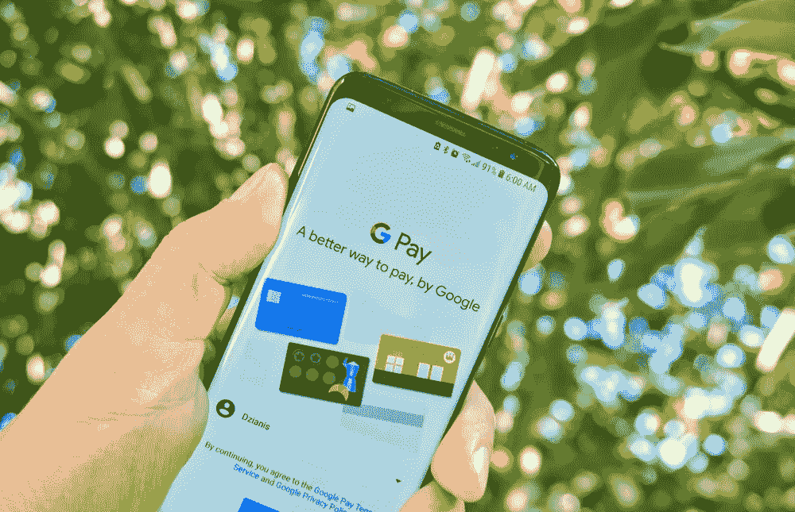

# GooglePay 揭示“生物识别”是一种新的支付方式

> 原文：<https://medium.datadriveninvestor.com/googlepay-to-take-biometrics-as-a-payment-method-8fea84c2c120?source=collection_archive---------5----------------------->

Google Pay——一个数字化交易平台，无需处理多张信用卡来转账或下单。它以前缺乏作为支付方式的生物识别功能。但现在，它通过引入一种新的支付方式，使认证过程变得更加实用。通过面部验证和指纹扫描，人们可以通过 GooglePay 转账。

在最新的 2.100 应用程序版本中，用户将被允许通过指纹扫描和面部模式实时执行安全交易。在此之前，GooglePay 用户使用 PIN 码验证。现在，谷歌已经在新版本中支持生物识别 API。这项新功能比传统的 PIN 验证更快、更有效。

 [## 分散金融的出现|数据驱动的投资者

### 当前的全球金融体系为拥有资源、知识和财富的人创造了巨大的财富

www.datadriveninvestor.com](https://www.datadriveninvestor.com/2019/03/14/the-emergence-of-decentralized-finance/) 

该功能目前在印度不可用。GooglePay 印度公司仍将使用 UPI pin 验证方法进行转账，并解锁手机和移动应用程序。

# GooglePay 生物识别技术在 Android 10 设备上的应用

生物特征[功能](https://thepaypers.com/news/google-pay-reveals-biometric-authentication-feature-for-money-transfers--1239356)目前在 Android 10 设备上可用。Android Police 报告称，很快该功能将在 Android 9 设备中得到支持。这项功能位于应用程序的“汇款”部分。用户可以自由选择验证方法。他们可以使用 PIN 或生物识别安全或两者结合来保护通过应用程序进行的交易。

值得注意的是，这种生物特征仅适用于转账，不适用于商店中的 NFC 支付。为此，手机必须解锁。

# **基于生物识别的支付优势**

生物识别正在[塑造支付的未来](https://shuftipro.com/blogs/biometric-verification-shaping-the-future-of-payments/)。与 PIN 验证相比，生物识别技术提供了更高的安全性。首先，记住密码有时很烦人。其次，通过凭据填充，可以劫持密码。为了解决这两个问题，生物识别被认为是一种快速高效的新支付方式。

面部验证或指纹扫描是全球最常用的方法，用于在线身份验证，以允许用户享受在线服务。这些方法在打击欺诈和欺诈交易中发挥着至关重要的作用。

GooglePay 在 2017 年推出后于 2018 年更名。这款应用在印度有大约 6700 万用户，他们积极使用它进行交易和转账。现在，它还向应用程序用户发送有关其交易的短信和通知。

GooglePay 的产品管理总监 Ambarish Kenghe 在一篇博客中说:

*“…为了帮助我们的用户充分理解应用程序的每一步，我们现在推出了通知和短信提醒，以明确资金的流向:Google Pay 现在将在每次收到收款请求时发送应用程序通知和短信，以提醒用户批准该请求将从用户的银行账户中扣款，”*

这种新的支付方式有望获得全球好评。它将扩展到一些以前的，希望所有即将到来的设备的操作系统。GooglePay 的迅速普及似乎也不会让未来的用户感到绝望。用户友好的应用程序旨在为消费者提供更多功能，以快速采用和更好的用户体验。