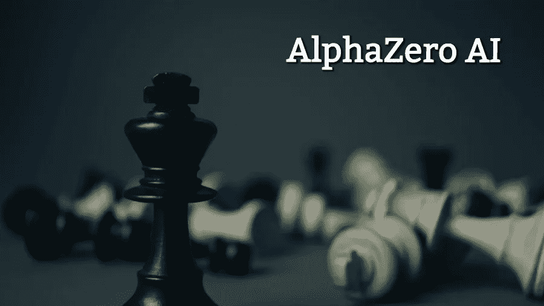

# 谷歌的人工智能象棋引擎 Alpha Zero 激励我成为一名狂热的机器学习爱好者

> 原文：<https://medium.datadriveninvestor.com/googles-ai-chess-engine-alpha-zero-inspired-me-to-become-an-avid-machine-learning-enthusiast-67b0aaa45ecc?source=collection_archive---------18----------------------->

皇家游戏棋已有数百年的历史。不同时代最优秀的头脑投入了他们的生命来探索游戏的辉煌。你能想象一个只有 64 个方块和 32 个棋子的游戏有比可见宇宙中一个原子的数量还要多的可能性吗？

在 90 年代，国际象棋被用作展示智力优势的政治武器。在过去的几十年里，皇家游戏见证了一个改变游戏进程的新成员。计算机软件的出现已经改变了下棋的方式。你可能还记得世界上有史以来最好的玩家加里·卡斯帕罗夫和 IBM 大胆的深蓝计划之一之间的著名人机对抗赛。当时的假设是，如果计算机能够在最复杂的游戏中(如国际象棋)击败最优秀的人类，那么它就可以在任何其他智力活动中确立其至高无上的地位。

1997 年，比赛的结果让人类非常震惊，机器以 3 比 2 的比分击败了世界冠军加里·卡斯帕罗夫。自从失败后，问题不再是计算机是否有能力打败人类。但焦点是如何利用计算机来合作，以更好地理解游戏。

在国际象棋方面，机器学习和人工智能正在让人们更加强烈地感受到它们的存在。整个国际象棋世界都被一个名为 Alpha Zero 的人工智能国际象棋引擎震惊了，它以 28 比 0 的综合优势击败了最好的计算机软件之一 Stockfish。最让我吃惊的是，Alpha Zero 仅用了 4 个小时就掌握了整个游戏。就像人类通过试错法学习一样，机器开始通过与自己对弈来学习象棋，从初学者到大师，随后在几个小时内达到世界级大师的水平。

StockFish 和 Alpha Zero 的核心区别是前者拥有数百万游戏的数据库，而后者必须从头开始！令人着迷的是，该引擎展示了人类思考的深度战略游戏，而不像传统的国际象棋程序那样展示蛮力游戏风格。

许多问题开始萦绕在我的脑海中——这样一个杰作背后的潜在技术是什么——人类可以从它那里学到什么，以及在我们追求的领域中有什么相似之处。正是这种想法激励我在没有编程背景的情况下从事机器学习领域。嗯，我必须说，从一个 MBA 到一个机器学习爱好者的旅程到目前为止真的很有趣。最近我通过 Coursera(在线学习门户)获得了斯坦福大学机器学习在线课程的认证。

对于想要探索机器学习领域，但由于缺乏编程经验而受到思维过程阻碍的初学者来说。我想传达的信息是，旅程开始时可能会有点吓人，但我可以保证它没有听起来那么难。在接下来的系列博客中，我想为初学者介绍一些机器学习的基本概念，并进一步提供一个简单的入门路线图。