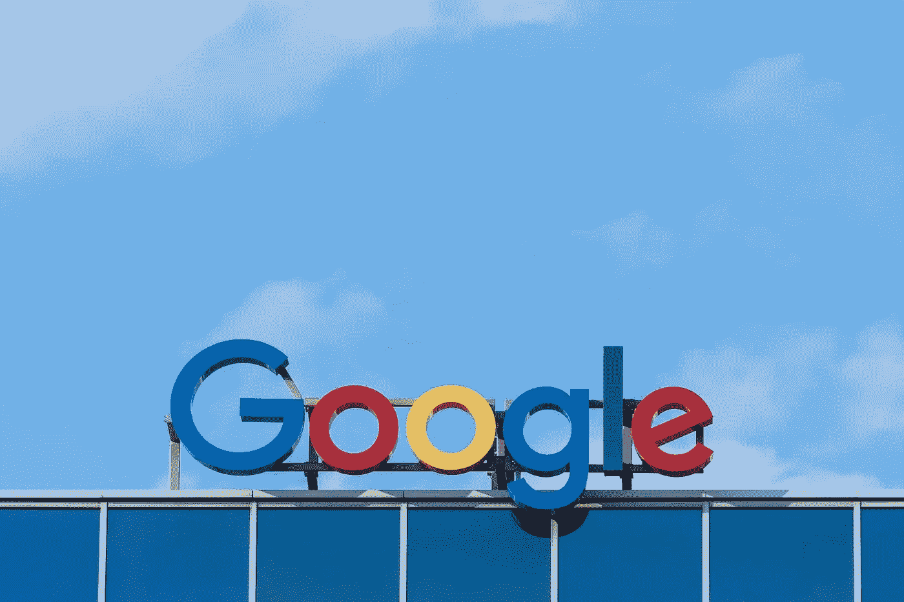
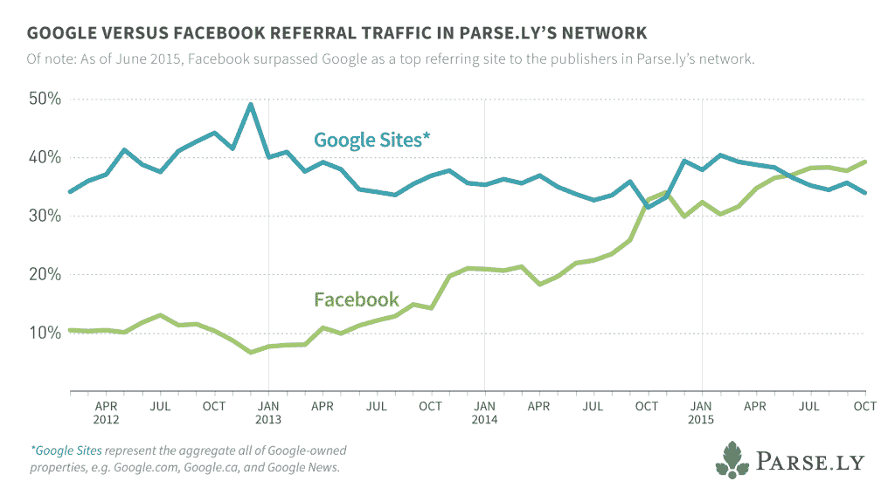

# 谷歌的人工智能使命。

> 原文：<https://medium.datadriveninvestor.com/googles-ai-mission-17cd8b61c415?source=collection_archive---------19----------------------->

2014 年之前，谷歌一直凭借其搜索工具在互联网流量上占据主导地位，现在依然如此。但是随着脸书和其他社交巨头的成长，这种优势受到了威胁。

2015 年，谷歌看到自己在简单搜索市场没有未来。需要对公司进行重组，这可能需要几个月的会议和官僚主义，从而诞生了[Alphabet Inc .](https://www.theguardian.com/technology/2015/aug/11/google-alphabet-why-change-restructuring-what-it-means)2015 年 8 月，谷歌的母公司看到了目标的变化，并制定了一个简单的任务，人工智能。

这种调整是必要的，因为社交媒体的动态正在接管搜索流量。人们可以通过基于感兴趣话题的脸书群组找到社交媒体上分享的内容。

早在 2014 年，搜索引擎优化(SEO)是 Web 开发人员为谷歌搜索改善其网站的常见做法，因为它占流量的大约 35%，而超过 50%的流量来自网络上的其他地方。FB 宣布了脸书报纸，试图主导新闻消费，但失败了，但这一战略继续下去，见证了 Facebook 即时文章的诞生。在接下来的三年里，来自脸书的流量增长到大约 45%来自 T2，超过了搜索流量的地位。

(来源:[https://blog . parse . ly/post/2855/Facebook-continus-to-beat-Google-in-sending-traffic-to-top-publishers](https://blog.parse.ly/post/2855/facebook-continues-to-beat-google-in-sending-traffic-to-top-publishers/))

谷歌认为，搜索流量的垄断地位被脸书和 Twitter 等互联网公司削弱只是时间问题，因此，如果它们想保持领先地位，就需要重组和重定向。

谷歌必须打造一个全新的游戏场，在一个它将在未来开拓、引领和决定其方向的领域采取正交方向。以这样一种方式建立它，即使当一个竞争实体出现时，他们也能有更好的控制。Alphabet 的使命诞生了。谷歌搜索不再仅仅是搜索，在人工智能和大数据的帮助下，谷歌将成为一个建议平台。这意味着搜索结果不仅仅是纯粹的搜索结果，它实际上是基于互联网趋势的建议结果，谷歌人工智能机器根据之前的用户行为识别，以给下一个用户提供比上一个用户更好的体验。该用户会比前一个用户更快更容易地找到他正在寻找的资料。

为了实现这一点，谷歌做了它最擅长的事情，收购初创公司。2013 年，[谷歌从多伦多大学计算机科学系拿起了](https://www.engadget.com/2013/03/13/google-acquires-neural-network-startup-dnnresearch/)深度学习和神经网络初创公司 DNNresearch。据报道，这次收购帮助谷歌对其图片搜索功能进行了重大升级。2014 年，谷歌以大约 6 亿美元收购了英国公司 DeepMind Technologies，这是一家成立于 2010 年 9 月的英国人工智能公司。(谷歌的 DeepMind 程序能够在棋盘游戏“围棋”中击败一名人类世界冠军)。

它最近还收购了对话式商务平台 Banter。谷歌此前在 2016 年进行了另一项自然语言处理领域的重大收购——初创公司 API.ai，为谷歌助手的一些功能提供了动力。

谷歌不只是收购了 Ai 公司。他们还必须摆脱额外的负担，停止消耗宝贵资源的失败项目。谷歌关闭了其在 2012 年推出的可穿戴设备谷歌眼镜的未来主义，Orkut 曾经是一个受欢迎的社交网络服务，它源于谷歌的“20%时间”项目。该网站在国外比在美国更受欢迎，谷歌于 2014 年 9 月决定关闭该网站。以及最近的 Google plus 等等。

**也读** : [三星没有得到足够的信用](https://www.techkrest.com/2019/02/samsung-doesnt-get-enough-credit.html)

收购 Deepmind 后，Alphabet 公司在人工智能方面取得了巨大的进步。谷歌 DeepMind 的高级研究科学家伊琳娜·希金斯(Irina Higgins)宣布了她的团队的进展。她开发了一个人工智能代理——有点像由人工智能算法控制的视频游戏角色。它可以比典型的算法更有创造性地思考。它可以“想象”在一个虚拟环境中遇到的东西在其他地方可能是什么样子。换句话说，神经网络能够将它在模拟环境中遇到的某些对象与环境本身分开。AlphaGo Zero 通过研究人类专家的棋步和与自己对弈——一种被称为强化学习的技术——在围棋比赛中取得了统治地位。

还有谷歌助手，它已经走过了漫长的道路。谷歌最令人印象深刻的人工智能项目之一是能够像人一样打电话的 Google duplex。谷歌助手进行自然对话的能力意味着它可以在没有任何帮助的情况下，在沙龙预约理发和预订餐厅，与真人交谈。利用人类对话的录音，谷歌教会了它的人工智能如何与一个可能甚至不知道他们正在与计算机对话的人说话。助理使用话语标记和填充词，如“嗯”,听起来更自然。

将人工智能和机器学习应用于搜索，谷歌能够从搜索数据中看到趋势，并确定点击网站对谷歌是否有帮助。这可以很容易地通过监控该关键字的搜索活动来实现。Android 设备上的恶意软件攻击仍然是谷歌的主要担忧。谷歌的 Play protect 使用人工智能来检查 Play Store 上每个应用程序的隐私和安全信号，以及时检测潜在的有害信号。为此，它使用深度学习来识别和创建具有类似功能的应用程序的对等组。对等组不仅基于它们所属的类别，还基于应用的元数据、描述、用户指标和下载次数。因此，在他们的日常扫描中，如果该工具遇到一个应用程序请求其对等应用程序没有的权限，它将立即被标记为红色。谷歌涉及深度学习的另一项突破是在图像分析领域，即图像增强。这包括通过对现有数据进行外推，以及使用它所知道的其他类似图像来恢复或填充图像中缺失的细节。

另一个平台 Google Cloud Video Intelligence 专注于向新受众开放视频分析。存储在谷歌服务器上的视频可以被分割并分析内容和上下文，允许自动生成摘要，甚至在人工智能认为有可疑情况发生时发出安全警报。

就其在网络上的主导地位增长速度而言，谷歌目前落后于 FB，但由于他们的技术专长、巨额预算、影响力和愿景，从长远来看，其人工智能资产将在互联网上发挥巨大作用。他们知道自己在做什么。

这些不再是我们四年前认识的那些公司了。谷歌不再是一家互联网公司，它是一家知识互联网公司。
这两大巨头曾经竞争过，或者至少尝试过，这种竞争保持了互联网市场的多样性。然而，今天，他们似乎对自己在网络上的正交优势感到满意。

*原载于 2019 年 2 月 21 日*[*【www.insopra.com】*](https://www.insopra.com/2018/05/09/google-duplex-a-i-lets-google-assistant-to-make-phone-calls-googlei-o-2018/)*。*