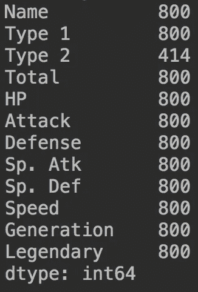

# 必须抓住他们所有人——口袋妖怪

> 原文：<https://medium.datadriveninvestor.com/gotta-catch-em-all-ml-on-pokemon-5c73b29d636?source=collection_archive---------14----------------------->

在我以前的出版物中，我解释了我用监督学习方法 K-最近邻和朴素贝叶斯对鸢尾花进行分类的过程。

[](https://medium.com/@mertefesevim/hi-to-ml-iris-flowers-classification-cadb88207851) [## 嗨到 ML —鸢尾花分类

### Iris 数据集被认为是机器学习的“Hello World”。所以作为一个刚开始 ML 的计算机工程学生…

medium.com](https://medium.com/@mertefesevim/hi-to-ml-iris-flowers-classification-cadb88207851) 

最近，我遇到了另一个古怪的数据集，这是由[阿尔贝托·巴拉达斯](https://www.kaggle.com/abcsds)在 [Kaggle](https://www.kaggle.com/abcsds/pokemon) 上制作的口袋妖怪数据集。研究机器学习的下一步将是在这个数据集上使用 PyCharm。


Ash & Pikachu

# **数据**

数据集包含 13 个属性和 800 个样本，我的**目标**将是发现**一个给定的口袋妖怪是否是传奇**。

属性是；

1.  PokeDex 指数
2.  名字
3.  类型 1 —口袋妖怪的类型
4.  类型 2——次要类型的口袋妖怪
5.  生命值
6.  攻击点
7.  防御——防御点
8.  物种 Atk —特殊攻击点
9.  物种 Def —特殊防御点
10.  速度
11.  Total —攻击总数，Sp。Atk，Defense，SpDef、速度和 HP
12.  产生
13.  传奇——不管口袋妖怪是不是传奇

在以前的发布中，没有缺失值，但此数据集中存在缺失值。

# **预处理**

首先，CSV 文件应该被熊猫图书馆阅读和分类。我这次用的是熊猫的 Dataframe 数据结构。

```
pokemon_csv = pd.read_csv('Pokemon.csv')

df = pd.DataFrame(pokemon_csv, columns = ['Name', 'Type 1', 'Type 2', 'Total', 'HP','Attack','Defense','Sp. Atk','Sp. Def','Speed','Generation','Legendary'])
```

识别缺失值；

```
print(df.apply(**lambda** x: x.count()))
```



only ‘Type 2’ has missing values

Lambda 函数显示所有 12 个属性没有任何缺失值，但是“类型 2”属性总共有 414 个值。在这种情况下，可以有两种方法；

*   填充缺失值
*   删除列“类型 2”

因为缺少 386 个值，所以我更愿意删除整列。

此外,“名称”列中没有唯一的名称。所以，它也会被丢弃。

```
df = df.drop(['Name','Type 2'],axis=1)
```

其次，Type 1 列包含 18 个不同的字符串值，应该转换成数值。为了对变量进行适当的编号，创建了一个名为“uniqueItem”的字典，并用唯一的数字添加了该列中的每个唯一的单词。

```
i = 0
uniqueItem = dict()**for** item **in** df['Type 1']:
    **if** item **not in** uniqueItem:
        uniqueItem[str(item)] = i
        i+=1
```

这里有 18 种不同的类型；

```
uniqueItem = {'Grass': 0, 'Fire': 1, 'Water': 2, 'Bug': 3, 
              'Normal': 4, 'Poison': 5, 'Electric': 6, 
              'Ground': 7, 'Fairy': 8, 'Fighting': 9, 
              'Psychic': 10, 'Rock': 11, 'Ghost': 12, 
              'Ice': 13, 'Dragon': 14, 'Dark': 15, 
              'Steel': 16, 'Flying': 17}
```

在字典中，uniqueItem 已输入到 dataFrame

```
**for** type **in** df['Type 1']:
    df = df.replace({type:uniqueItem.get(type)})
```

最后，数据需要被一分为二，作为以后的测试和训练数据；

```
X = np.array(df.iloc[:,0:-1])
Y = np.array([[df['Legendary']]])
```

X 和 Y 数组的形状产生了问题，所以不得不重新塑造 Y 数组；

```
Y = Y.reshape(800)Before reshaping Y :  (1, 1, 800)
After reshaping  Y :  (800,)
```

# 创建高斯朴素贝叶斯模型

之后，X 和 Y 阵列被分成测试和训练部分，需要创建模型并拟合数据；

```
X_train, X_test, y_train, y_test = train_test_split(
X, Y, test_size = 0.2, random_state = 10)

model = GaussianNB()
model.fit(X_train, y_train)
```

然后，可以显示精确度；

```
y_pred = model.predict(X_test)
print("Accuracy score of NaiveBayes:",accuracy_score(y_test,y_pred))Accuracy score of Naive Bayes:  0.95625
```

# 创建 SDG 分类器模型

根据 sci-kit 上的原理图，决定尝试 SDG 分类器；

```
clf = linear_model.SGDClassifier()
clf.fit(X, Y)

y_pred = clf.predict(X_test)
print("Accuracy score of SDG: ",accuracy_score(y_test,y_pred))Accuracy score of SDG:  0.91875
```

# 结论

作为第二个数据集，我试图实现机器学习方法，这个数据集教会了我很多东西。特别是在预处理部分，必须深入熊猫的特征。感谢 sci-kit 网站上的示意图，我实现了一个新的分类器。

因此，

*   朴素贝叶斯的准确率:0.95625
*   SDG 的准确度得分:0.9125

*最后，GitHub 库可以到达* [*这里*](https://github.com/MertEfeSevim/legendaryPokemonClassification) *。*

# 2018 年 9 月 27 日编辑:

我的一位教授建议，与其删除“类型 2”的整个列，不如删除不包含“类型 2”值的行。在某些情况下，当删除许多行时，为了不丢失整个列，可以增加数据集的密度。

要删除没有类型 2 值代码已更改的行；

```
df = df.drop(['Name'],axis=1)
df = df.dropna(subset=['Type 2'])
```

执行相同的代码来对列中的条目进行编号；

```
**for** item **in** df['Type 2']:
    **if** item **not in** uniqueItem2:
        uniqueItem2[str(item)] = i
        i+=1

**for** type **in** df['Type 2']:
    **if** type **in** uniqueItem2:
        df = df.replace({type:uniqueItem2.get(type)})
```

不幸的是，两种方法的结果都有所下降；

*   朴素贝叶斯的正确率得分:0.9048638638686
*   SDG 的准确度分数:0.8。56866.88888888686