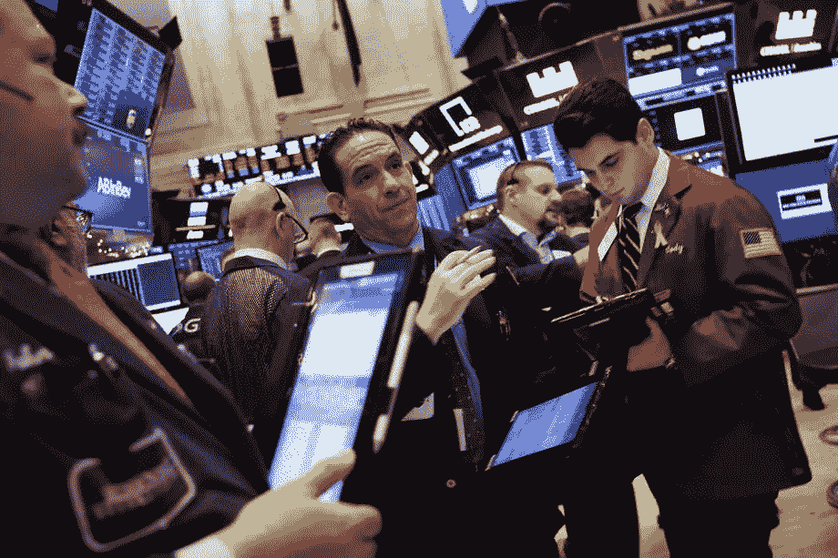

# 政府有关门的风险，可能会影响市场

> 原文：<https://medium.datadriveninvestor.com/government-has-a-risk-of-shutdown-and-might-effect-markets-675a28f0bcf5?source=collection_archive---------9----------------------->

政府很有可能会关门，并可能让许多人领不到工资。这加剧了投资者在假期前的焦虑。

标准普尔 500 下跌 2.06%，至 2416.62 点，道琼斯工业平均指数下跌 1.81%，至 22445.37 点。纳斯达克综合指数下跌近 3%，至 6332.99 点。苹果公司下跌了 3.89%，许多投资者认为苹果公司正处于死亡十字路口。死亡十字路口是指 50 天移动平均线低于 200 天移动平均线。亚马逊下跌 5.71%，至 1377.45 点，脸书下跌 6.33%，跌幅更大。微软下跌 3.23%，谷歌下跌 2.96%。

## **货币**

欧元下跌 0.8%，至 1 欧元兑 1.1358 美元

英镑下跌 0.3%，至每磅 1.2625 美元

日元下跌不到 0.05%，至 1 美元兑 111.33 日元

## **债券**

10 年期美国国债收益率下滑两个基点，至 2.78%

德国 10 年期国债收益率上升两个基点，至 0.25%

英国 10 年期国债收益率上升 5 个基点，至 1.321%

## **商品**

西德克萨斯中质原油下跌 1.1%，至每桶 45.41 美元。

黄金下跌 0.4%，至每盎司 1255.45 美元