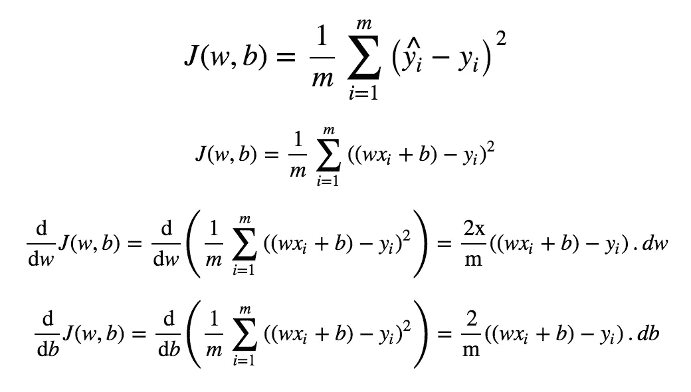
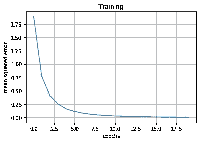

# 梯度下降实现

> 原文：<https://medium.datadriveninvestor.com/gradient-descent-implementation-5296f60e351a?source=collection_archive---------13----------------------->

让我们用 python 实现渐变下降，只用 ***numpy。***

在[之前的一篇文章](https://medium.com/datadriveninvestor/universal-function-approximators-a-k-a-deep-neural-networks-part-2-3db545fc0e51)中，我们讨论了两个数列(`[1,2,3,4,5],[3,6,9,12,15]`)和一个计算它们之间关系的人工神经元。本文打算实现我们在那里讨论的类比。

## 价值函数

成本函数及其相对于`w`和`b`的导数如下。



下面的实现有两个依赖项。

1.  [numpy](http://www.numpy.org/) (用于矢量化)
2.  [matplotlib](https://matplotlib.org/) (用于可视化)

在 Jupyter notebook 中运行上述代码应该会返回以下输出。

```
inputs:	 [[1 2 3 4 5]] 
outputs: [[ 3  6  9 12 15]]
weight: [[1.76405235 1.76405235 1.76405235 1.76405235 1.76405235]] 
bias: [[0.40015721 0.40015721 0.40015721 0.40015721 0.40015721]] 
activation: [[2.16420955 3.9282619  5.69231425 7.45636659 9.22041894]]
weight:  [2.6302523] bias:  [0.71394367]
```



既然看起来像是收敛，我假设我的实现是正确的。

直到下次，继续黑；)