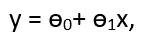
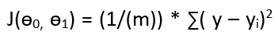
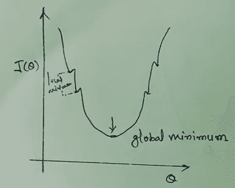
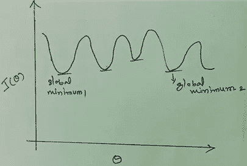
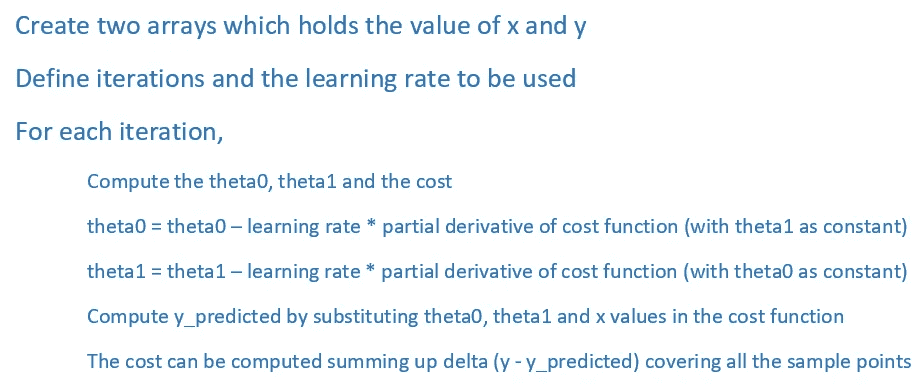
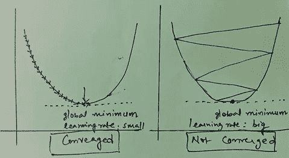

# 梯度下降，ML 算法的关键？

> 原文：<https://medium.datadriveninvestor.com/gradient-descent-the-key-for-ml-algorithms-d84ad511937e?source=collection_archive---------13----------------------->

***作者仅代表作者个人观点。这些绝不代表和/或反映他所关联的组织。***

**背景**

作为机器学习旅程的一部分，我们通常从线性回归开始，并逐渐了解成本函数的概念，挑战从这里开始，以优化成本函数。尽管我们可以对一小组数据元素进行试错，但随着数据的增加，这变得不可行。

为了解决这个优化问题，我们有一个相关的技术和理论，称为“梯度下降”，这将在获得成本函数最小化方面派上用场。梯度下降并不局限于线性回归，而是可以扩展到逻辑回归，并进一步扩展到神经网络。

你可能想知道为什么我们需要学习所有这些东西，当我们可以找到内置函数来直接处理它的时候？好问题，对它的内部运作有一些见解总是好的，因为这可能有助于更好地可视化问题，从而有助于我们对未来所有复杂问题或场景的建模。此外，这提供了一个窥视所使用的库的机会，以便同样的库可以被用于手头的其他问题。因此，在处理复杂的主题时，对事物如何工作有一个坚实的基础总是一个推荐的方法。需要记住的另一点是，内置函数仅限于某些特定的语言，但并不是所有语言都有内置函数。现在背景已经设置好了，让我们跳到细节上。

**梯度下降—概述**

因为问题是优化成本函数，所以让我们从那里开始

对于给定的假设

**成本函数**可以写成

i=1 到 m，其中 m 是样本数据点的数量。这也被称为**均方误差**。

让我们将一些值初始化为θ0 和θ1，并开始计算 J(ɵ0、ɵ1)，在一些反复试验和错误之后，我们可以达到收敛(j，成本函数达到最小值)，并且当我们开始增加数据点的数量时，这可能证明是一种低效的方法，这也可能导致整体成本更高。

用有限的步骤达到我们的成本函数的最小值的替代方案是什么？梯度下降算法在这里起了拯救作用，帮助我们以最少的步骤达到成本函数的最优值，因此它有助于从许多可能的机会中为给定的方程得出最佳拟合的结论。

为了对此有一个更好的直觉，让我们用所有的数据点绘制一个图，假设绘制的图有许多波谷，可能有多个局部最小值，但总是只有一个全局最小值。我们能达到全局最小值吗，还是我们需要满足于局部最小值，这是我们可以在随后的段落中回顾的，好吗？

*   如果绘制的数据转变成一个凸形，像一个碗形，侧面有小的脊，一个大的槽，那么我们可以一步一步地进行增量改进。每一步都让我们更接近谷底，当我们到达一个不可能再有进一步改善的阶段时，那么我们就可以得出结论，全球最小值已经到来。虽然我们有一个临时的局部最小值，但它们非常小，对曲线的整体方向没有任何影响，我们一定会达到全局最小值。

To keep it simple, the graph is plotted with only one value

*   如果数据没有给我们一个纯凸的形状，那么它可能会有很多起伏，这些起伏在深度上差不多相等，为达到全局最小值留下了选项。我们怎么能得出结论说我们达到了全球最小值呢？我们可以采取蛮力的方法，尝试所有这些可能性，以达到最终的结果，或者我们可以在最终确定全局最小值之前，将试验限制在几个随机的范围内。考虑到相关的成本，在大多数情况下，它将在第一次遇到全局最小值时结束。
*   在下面的图表中，我们可能需要在全局最小值上妥协，这是很容易达到的，或者必须经过冗长的过程才能达到实际的最小值。

To keep it simple, the graph is plotted with only one theta value

虽然我们可以很容易地用图形直观地解释这一点，但真正的挑战将是理解幕后的逻辑。让我们通过一步一步的流程来实现这一点。

**实施**

*   在这个旅程中，我们需要了解的第一件事是寻找斜率，对于一条线来说，选择两个点并将其放入公式(y2-y1)/(x2-x1)可能很容易，但我们如何找到曲线的斜率，我们可能需要使用单个点而不是两个点。另一方面，斜率将有助于确定 y 值相对于 x 每次变化的变化率。
*   有多种方法来处理这个问题，比如假设两个点更靠近主题中的点，并使用常规公式来计算斜率，请记住，这可能不准确，但可以接近实际值。另一种方法或者说更好的方法是找到函数的导数，然后代入上下文中的点。如果处理多个特征，我们可能需要采用偏导数。
*   在上面提到的函数中，有两个变量ɵ0 和ɵ1，因此我们需要使用偏导数方法，在处理另一个变量时，保持其中一个变量不变。

α是学习率，它有助于决定向收敛过渡时要采取的步长。

固定大小的步长可能会超过全局最小值，因此当我们开始接近最小值时，步长必须逐渐降低，这可以通过在每一步计算的斜率来容易地实现，因此可以基于斜率来调整步长，因此当我们接近收敛时，步长变得最小。

关于学习率和迭代次数，可能会有一些关于从哪里开始的问题。

*   我们通常可以开始小的迭代，比如 10 或 50 次，学习率为 0.01。
*   先通过提高或降低学习速度来改变学习速度。一旦我们看到导致最低成本的持续下降趋势，我们就可以停止玩这个游戏了。
*   从这里，我们可以确定学习率，并尝试迭代次数，以达到尽可能低的成本。

另一种达到最小成本的方法是到达斜率变为零或接近零的点。

**编程逻辑**

*说到编程语言实现，Python 中没有标准的内置函数，但 Tensorflow 有一个，它从用户那里抽象出完整的实现细节。为了保持中立，让我们放一些伪代码，可以根据用户的选择翻译成任何编程语言。*

检查成本值，调整学习率和迭代次数的值，直到达到收敛。

**挑战**

这个算法有几个问题需要注意。

*   该算法可能永远不会收敛，如果所采取的增量步骤很大，使得它越过全局最小值而没有进入收敛路径，这是很可能的
*   如果步骤很慢，它可能会收敛，但将采取更多的步骤，所以这要么是不可取的

我们需要的是一种平衡的方法来选择学习速率，这样既不会花费更多的时间，也不会让我们陷入一种不收敛的状态。

**梯度下降的变体**

考虑到所有可用的训练数据，将实现梯度下降，然而，这将是耗时的，因为每个步骤中的计算必须包括所有数据集，从而导致更高的成本。有一些随机和小批量版本形式的变体，这些变体采用数据的子集，而不是在完整的训练集上工作。两者之间的区别在于，随机只选取一个数据点，而小批量版本只选取数据点的子集。在这两种情况下，全球最小值都可以实现，但它所采取的路径可能看起来有点粗糙和特别。

**最终意见**

从以上细节可知，梯度下降是机器学习中的关键概念之一，适用于各种算法。

随着人工智能在我们日常生活的所有重要方面展开翅膀，精确度将成为关键，如果我们做得不对，对这些敏感应用的影响将会很大——无论是无人驾驶汽车还是医疗诊断等。整体梯度下降不仅有助于优化成本，还有助于确保更好的准确性，这是机器接管控制时所需要的。同意吗？