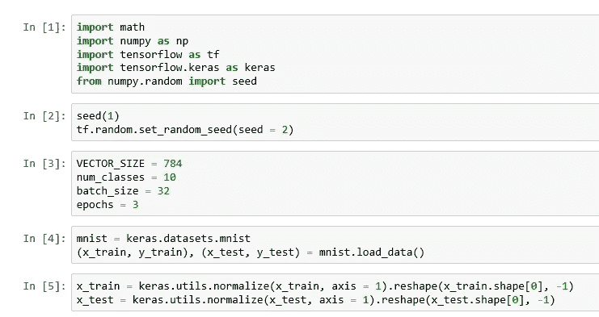
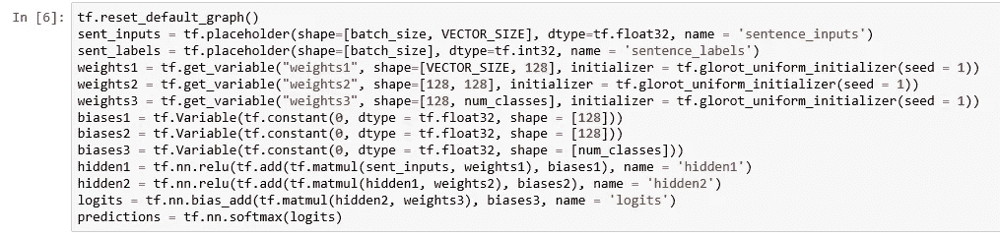
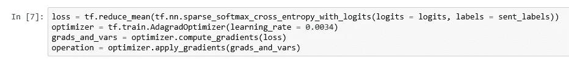
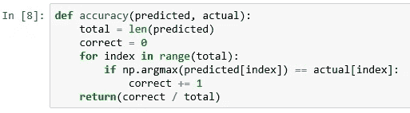
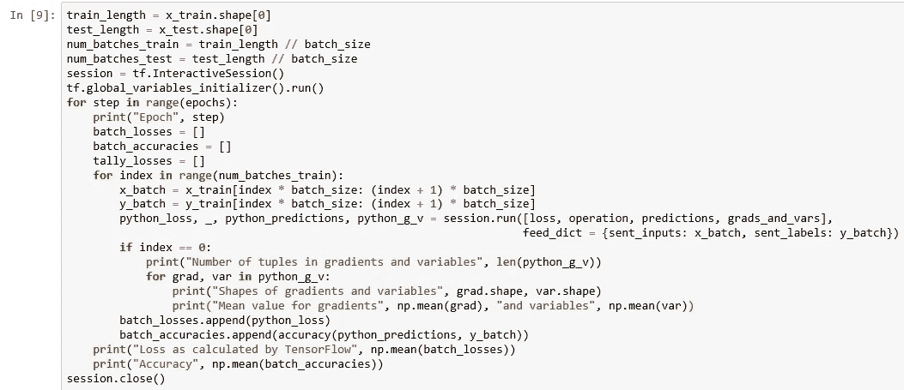
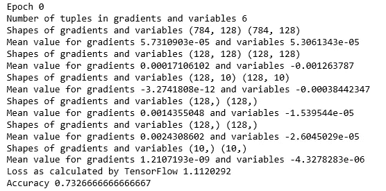

# 张量流中的梯度

> 原文：<https://medium.datadriveninvestor.com/gradients-in-tensorflow-9257d7bc5610?source=collection_archive---------0----------------------->

Photo by [Lance Anderson](https://unsplash.com/@lanceanderson?utm_source=medium&utm_medium=referral) on [Unsplash](https://unsplash.com?utm_source=medium&utm_medium=referral)

神经网络从一组初始权重开始，并根据网络的架构计算其第一个输出。然后将输出与数据中的预期输出进行比较，并计算损失。为了减少损失，网络计算关于各种可训练变量的损失梯度，并使用这些梯度来重新计算可训练变量，然后再次迭代计算输出。

如果您的网络没有按预期运行，检查这些梯度值可能是找出问题所在的好方法。在这里，我们讨论如果你使用 TensorFlow 来建立和运行你的神经网络，你如何找出你的梯度值。

 [## DDI 编辑推荐:5 本机器学习书籍，让你从新手变成数据驱动专家…

### 机器学习行业的蓬勃发展重新引起了人们对人工智能的兴趣

www.datadriveninvestor.com](https://www.datadriveninvestor.com/2019/03/03/editors-pick-5-machine-learning-books/) 

我扩展了我以前的[文章](https://medium.com/datadriveninvestor/getting-reproducible-results-in-tensorflow-3705536aa185)中的代码，并添加了显示渐变的代码。前五个单元格与前一篇文章相同。

Get training data

接下来，我们像上一篇文章一样构建张量流图。

Build TensorFlow graph

通常我们会在这之后尽量减少损失。最小化包括计算梯度和应用梯度的损失。不要像前一篇文章中那样调用优化器的 minimize 方法，而是依次调用计算梯度和应用梯度方法。

Gradients

计算精度和以前一样。

Accuracy

compute gradients 方法将梯度和变量提取为元组，我们在 TensorFlow 会话中运行这些元组，以将值导入 Python。这里有六个将被训练的变量——三个权重和三个偏置——权重 1、权重 2、权重 3、偏置 1、偏置 2 和偏置 3。梯度是损失对六个变量中每一个的偏导数。TensorFlow 将梯度和梯度所在的变量表示为列表中元组的成员。我们显示每个梯度和变量的形状，以检查实际情况是否如此。然后，我们还显示第一批的梯度和变量的平均值，不过如果您感兴趣，也可以对整个数据集进行同样的操作。

Run the network

我正在显示第一个时期的输出。其余两个时期的输出是相似的。

Output