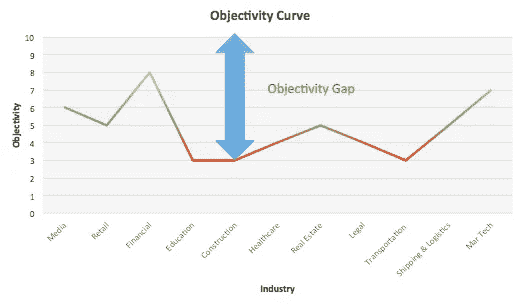

# 在曲线上给企业评级

> 原文：<https://medium.datadriveninvestor.com/grading-businesses-on-a-curve-de4ac4e075f9?source=collection_archive---------22----------------------->

A better way to think about businesses

关于[人工智能](https://www.wired.co.uk/article/10-threats-civilisation-ai-asteroid-tyrannical-leader)和[机器学习](https://www.wired.co.uk/article/machine-learning-ai-explained)的应用的预测从悲观的(它们将在未来几年让大量的人[失业](https://www.nbcnews.com/think/opinion/will-robots-take-your-job-humans-ignore-coming-ai-revolution-ncna845366)到乐观的(这些[技术](https://www.wired.co.uk/topic/technology)创造了开发新的商品和服务的机会，从而带来新的工作岗位)。然而，不管你站在哪里，计算机科学的先进实现已经开始全面扰乱行业，忽视这一事实意味着你可能会错过巨大的机会。然而，只有当你*重新调整*看待商业前景的方式，并开始从决策光谱的角度考虑行业时，这些机会才会变得清晰。

r*e 校准*意味着理解机器学习和人工智能(大数据)的兴起已经迎来了一个客观的时代。企业越来越依赖客观的，或者非人类的决策。未能采用这种方法并继续依赖主观分析和/或直觉的公司面临着越来越艰难的生存之战。

从某种意义上来说，所有行业都位于一种主观/客观曲线上。(见上图)虽然企业中的某些职能，如营销或财务，可能在“客观性曲线”上排名较高，但总的来说，在所有活动中，某些行业落后于其他行业。聪明的投资者或企业家在分析机会时，应该理解企业在曲线上的位置，以及哪些技术可以应用于严重依赖主观决策的市场。

虽然重要的是要记住，人工智能和人工智能的应用越来越普遍，但在这个意义上，客观性远非无处不在。从这些角度思考行业，可以让你看到过时的决策在哪里仍然被利用，并说明你如何通过优先考虑客观决策的技术来瞄准商业机会。当你开始观察这条曲线上的企业时，很明显在多个行业和部门中存在“客观性差距”,在这些行业和部门中，朝着客观决策的进展仍然很显著。但是是哪些呢？

例如，物流和运输等行业传统上与传统的学校技术联系在一起。它们代表了一个处于曲线上的行业，在这个行业中，某些类型的先进技术可以用来帮助企业“迎头赶上”。在某些情况下，这种“客观化”已经开始。

[Bluecargo.io](https://www.bluecargo.io/) 将全球航运确定为可以有效部署 ML 的领域。他们开发了一个预测算法平台，提供卓越的可视性，帮助优化海港码头的运营。 [Omnitracs](https://www.omnitracs.com/blog/ai-machine-learning-and-more-efficient-routing) 在 25 年的时间里一直是远程信息处理领域的领导者，但最近开始采用人工智能和人工智能来开发车队管理、路线选择和卡车运输预测分析平台。在这两种情况下，公司已经确定了一些特定的行业，这些行业仍然严重依赖主观决策，通过使用人工智能和人工智能来寻找独特的商业机会。

房地产同样对思维正确的企业家和投资者敞开大门。像  [Locate.ai](https://locate.ai/) 这样的公司，一个使用机器学习和地理空间数据并将其应用于房地产的预测分析平台，看到了房地产投资的传统方式，并看到了一个机会。Cherre 是另一个利用客观决策平台瞄准房地产的公司。他们确定了经纪市场，并创建了一个工具，用于收集和分析实时公共和私人房地产数据，以帮助更好地确定给定资产的可行性和价值。

这四家公司都是投资者和企业家瞄准传统低技术行业的绝佳例子，他们通过人工智能和人工智能为改变游戏规则的大颠覆找到了空间。然而，除了确定客观性差距，投资者和企业家还需要问自己:考虑应用是否比考虑行业更好？哪些技术有望驱动客观的商业智能？IBM 或亚马逊等瞄准这一领域的大型企业是否已经损害了这一机会。

人工智能和机器学习承诺的商业革命已经开始。但现在还为时尚早。如果你能开始在客观曲线上考虑所有业务，你会很快发现在人工智能和人工智能实现普及之前还有一段路要走。与此同时，在许多传统的、低技术含量的行业中，对于思维正确的企业家或投资者来说，仍然有很多赚大钱的机会。