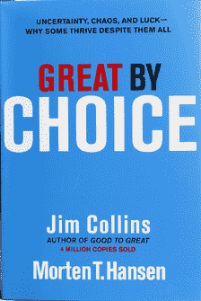

# 伟大的选择书评

> 原文：<https://medium.datadriveninvestor.com/great-by-choice-book-review-5a1ca56af489?source=collection_archive---------36----------------------->

*从* [到*SwiftEconomics.com*到](https://swifteconomics.wordpress.com/2013/05/06/swift-reviews-great-by-choice/)

我认为吉姆·科林斯是商业管理文学的黄金标准。他曾著有畅销书《从 [*到最后*](http://www.amazon.com/Built-Last-Successful-Visionary-Companies/dp/0060566108/ref=la_B001H6GSHK_1_5?ie=UTF8&qid=1367817897&sr=1-5)[*从优秀到伟大*](http://www.amazon.com/Good-Great-Companies-Leap-Others/dp/0066620996/ref=la_B001H6GSHK_1_1?ie=UTF8&qid=1367817897&sr=1-1)[*如何不可一世*](http://www.amazon.com/How-The-Mighty-Fall-Companies/dp/0977326411/ref=pd_sim_b_3) 。这一次，他与莫滕·汉森合作撰写了《伟大的选择:不确定性、混乱和运气——为什么有些人尽管如此仍能茁壮成长》 。这本书完善了关于是什么让一些公司伟大而另一些公司不那么伟大的四部曲。正如副标题所暗示的，这本书关注的是一些公司如何在动荡的环境中茁壮成长。

吉姆·科林斯的优势在于同时使用大量的研究，并找到一种方法将其归结为一个可读的，连贯的，几乎要点式的叙述。对于这个 boo，他有一个 20 人的团队，一些研究人员至少在过去 50 年里调查了每一家主要公司，以找出在高度动荡和不稳定的环境中，哪家公司的业绩超过行业平均水平至少 10 倍。然后，他提出一些令人难忘的短语来帮助建立一个整体框架。诸如“第五级领导”、“BHAG”和“刺猬概念”等术语已经成为商业词汇的一部分。在《伟大的选择》中，他又增加了一些。然而，我将从我认为最重要的部分开始；伟大的公司不是靠运气度过动荡时期的。他和他的团队煞费苦心地研究了 7 个 10 倍的公司和它们的比较(类似的公司在不确定性中表现不佳)，并列出了每一个值得注意的好运气或坏运气事件。事实证明，与对照组相比，10 倍者的好运或霉运数量没有统计学上的差异。事实上，控制公司的运气稍微好一点。

作为一个小的题外话，马尔科姆·格拉德威尔在*中的案例被说得太多了。虽然这肯定有一定的道理，但他也提出了这样的理由，即那些离群者必须在他们的工艺中投入至少 10，000 小时的工作，并且拥有大约 120 或更高的智商(至少如果他们是在智力领域)。还应该注意的是，他所讨论的那些不太成功的人仍然拥有这些类型的资格，他们仍然相当成功，只是他们不是成功的局外人。公司比个人少很多。作为一个个体，用最好的方式做事会给你带来很高的成功机会和成就伟业的机会。对于公司来说，以正确的方式做事几乎可以确保伟大。毕竟，不幸的坏运气，比如得癌症，可以杀死一个人。但就算 CEO 死了，一个伟大的公司还是可以挺过去的(当然假设 CEO 是 5 级领导)。*

*事实上，吉姆·科林斯发现“运气的回报”才是重要的。伟大的公司在运气好的时候能充分利用它，运气不好的时候也能承受打击。平庸的公司，没那么多。怎么会？嗯，关键似乎在于准备和谨慎。以下是一些要点:*

*   *10Xer 的“20 英里行军”换句话说，他们试图年复一年地获得稳定的收益，而不是冒很大的风险去超越或赶上他们的竞争对手。*
*   *10Xer 的“发射子弹而不是炮弹。”这意味着，当进入一个新的市场或采用一种新的战略时，他们会用少量的现金投资来测试它，而不是全速投入新的东西，即使看起来有很大的机会或紧迫感。*
*   *10xer 的“生活在死亡线上”并携带大量现金储备(比控制公司大得多)。通过这种方式，他们永远不会面临破产的危险，并可以在机会出现时抓住机会(即运气回归)。*
*   *10Xer 对每一种可能性都是偏执的，以一种近乎狂热的方式为每一个可以想象的场景做准备。*

*正如吉姆·科林斯在《T4》中发现的那样，利用不好的信息下大赌注通常会杀死伟大的公司，而不是简单地生闷气，陷入缓慢而痛苦的衰退。这本书展示了硬币的另一面。在不确定性(和其他地方)中茁壮成长的伟大公司是通过稳步前进，同时做出审慎、谨慎的决策来实现的。伙计们，成功不是华而不实的。*

*如果说吉姆·科林斯以及因选择而变得伟大的 T1 有弱点，那么这是一枚硬币的另一面，也是它的优点。虽然我认为他们使用了坚实的“研究基础”，但在将大量可用信息浓缩成几个流行语时，无论它们有多好的支持，都必须小心谨慎。毕竟我们这里只有七个案子，而且都是有关联的。相关性本身并不等于因果关系。是否存在潜伏的变数？他们是不是过于简单化了？*

*可能，至少在这里或那里的一些地方。事实上，就连他对运气的讨论也必然相当主观。毕竟，哪些项目应该有资格？如果有另一个批评柯林斯的理由，那至少也是他是对的表面证据；他在这里和其他地方写的大部分内容听起来都是真实的。有准备不是比没准备好吗？以稳定的速度努力变得更好，然后全力以赴，这不是更好吗？*

*但是这些教训，就像戴尔·卡耐基在 [*中阐述的如何赢得朋友和影响他人*](http://www.amazon.com/How-Win-Friends-Influence-People/dp/1439167346/ref=sr_1_1?s=books&ie=UTF8&qid=1367819015&sr=1-1&keywords=dale+carnegie) 一样，有时似乎显而易见，但很少有人实践它们。吉姆·科林斯写的很多东西给人的感觉都差不多。在某种程度上，这是显而易见的，在某种程度上，这是天才。*

*​*

*但最重要的是他是对的。至少我是这么认为的。因此，我推荐阅读他的书。它没有*好到伟大*好，所以从那里开始，但它独立存在，是对他的开创性系列的一个非常好的补充。*

**最初发表于*[*www.andrewsyrios.com*](https://www.andrewsyrios.com/home/great-by-choice-book-review)*。**