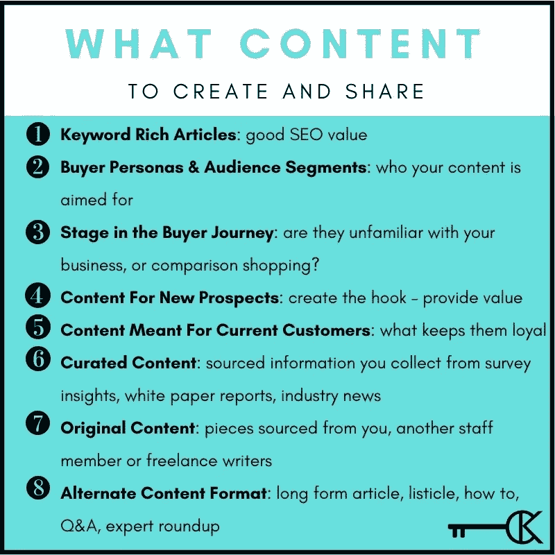

# 伟大的内容走向本土

> 原文：<https://medium.datadriveninvestor.com/great-content-goes-native-13da8a7ed453?source=collection_archive---------13----------------------->

## 即使在资金匮乏的情况下，广告也在营销中发挥着重要作用

Photo by Austin Distel on Unsplash

内容营销和本土广告是那些想要传播出去并给他们的企业带来最好的光的企业家的基石。每种方法都有其优势，因为它们在综合营销策略中相互交织。

两位营销专家和有影响力的人，[切尔西·克罗斯特](https://twitter.com/ChelseaKrost)和[文森佐·兰迪诺](https://twitter.com/vincenzolandino)讨论了企业主如何在资金匮乏的情况下充分利用他们的内容，同时还能为搜索引擎优化服务。

 [## 在创业之旅中，拥抱学习|数据驱动的投资者

### 好像建立一个数百万美元的公司还不够困难，企业家必须额外照顾他们的…

www.datadriveninvestor.com](https://www.datadriveninvestor.com/2018/10/16/on-the-entrepreneurial-trek-embrace-the-learning/) 

Krost 是千禧一代专家和顶级营销和品牌策略师。兰迪诺是第一代意大利裔美国人，也是第三代企业家，是现代媒体母公司兰迪诺集团的首席执行官和联合创始人。

“原生广告是一种付费的内容营销方式，”Krost 说。“这是一种创建看起来像内容的广告的方式，是对你的有机帖子和营销的一种很好的补充。”

兰登多解释了它们之间的区别和重叠。

“内容营销是首要战略，”他说。“这不是一个单一的策略。它由我们日复一日做的许多小事组成:每条推文，每个博客，每个视频。久而久之，它最擅长创造信任。”

尽管脸书和 Twitter 以及 LinkedIn 的广告似乎都属于原生广告定义，而不是内容帖子，但兰迪诺说这不一定是真的。

“这取决于那些广告看起来像什么，”他说。“如果它们是明目张胆的广告，那么很可能不是。如果它们看起来像一个帖子，并且感觉像你有机发布的内容，那么是的，它将被称为原生的。

“影响者广告可能是原生广告的一种形式，”兰迪诺说。“一些有影响力的人可能已经失去了他们的魔力，但优秀的人仍然在制作广告——赞助内容——感觉很正常。观众不在乎这是广告，因为感觉不像。”

# **影响者需要实践**

他认为影响者营销是原生广告，尽管他说“有些影响者就是做得不对。”

“原生广告是付费媒体的一种形式，”克罗斯特说。"促销信息融入了用户体验和内容论坛，并被放置在那里."

她引用了《商业内幕》( Business Insider )( T1 ),称两年内原生广告将占全部广告收入的 74%。

企业家可以利用本土和传统广告来获得更多的品牌曝光。一开始，员工是[公司最大的啦啦队](https://blog.markgrowth.com/company-cheerleaders-shout-your-praises-b0b24ca1014c)。他们支持产品和服务的内容对消费者影响最大。另外，工人的内容是免费广告。

 [## 公司啦啦队员对你赞不绝口

### 敬业的员工向公众宣传他们的公司

blog.markgrowth.com](https://blog.markgrowth.com/company-cheerleaders-shout-your-praises-b0b24ca1014c) 

“我喜欢称这些员工为有影响力的人，”克罗斯特说。“如果有机会，员工可以成为你最大的品牌拥护者。

她说:“原生广告是推广对目标消费者有益的产品和服务的一种很好的方式。”"想想决心、新项目、变得有条理、产品发布等等."

从包罗万象的计划中，企业主可以挖掘细节。

“制定一个策略，让你用本地和传统广告来支持你的内容，”兰迪诺说。“你就是这样赢的。你不希望你的品牌依赖付费。相反，用付费来补充你日复一日所做的事情。你买不到一致性。

“这是一个伟大的时间来重新评估你想如何制定你的内容营销计划，以利用有机和基于广告的内容，”他说。"适当的计划可以防止糟糕的表现."

在任何活动中，一致性都是关键。这适用于信息和品牌。以一个声音为目标。

Krost 给出了一些“拇指停止”策略的例子，这些策略可以让极度活跃的手指停下来引起注意:

*   强大的标题和标题
*   强烈呼吁采取行动
*   引人注目的图片
*   吸引人的视频

“真实性是成功的关键，”她说。“我上传了一段我和我丈夫的傻傻的舞蹈视频，你猜怎么着……它让*得到了如此多的参与。它展示了我真实的自我——享受生活。”*

# **给他的世界上色**

兰迪诺的“拇指塞子”之一是明亮，充满活力的颜色，简单而又干净。他也喜欢大胆的，发人深省的视频拷贝和自定义缩略图。

在一个饱和的市场中，突出人物的视频会脱颖而出。他们每个人都有一个故事，我们讲述自己最好的故事。他们的个性会从人群中凸显出来。

“视频广告需要有很强的针对性，”兰迪诺说。“我们为我们的客户发现，我们越是专注于一个我们想与之交谈的人，视频的点击率就越高。感觉就像你真的在和他们直接对话。

“对于视频——因为它开始时通常是无声播放的——如果你使用大胆的文字、颜色和快速移动的图像，在一开始就抓住眼球，它就能击中目标，”他说。

 [## 获得你的 2 美分价值:预算营销

### 以很少甚至免费的方式宣传你的业务

blog.markgrowth.com](https://blog.markgrowth.com/get-your-2-cents-worth-marketing-on-a-budget-801786370414) 

预算因素总是迫在眉睫。

“视频的最大挑战是品牌和人们会抱怨它‘太贵了’”，兰迪诺说。“我认为，你花在制作上的钱越多，你就越需要花在推广上——或者说，你就越需要认真对待人口统计学和洞察力的研究。”

Krost 说，营销人员在投入视频制作之前，必须花时间研究他们的目标受众和购买者角色。

“评论中的互动是个大问题，”她说。“为什么要花时间和精力制作一个视频，然后浪费与观众交流的机会？”

一定要把视频作为内容营销策略的一部分，不要让它成为策略。每种战术都必须在正确的时间和地点发挥作用，保持平衡。

# **下一级性能**

克罗斯特说:“[直播已经把视频内容](https://blog.markgrowth.com/up-the-creek-with-a-paddle-livestreaming-makes-a-splash-1f81a3079e27)带到了一个新的水平。”。“您可以随时随地进行直播，通过问答、举办比赛、调查观众等方式与观众互动。这都是关于社区参与。

“视频内容——尤其是直播——让我们以前所未有的方式与观众联系起来，”她说。“我们可以展示我们的专业知识，更新我们正在从事或参加的项目和活动，教育消费者并分享信息娱乐。”

虽然营销人员希望他们的视频看起来恰到好处，但克罗斯特说，完美是好的敌人。事实上，成品不应该看起来排练过。

“参与是增加受众的关键因素——不管是不是视频，”她说。“想一想你如何总能提出一个发人深省的问题，或者让你的追随者加入到对话中来。”

 [## 用桨划着小溪:现场直播引起轰动

### 当视频聊天和闲逛只是一个想法的时候

blog.markgrowth.com](https://blog.markgrowth.com/up-the-creek-with-a-paddle-livestreaming-makes-a-splash-1f81a3079e27) 

兰迪诺想要有呼吸的空间。

“直播视频不需要过度制作，也不需要很闷，”他说。“如果你要上线，就要让人觉得你在提供访问权限，而不是编写脚本。尽可能真实。允许事情发生在当下。做一些*不一样的*。

"同样，在你上线之前，问问你自己，这需要上线吗？"兰迪诺说。

不要不断地从零开始创造。[常青内容](https://www.datadriveninvestor.com/2019/08/06/once-is-never-enough-for-good-content/)相对容易刷新，反复前往，不费吹灰之力就能让它看起来又是新的。

“Evergreen 很重要，因为在你的业务中，人们今天、明天和 10 年后会问很多很多问题，”Landino 说。“不要把自己局限在某个时间、日期或事件上，让事情变得过于复杂。

“常青内容是营销你的业务的最具成本效益的方法，”他说。“一篇写得很好的文章或精心制作的视频可以帮助你在*岁月*中获益。”

# **有目的地改变用途**

重新定位强化了公司的统一声音。

“常青内容——视频和文字——对品牌的一致性非常重要，有助于保持消费者对你的品牌或业务的关注，”Krost 说。“这些内容强化了您的品牌身份和信息，持续提供价值，并为您的网站和社交渠道带来流量。

“这些内容永远不会过时，”她说。“无论是博客帖子、视频还是信息图表，信息总是相关的，并为你的受众提供价值。”

 [## 过一个快乐的、经济实惠的假期

### 心意才是最重要的，你家的钱也是

medium.com](https://medium.com/financial-strategy/have-a-happy-budget-friendly-holiday-fc2b7bf4500) 

视频非常适合假日营销策略——无论全年的假日是什么。Krost 建议这些促销活动:

*   限量版假日商品和服务
*   特别促销和折扣
*   你的品牌或业务如何在假期得到回馈
*   你的企业如何让这一年中的忙碌时光变得更轻松
*   通过你的品牌镜头享受一年中的时光

“炫耀正在发生的特殊事件，”兰迪诺说。“产品销售情况如何？让我们看看。员工是否充满好的斗志？我想看看他们，听听他们。”

在整体内容营销计划中，用户生成可能是有效的。所谓的 UGC 具有免费的巨大优势——加上真实性。这让他们在情感上和经济上变得强大——双赢。

“UGC 是由消费者创建和发布的内容，如视频、博客、论坛帖子、推文、证明或观点，”Krost 说。

用户生成的内容支持传统和原生广告需求。

“UGC 只是令人垂涎的内容营销计划的另一部分，”兰迪诺说。“一个好的内容计划会让你的观众通过竞赛、参与和重新分享他们的照片和视频成为内容的一部分。这些都是让观众为你创造*的方法。*

“UGC 可以并且应该在包括原生广告的内容营销计划中得到利用，”他说。

很像书面内容，视频可以调整搜索引擎优化。正如 Krost 解释的那样，SEO“是通过有机的搜索引擎结果来增加你的网站流量的数量和质量的实践。”

她使用多种技术优化自己的视频:

*   引人注目的缩略图
*   视频记录
*   关键词丰富的标题，描述和标签。

# **个性化的长期优势**

Landino 建议每个登录页面有一个视频，这样更容易围绕这个视频进行优化。

“我们将看到更个性化的内容营销方式，”克罗斯特说。“更少的广告牌信息和更多的用户生成和原生广告内容将超越传统广告的影响力。

“品牌比以往任何时候都知道，他们必须将影响者生成的内容和激活纳入他们的营销战略，”她说。“我们应该期待更少的一次性影响者合作关系。更多的长期关系肯定会发生。”

 [## 关系是你最大的投资回报

### 商业和个人投资不仅仅是金钱

medium.datadriveninvestor.com](/relationships-are-your-greatest-return-on-investment-8b0c254281b5) 

兰蒂诺希望未来的技术更加真实。

“内容营销的未来更少术语，更多真实，”他说。“为你的品牌设定一个基调，一种声音，让它在你的视频和文字内容中闪耀。多一点个性，少一点沉闷。

“有了现在和未来可用的所有数据，我们就可以开始创作针对我们受众群体的内容，没有必要一概而论，”兰迪诺说。“那是*巨大的*

**关于作者**

吉姆·卡扎曼是拉戈金融服务公司的经理，曾在空军和联邦政府的公共事务部门工作。你可以在[推特](https://twitter.com/JKatzaman)、[脸书](https://www.facebook.com/jim.katzaman)和 [LinkedIn](https://www.linkedin.com/in/jim-katzaman-33641b21/) 上和他联系。