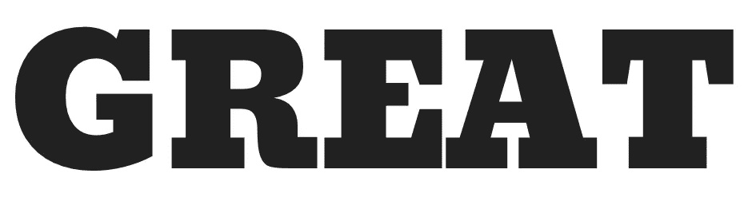
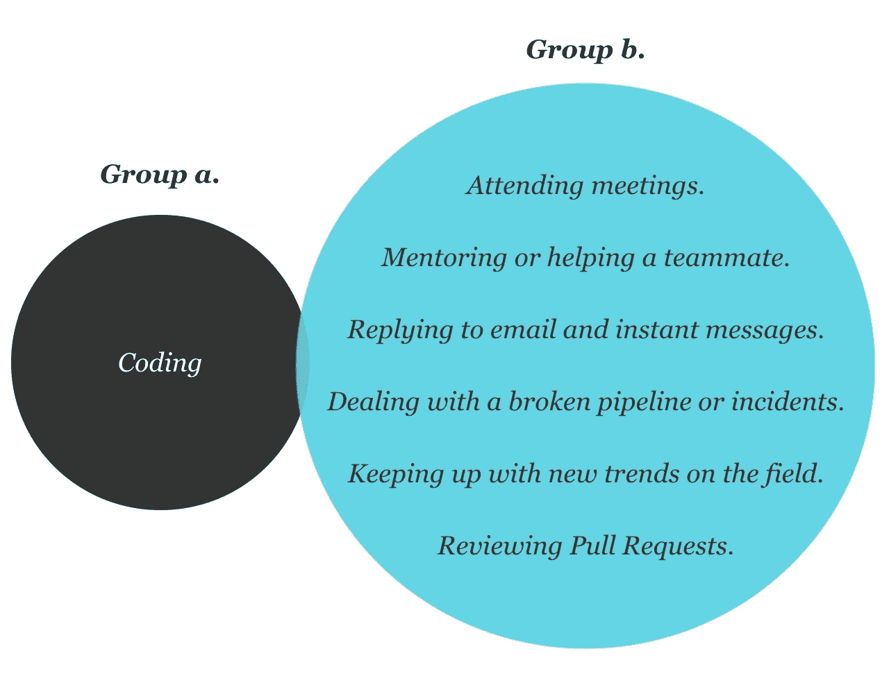

# 你的一天不需要更多的时间…

> 原文：<https://medium.datadriveninvestor.com/great-pull-requests-bc6ea3f55f45?source=collection_archive---------40----------------------->

## 你需要很好的拉动请求。

拉请求的使用已经被采纳为在团队或开源环境中开发软件的标准。贡献者“请求”一组变更被团队的一个或多个成员批准，以支持代码库的健康发展。

然而，编写正确类型的拉请求对于您的团队高效工作至关重要。

让我们大胆地将大多数软件工程师作为普通科技公司或初创公司的*个人贡献者*在工作日所从事的活动分成两组:

这可能看起来不太自然，但是，您的团队可以通过简单地产生更好的拉请求，在第二组活动上花费更少的时间。

# 什么是伟大的拉请求？

看到就知道；一组好看的修改，包装得很好，包含了你做事情所需的所有信息。即将到来的变化可能并不简单，但回顾起来却非常简单:清晰、美丽，它让你内心温暖而模糊。

# 伟大的拉取请求有什么特别之处

## 更简单、更快速地查看

对于一个好的拉式请求，评审者不会浪费时间去弄清楚引入的变更或特性的上下文、基本原理和含义。虽然背景设置在小团队中可能不是一个大问题，但在中型和大型团队中却有着绝对的不同，在这些团队中，不可能跟踪其他人当前正在进行的工作的细节。

## 分享和推动知识增长

每当介绍设计模式、技术、技巧或最佳实践时，一个好的拉式请求比你的普通博客帖子要好。评论者得到了一个非常实用和有背景的案例研究，用于联系抽象的概念或技术；不仅评审者被推动成长，而且作者也被迫进一步研究以支持和证明他们提议的改变的策略和结果。

## 质量驱动因素

他们提高或维护代码库的质量。深思熟虑的改变在贡献者中变得有感染力；他们为评论者和贡献者设立了标杆。优秀的代码库质量与更少的事故和中断直接相关，这转化为高效和快乐的团队。

## 介绍调试文档和操作手册

他们帮助新的团队成员开始并理解新的代码库；它们简化并加快了生产问题的控制，因为它们在一个地方成为整个故事的快照，时间不会浪费在跟踪和调查根本原因、事情如何工作或稳定策略上。

# 错误提取请求的危险

## 时间流逝

不良的拉式请求不太可能在一轮审查中获得批准，因为审查者要求澄清，他们增加了陷入永无止境的修改请求的机会，甚至最终被关闭，浪费了每个人的时间。

## 减缓产品开发

糟糕的拉式请求将不可避免地被拖延，它们变成了“烫手山芋”，团队成员会推迟审查，直到有人不得不“为团队做一个”。

## 对作者的职业生涯不利

糟糕的拉式请求会损害作者的声誉，会降低团队对他们资质的信心，并引起管理层的担忧，使他们的职业生涯更难取得进展。

# 剖析一个伟大的拉请求

*   出色的代码质量
*   描述
    -深思熟虑的标题
    -背景、目标和战略
    -知识传授*
    -截图/gif/预览链接*
    -性能影响分析
    -测试覆盖
    -待完成的任务或后续步骤*
*   合适的审查者

**可选，取决于变更类型*

# 拉动式请求的注意事项

## 做:在让别人检查你的代码之前，彻底检查它

任何人都不可能比作者自己更好地理解提议的变更的内容和范围，他们有责任有意识地和批判性地审查自己，以便在请求其他人花费时间之前，所有的“粗糙的边缘”和“人为错误”都被磨光。

## 做:提供背景

一个不提供背景的拉式请求成为了评审者的“谜题”；他们将需要做出假设，以揭示作者的原因和意图，这最终可能是错误的，并导致不想要的结果。这最终导致审查者要么从作者那里寻求进一步的澄清，要么自己做研究的延迟和开销。至少，拉取请求描述应该回答“什么？”，“为什么？”以及“怎么做？”；写“bug fix”从来都不是一个可以接受的描述。

## Do:保持简短

冗长的拉取请求增加了审查的复杂性；小的原子变化有助于审阅者快速理解变化，而不必处理跨越多个文件的变化难题。当较小的拉请求在技术上不可行时，多个语义提交可以帮助掌握组件和开发进度。因为如果需要的话，在合并之前总是可以压缩提交，所以没有必要把所有的事情都塞进一个提交中。

## 不要:一次解决多个问题

合并不相关的代码变更的拉请求会污染存储库的历史，并且在事故或停机期间不必要地使回滚到先前版本变得复杂。

## 不要:包含错误的审阅者

如果作者要求不熟悉代码库或不精通语言或技术的人进行审查，审查只会成为开销，而没有真正的价值。

## 不要:降低测试覆盖率

不包括单元或功能测试的拉请求是一个坏的拉请求。很少有不需要添加新测试的情况，但是作者应该有一个很好的理由来支持这个决定。

# 大量拉取请求的成本

## 前期投资

为每个存储库配置一个 Pull Request 模板是一项一次性投资，它将帮助您的团队接受并维持这个计划。如果你的团队使用 Github 或 Gitlab，你应该不会花超过 3 分钟。

## 每次拉动请求投资

根据变更的性质，作者可能需要额外花费 5 到 10 分钟来思考和填写拉式请求模板。

# 结论

如果*你*或者*你的*团队正在努力完成工作，保持代码质量或者仅仅感觉一天的时间不够用；调查你的拉动请求。伟大的拉动式请求是任何规模的任何团队都可以从今天开始做的事情，只需要最小的投资和巨大的回报。

【fabianuribe.com】最初发表于**。**