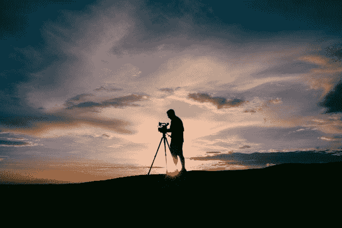
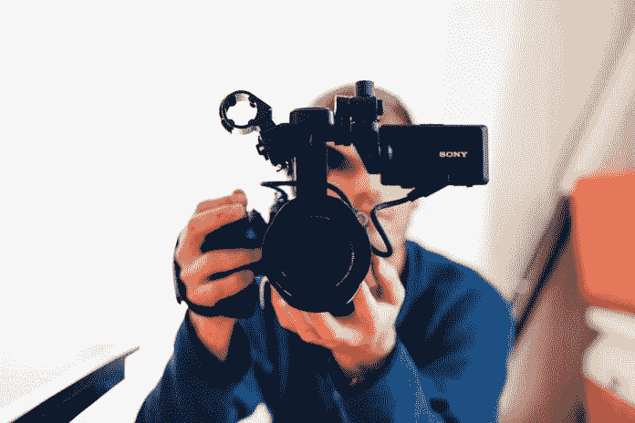

# 伟大的视频激励他人

> 原文：<https://medium.datadriveninvestor.com/great-videos-inspire-others-81d31e70c49d?source=collection_archive---------12----------------------->

## 获奖作品赋予一个名字一张脸和声音

当谈论视频内容时，去找专家。那就是[德米安·罗斯](https://twitter.com/demianross)，他制作他的每周 D 计划播客并主持[通往 1000 人之路](https://www.youtube.com/watch?v=ZId1ShcuHo4&list=UUkZYsLkvMop8E1QyuiKSQ9Q)视频系列。他和营销专家 [Madalyn Sklar](https://twitter.com/MadalynSklar) ，以及 [Manage Social](https://twitter.com/ManageSocial) 产品设计师 [Kate Frappell](https://twitter.com/katefrappell) ，讨论了获奖视频的内容。

“从好的方面来说，视频让一个名字有了面孔和声音，”Frappell 说。“视频是一种快速消费内容的方式。

“不利的一面是，视频经常涉及声音，”她说。“并不是所有的情况都适合噪音。相比阅读，浏览内容更难。”

Frappell 指出了需要准备的各种视频障碍:

*   你在某种程度上被限制在安静、私密的地方创作。
*   背景噪声通常会带来质量问题。
*   除了故事，制作视频通常需要一些编辑。
*   如果没有编辑，视频内容创作者——尤其是那些上线的创作者——更容易被误解。
*   虽然许多人尊重现场视频的“原始”，但与写作相比，提炼思想的空间更小。

 [## 日程安排者让社交媒体保持正轨

### 利用生产力工具优化您的发布

medium.com](https://medium.com/datadriveninvestor/schedulers-keep-social-media-on-track-8f5813729d94) 

“也就是说，近年来视频创作已经走过了漫长的道路，”Frappell 说。“现在有了更多的应用程序，编辑过程变得更加简单。创作者在不断提高他们口头表达思想的能力。从长远来看，这项技能将被认为是非常有价值的。

“总的来说，我真的很期待看到视频内容创作在未来几年的发展，”她说。

在他更近的将来，罗斯对“通往 300 岁之路”的愿景源于激励他人。

“最初的概念是三个目标，我想 100%地完成每个目标，并记录这个过程，”他说。“公式是 3×100 = 300。它很快演变成更多的我只是分享我对商业和个人的想法，以及我在这两方面的起伏。

“我觉得谈论我的低谷似乎最能激励人们，”罗斯说。“他们看到像我这样的人在处理抑郁、焦虑、恐惧、心碎和失业，他们找到了一种联系的方式。我无法掩饰我的痛苦。这不全是阳光，但人们通常会支持失败者。”

# 脚本可选

开始视频是成功的一半。Ross 试图在计划和内容执行之间取得平衡。

“每天制作一个视频真的没有太多的计划，”他说。“我有时会点击记录，看看有什么流。大多数时候，我有一个报价或主题，我只是即兴发挥。没有一条“路”是真正被脚本化的。

“如果你经常做一些事情，这就像练习一样，这使得制作视频像呼吸一样自然，”罗斯说。“我真的不知道我要说什么，直到我按下记录键，这有时是非常明显的。因此，规划更少，行动更多。”

 [## 打破记录，让它成真

### 视频使得无论在什么地方讲故事都很容易

blog.markgrowth.com](https://blog.markgrowth.com/hit-record-and-make-it-real-b707d5947de9) 

许多内容创作者大多专注于指标，这远离了仅仅为了创作视频而制作视频。

“我很久以前就决定完全不用担心这些指标，”罗斯说。“我了解到，大多数人最终都会筋疲力尽。我的目标是在 1000 天内制作 1000 个视频。这是我唯一使用的度量标准。

“也许在第 365 天或第 500 天之后，我会开始考虑扩大渠道，”他说。"现在，关键是按下该死的按钮."

建立个人品牌和保持真实。制作人在创作内容时可能会变得过于“相机就绪”。

罗斯说:“镜头中的*你*必须是现实生活中的*你*。“一旦我听到某人在电台的声音，或者他们变成了一些在现实生活中无法维持的活泼角色，我就会退缩。另外，当人们在现实生活中遇到你时，他们会问，‘这是谁？’

"你有没有遇到过你认识的人在现实生活或视频中表现不一样？"他说。“我的视频[非常真实和原始](https://www.youtube.com/demianross)。”

罗斯在背景、灯光和设备方面为新内容创作者提供技术建议。

“从你所拥有的开始，”他说。“当你看到你需要变得更好的东西时，就去买那些东西。内容的质量比视频的质量更重要。我非常相信改变你的位置。它成为旅程的一部分。

“我开始用 iPhone，实际上只是开始用我的 DSLR，因为我需要一个更好的麦克风来播放外部视频，”罗斯说。“不要让设备或你对质量的想法成为你不开始的理由。好就够好了。”

# 在一个播客的心目中

视觉上，耳朵有。

“音频是你需要关注的地方，”罗斯说。"录制视频时考虑播客质量."

缓慢的进步仍然是进步。内容创作者必须学会如何调整自己的节奏，并在结果不佳时保持动力，专注于自己的目标。

 [## 社交媒体上的音频是你成功的声音

### 播客和推特让企业有了发言权

medium.com](https://medium.com/an-idea/audio-on-social-media-is-the-sound-of-your-success-380bb9fcbf44) 

“不要拿自己和别人比较，但也许可以向他们学习，而不是复制，”罗斯说。“我不会放弃任何事情，除非我做了 90-90 个视频、博客帖子或播客。大多数人在七点后就放弃了。

“建立一个内容目标，一个你会做的数字，”他说。“我不在乎多久一次，但至少每周一次。选择一个你愿意做的数量，无论如何都要坚持这个目标。”

当他查看指标时，Ross 专注于两个最爱:评论和直接信息。

“这就是神奇之处，”他说。“真的，这是唯一重要的指标。你必须回应每一条评论。当我在每个平台上本地发布时，我迷路了。现在只有 YouTube 和脸书了。

“这真的是关于建立信任，”罗斯说。“不管你创作视频的目标是什么，其中很大一部分是建立社区。观点和喜欢并不是检验你是否成长的唯一途径。

他和 Sklar 在脸书直播上继续他们的视频对话[。](https://www.facebook.com/manageflitter/videos/2345310098834934/?notif_id=1552429277045980&notif_t=live_video_explicit)

**关于作者**

吉姆·卡扎曼是拉戈金融服务公司的经理，曾在空军和联邦政府的公共事务部门工作。你可以在[推特](https://twitter.com/JKatzaman)、[脸书](https://www.facebook.com/jim.katzaman)和 [LinkedIn](https://www.linkedin.com/in/jim-katzaman-33641b21/) 上和他联系。

*原载于 2019 年 6 月 14 日*[*https://www.datadriveninvestor.com*](https://www.datadriveninvestor.com/2019/06/14/great-videos-inspire-others/)*。*