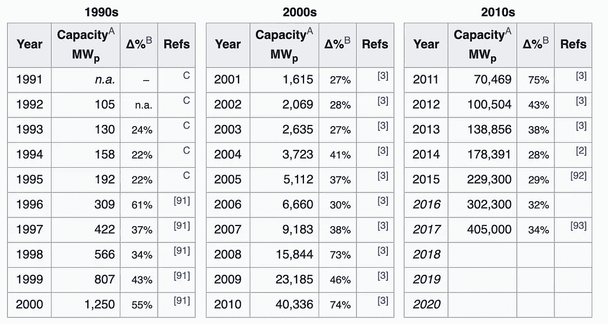
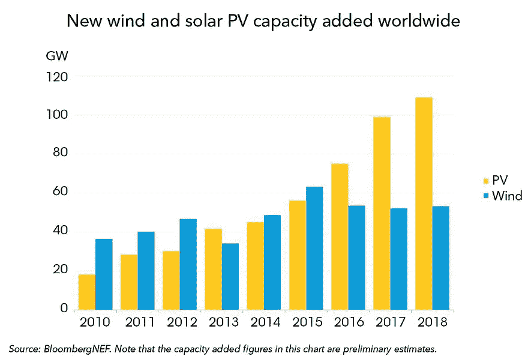
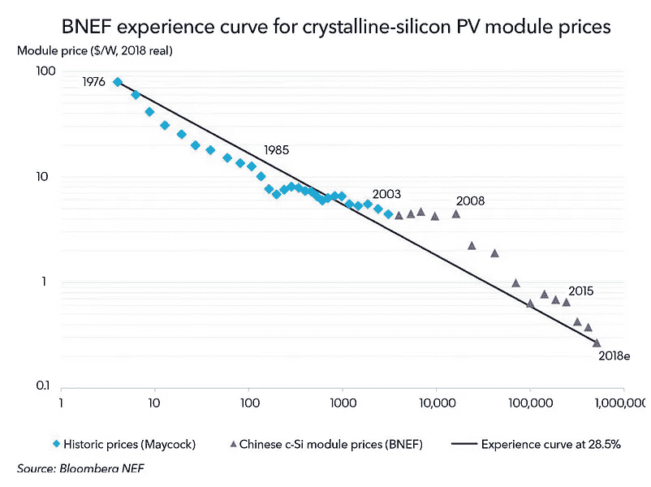
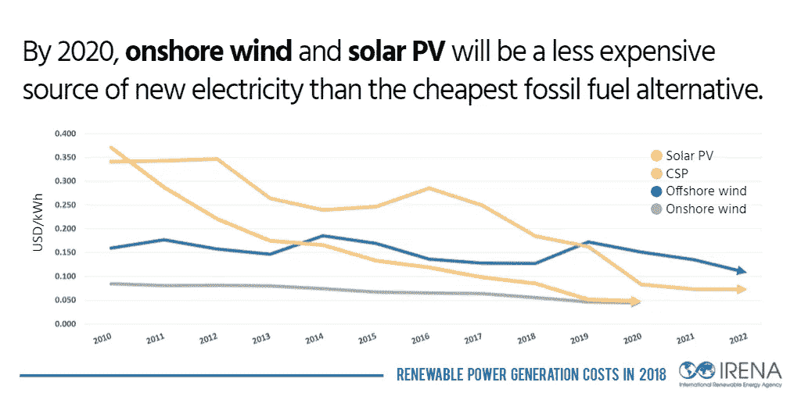
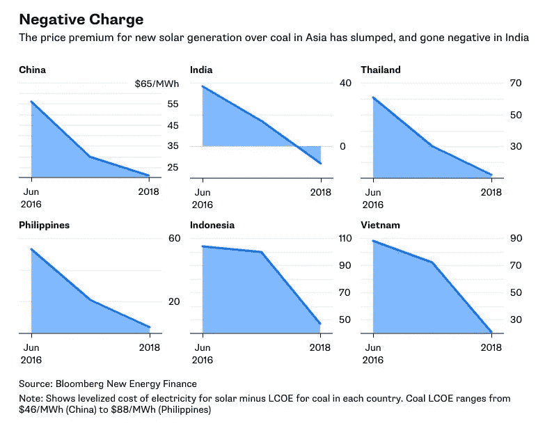
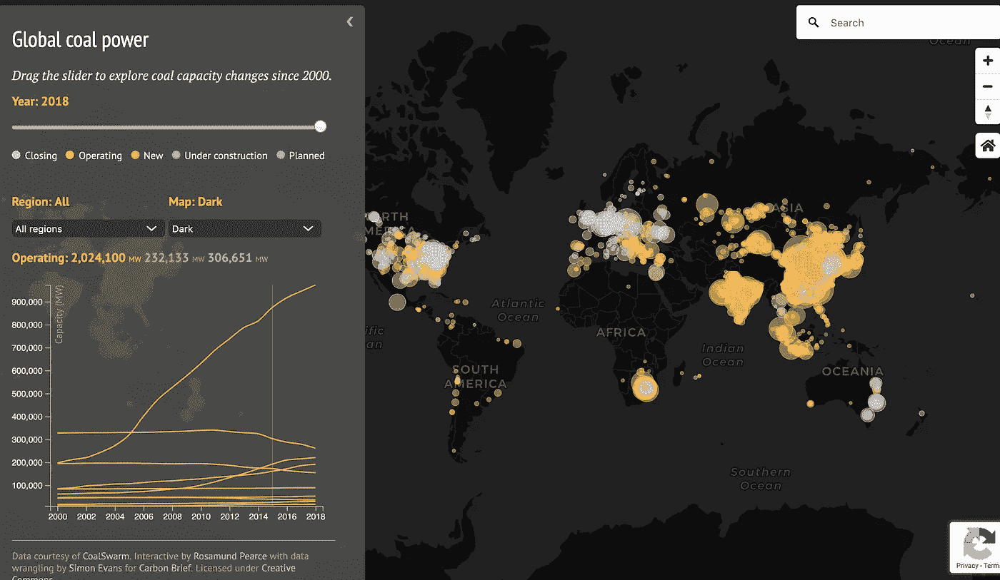
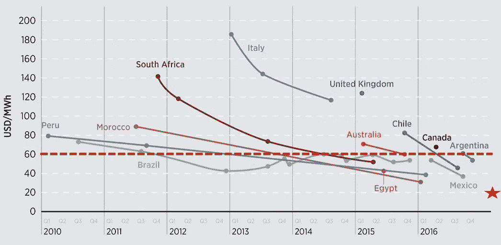
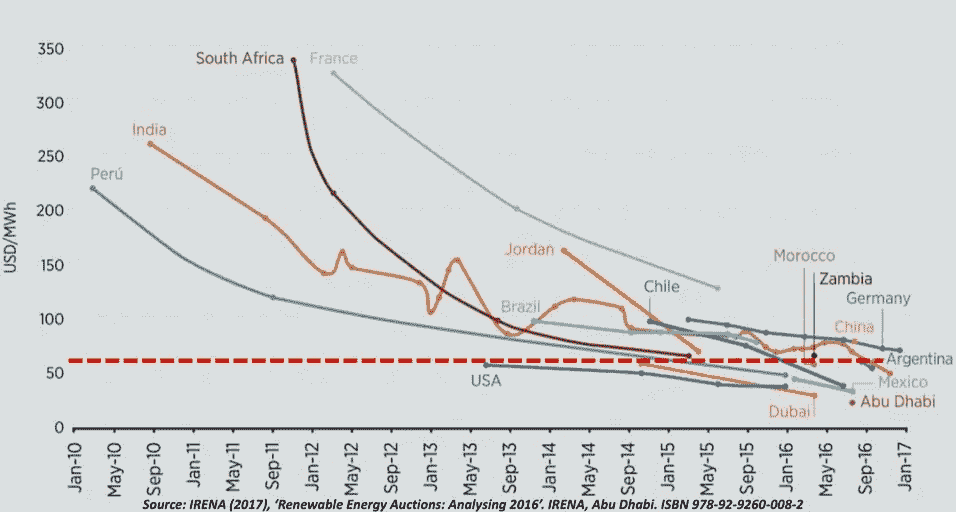

# 绿色能源

> 原文：<https://medium.datadriveninvestor.com/green-energy-a7a8ddf4e5f7?source=collection_archive---------6----------------------->

## 可再生能源将如何取代其他能源

我的几个朋友开始看 HBO 的新迷你剧《切尔诺贝利》,该剧被 IMDB 评为顶级电视剧之一。这个节目引发了一场对话。为什么世界没有走向核电？2015 年，彼得·泰尔在《T2 纽约时报》上写了一篇专栏文章，推动核能的未来。但是我们真的需要核能吗？

数据表明我们没有。可再生能源可能即将超过所有其他能源。绿色能源可能最终会留在这里。在过去的几年里，美国的 T4 一直引领着绿色能源的发展。结果开始显现。我们开始看到 CO₂排放量的逆转。回顾美国过去 10 年，CO₂排放量一直在下降，达到 90 年代初以来的最低水平。

CO₂ emissions in the past [10 years](https://cfpub.epa.gov/ghgdata/inventoryexplorer/index.html#allsectors/allgas/gas/all) in the US

这种逆转似乎是可再生能源价格下降以及可再生能源相对于其他能源的份额不断增加的结果。这一趋势在未来几年只会加速。可再生能源正处于一个 S 型曲线的起点。他们部署的速度只会加快。让我们来看看不同的数据，看看为什么会发生这种情况。

# 价格

太阳能电池板的价格一直遵循斯沃森定律，即电池板产量每翻一番，价格就会下降 20%。

太阳能电池板使用的增长导致了滚雪球效应。生产的面板越多，价格越低，需求就越大。我们正处于太阳能和风能变得比维持燃煤电厂更便宜的边缘。自 20 世纪 90 年代以来，太阳能电池板的容量一直在呈指数级增长，没有理由认为这种趋势在不久的将来会改变。

Total capacity over years and percentage change year over year

国际可再生能源机构(IRENA)的一项研究表明，到 2020 年，**陆上风能**和**太阳能光伏发电**将成为全球最便宜的能源。这意味着将会有强烈的动机放弃其他化石燃料替代品。

Bloomberg and IRENA report

The [price premium](https://twitter.com/DrSimEvans/status/999582682253332481/) of solar versus coal in Asian countries

在一些国家，这一趋势已经逆转。在印度，部署新的太阳能比煤炭更便宜。在其他亚洲国家，价格差距正在更快地缩小。

到 2020 年，新的可再生能源将比现有的煤电厂便宜，这使得它们的退役成为一个明显的例子。

# **煤炭产能**

发达国家的煤炭产能一直在减少，发展中国家的煤炭产能也在减少。美国和欧洲带头发起冲锋。在这些地区，煤炭发电量从 2010 年的 340 吉瓦减少到 260 吉瓦，从 2018 年的 193 吉瓦减少到 154 吉瓦。

由于经济增长，中国和印度的煤炭消费量一直在增加。但随着替代品价格的下降，增长一直在减速，如果这一趋势在未来 5 年内逆转，这并不奇怪。印度和中国的煤炭消耗将会减少。

Graph from [Carbon Brief](https://www.carbonbrief.org/mapped-worlds-coal-power-plants)

随着煤炭消耗的减少和可再生能源的增加，美国已经提前两年实现了 [EPA 清洁能源](https://www.woodmac.com/our-expertise/focus/Power--Renewables/watch-the-webinar---transformation-power-markets/)的目标。在英国，CO₂的排放量是自 1888 年以来最低的，而且还会继续下降。

如果光伏发电在未来 10 年保持同样的增长率(20%年增长率)，美国将从光伏发电中产生比现在多 30 倍的能量。这将代表超过 50%的能量由光伏电池提供。这是一个乐观的设想。彭博·BNEF 估计，到 2050 年，世界上 50%的能源将由可再生能源生产。

## 定价差异

[煤炭运营](https://www.youtube.com/watch?v=EXw38SaGmOk)成本约为 6 美元/千瓦时，新能源和太阳能在一些国家已经达到 4 美元/千瓦时。这使得新太阳能发电厂的成本比煤炭运营成本低得多。

Red dashed line is the price of coal or gas electricity, the other lines are the prices of wind electricity and prices of new solar energy, respectively

包括美国在内的全球可再生能源部署的指数增长清楚地表明了这些降价的结果。这些趋势随处可见:

2018 年 10 月:[印第安纳州北部的一家公用事业公司 NIPSCO](https://www.indystar.com/story/news/environment/2018/09/20/move-over-coal-indiana-utility-switching-solar-and-wind/1369539002/) 表示，最便宜的选择是从 65%的煤电转向零煤电，并用太阳能、风能和储能来替代。

2019 年 1 月，太阳能和风能的总容量超过了美国的任何其他能源，包括[天然气](https://www.solarpowerworldonline.com/2019/03/new-u-s-solar-generating-capacity-beats-all-other-forms-of-energy-brought-online-in-january-2019/)。

2019 年 3 月，佛罗里达州电力和照明公司表示，将退役两座老化的天然气工厂，[用太阳能电池板和世界上最大的(迄今为止)电池](https://arstechnica.com/information-technology/2019/03/florida-utility-to-close-natural-gas-plants-build-massive-solar-powered-battery/)的组合来取代它们，

## 总而言之

这些成本差异正在推动全球太阳能和风能的部署持续增长。考虑到价格趋势和增长趋势，到 2035 年，50%的能源将由可再生能源使用就不足为奇了。这比[专家](https://www.mckinsey.com/industries/oil-and-gas/our-insights/global-energy-perspective-2019)的估计要早得多。如果可再生能源保持这一趋势，就没有必要发展核能，切尔诺贝利和其他核事故将成为历史。