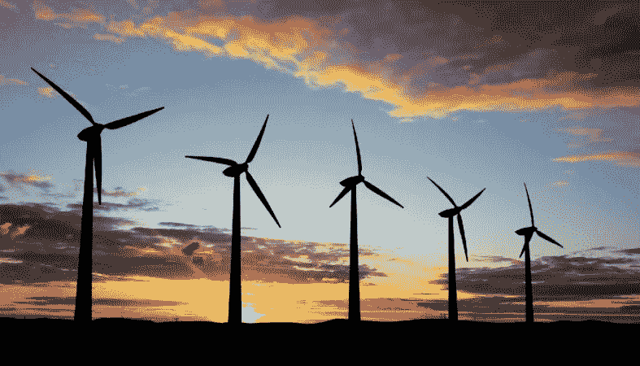
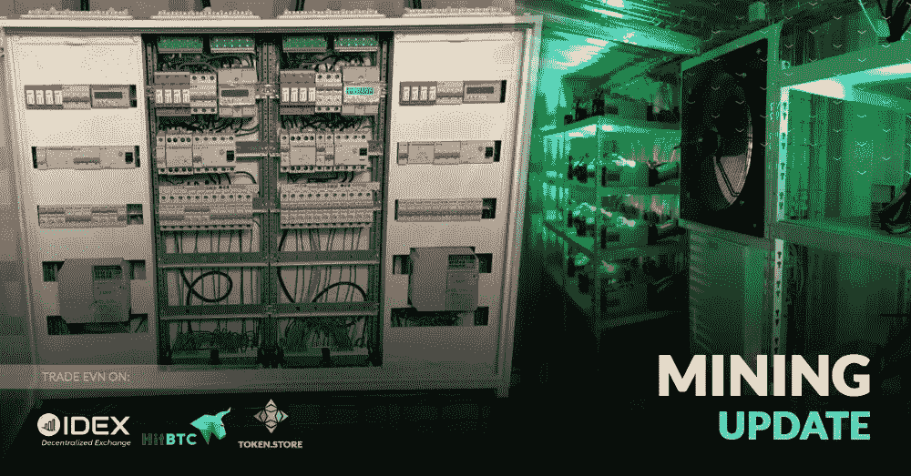

# 绿色采矿:项目综述

> 原文：<https://medium.datadriveninvestor.com/green-mining-a-review-of-projects-e80ce26c80ae?source=collection_archive---------21----------------------->

由于加密货币的成本大幅增加，比特币开采成为一项利润丰厚的业务，加密货币开采对环境的危害问题已经提上日程。

认为比特币挖矿消耗的能量太大。根据科学家的说法，自从有必要使用巨大的计算能力来开采一枚比特币以来，这一过程已经开始对环境产生严重的负面影响。卡塔尔大学(Qatar University)教授乔恩·h·特鲁比(Jon H. Truby)在一份名为“比特币脱碳:降低区块链技术和数字货币能耗的法律和政策选择”的研究中，写道了采矿的危险。这位科学家认为，加密货币开采的无限能源消耗会导致环境灾难。专家们应该注意创造不消耗电力和不向大气排放二氧化碳的采矿模式。

关于采矿危险的说法颇有争议。不久前，分析机构 Ars Technica 比较了比特币开采和贝宝支付系统服务器维护所消耗的能源数量。每天大约有 1000 兆瓦用于生产比特币，而维护拥有 PayPal 的易贝基础设施的成本约为每小时 157 兆瓦。

如果只考虑电力成本，那么比特币挖矿真的是一个更耗能的过程。但是当你考虑到为了保证贝宝的工作，有一大群坐在办公室里的专业人员，他们的电源也需要很多能量；考虑这些员工上班所乘坐的交通工具排出的废气造成的危害；许多塑料瓶、废纸和其他垃圾是任何工作场所的重要活动留下的，特别是当涉及到 PayPal 这样的大公司时——如果你把所有这些都考虑在内，事实证明 PayPal 对环境造成的危害并不比比特币采矿少。

另一方面，如果你遵循这种方法，那么任何人类活动都变得有害和不环保。

> 采矿和秘密领域对环境的危险问题已经变得如此紧迫，不仅因为它对自然的危害，还因为人类根本无法提前想象比特币采矿在几个月内会达到什么规模，因此也无法预测这会导致什么后果。

所有这一切导致提供不同的生态友好型采矿解决方案的项目被提上日程。我将简单地告诉你一些最成功和最有趣的。

# 新 4

NEW4 项目在 2018 年 8 月的 ICO 期间筹集了 4500 万美元，通过回收利用为采矿提取能源。从全球意义上来说，这并没有使采矿本身对环境更安全，相反，该项目的作者提出在采矿的帮助下解决废物处理的问题。

# 环境

臭名昭著的 Envion 项目今年早些时候推出了 ICO，吸引了近 1 亿美元。该公司向投资者提供资金，用于生产采矿专用设备，这可以节省开采硬币所需的能源。该开发是一个标准的 20 英尺联运海运集装箱内的自动化移动单元。一个特殊的冷却系统在容器内部工作，因此降低了能耗。容器将使用 MMU 程序进行管理:一个单位可以位于世界上的任何地方，所有者可以随意“切换”设备来开采各种硬币。远程控制系统包括视频监控系统和自动开关门。

Envion 这个看似天衣无缝的“绿色”项目最终失败了，它的投资人一无所有，团队解体，代币贬值，在德国引发了一场大丑闻。

# 水矿工

Hydrominer 的创造者让其追随者投资一个加密货币农场，该农场依靠阿尔卑斯山的一个水力发电站的能源运行。2015 年，姐妹 Nadine 和 Nicole Dumblen 推出了他们的加密农场，租用了两个水力发电站，并连接了 1000 个矿工的 GPU。他们把设备放在运输海运货物的特殊集装箱里，事情变得越来越困难。他们进行了一次成功的众筹活动，并在一次 ICO 期间筹集了 300 万美元。

# 佛勒姆

Foleum 项目推广了使用可再生自然能源提取加密货币的想法。该项目的代币应该是一种股票，使持有者有权从使用自然能源(风能和太阳能)的加密货币开采活动中获得利润。该项目计划从 240 万美元筹集到 3100 万美元。

# 齿轮

GEAR 项目提出了一个类似的采矿“绿色”生态系统。它的本质在于利用自然能源提取加密货币，而投资者反过来获得公司利润的一部分。该项目计划筹集高达 1 亿美元的资金。

过去三年中，大量绿色项目及其成功吸引的资金一方面证明了环境问题与加密社区的相关性，另一方面也证明了这方面的最佳解决方案尚未找到。

## 跟随[美国](http://fairwin.io/):

推特:[https://twitter.com/FairwinGambling](https://twitter.com/FairwinGambling)T2:[https://www.facebook.com/fairwin.gambling/](https://www.facebook.com/fairwin.gambling/)insta gram:[https://www.instagram.com/fairwin_team/](https://www.instagram.com/fairwin_team/)

## 与我们聊天:

不和:[https://discord.gg/Hbardp2](https://discord.gg/Hbardp2)Reddit:[https://www.reddit.com/user/fair-win](https://www.reddit.com/user/fair-win)电报:[https://t.me/fair_win](https://t.me/fair_win)