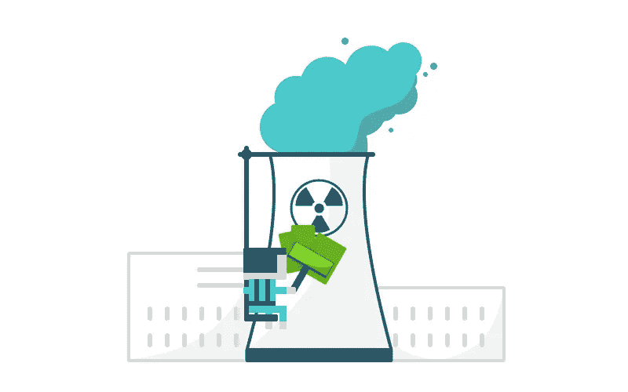

# 影响力投资中的绿色清洗？我们是这样对抗的。

> 原文：<https://medium.datadriveninvestor.com/greenwashing-in-impact-investment-heres-how-we-fight-it-84ac46715e5b?source=collection_archive---------4----------------------->

所以，你热衷于投资与你有共同价值观的公司。太好了！

**在你在虚线上签字之前，你可能有几个问题想弄清楚。如果你和之前的 Yova 顾客一样，你的第一个问题应该是这样的:**

【Yova 如何决定一家公司是否符合我的价值观？

这是一个很好的问题。投资者应该经常问这个问题。

你可能听说过术语“[绿色清洗](https://sites.hks.harvard.edu/m-rcbg/heep/papers/Toffel_DP43.pdf)”。这在我们的行业内外都是一个非常现实的问题——公司利用复杂的公关和广告活动让人们相信他们比实际情况更环保。比如核电站是环保的；是的，二氧化碳的排放量几乎为零，但是核废料呢？没那么简单。

如果你仔细观察，你会发现类似的现象比比皆是。例如，性别平等可能会写入公司政策，但平等机会并没有实现。

一个时尚品牌可能会大声宣扬其对人权的承诺，同时继续将其部分制造流程分包给供应链不透明的公司。

外面是个雷区。我们在 Yova 的服务承诺的一部分是，我们透过表面看问题，打破公共关系的漩涡。通过了解冷酷的事实，我们使你能够投资那些真正有助于创造你想要生活的世界的公司。

# 我们是这样做的:

**我们从原始数据开始:**我们与独立专家合作，分析公司的环境和社会表现。数据是根据 400 多个相关指标收集的，并根据 70 多个数据点进行组织。利用这些数据，我们对一系列因素进行衡量和基准测试，从排放和资源开发，到人权等等。

**我们超越数字:**我们与专业研究提供商合作，监测媒体报道的企业争议、诉讼和罚款。重要的是，该方法以当地语言收集报道，而这些报道可能不会出现在你所关注的媒体上。

**我们评估“从摇篮到坟墓”:**在考虑公司的环境和社会影响时，我们会分析其产品的整个生命周期。这包括原材料提取、材料加工、制造、分销、使用、维修和维护，以及处置或回收。

**我们识别创新者:**像亚马逊这样的在线科技公司可能会有低排放。但这可能归结于它所做工作的性质。我们将对照同行业的其他公司(例如谷歌和微软)来检查它的表现，并且只包括这个行业中的“精英中的精英”。同样，我们并不排斥“更脏”行业的每一个参与者(例如，水泥生产商)。相反，我们寻找真正减少碳足迹并在正确方向上不断进步的创新者。毕竟这个世界需要水泥，就像这个世界需要网购一样。我们应用了一些常识——清洁水泥公司不会优先于太阳能公司！

**我们欣赏进步:**如果一家公司在这些问题上已经表现出色，那就太好了。但是，一家曾经有过糟糕记录、现在正在取得重大进展的公司会怎么样呢？我们将这种绩效变化称为“动力得分”。我们提升势头良好的公司——惩罚那些走向错误方向的公司。

**我们不依赖自我报告的数据:**我们的专业研究提供商利用大量外部信息来源，从不根据自己未经核实的数据评估一家公司。当外部信息与公司提供的信息相互印证时，有严格的方法来建立更深入的了解。

**我们不会“一劳永逸”:**我们会紧跟公司对您价值观承诺的变化。假设一桩腐败丑闻曝光，而那家公司在你的投资组合中。如果你的客户档案表明社交问题对你很重要，我们有一个系统可以将这家公司从你的投资组合中移除，用一家更符合你价值观的公司取而代之。

# 太好了。我在哪里报名？

第一步是参加我们的[探索问卷。大约需要 10 分钟，而且完全免税。](https://medium.inyova.ch/?utm_source=Mediumcom&utm_medium=QLpage)

我们会问你一些问题，以便了解你的价值观和对这个世界的希望，以及你承担财务风险的能力和你自己对风险的承受能力(这是你在情感上可以接受的风险水平)。我们不想让你失眠！).

从那里，我们的团队将创建一个个性化的投资策略供您考虑。

从这里开始我们的 10 分钟探索问卷[。](https://medium.inyova.ch/?utm_source=Mediumcom&utm_medium=QLpage)

# 还有问题吗？

前往我们的[脸书页面](http://facebook.com/inyova)询问专家。

*原发表于*[*https://yova . ch*](https://yova.ch)*。*

在 Yova，我们帮助人们通过符合他们价值观的投资组合来积累财富。