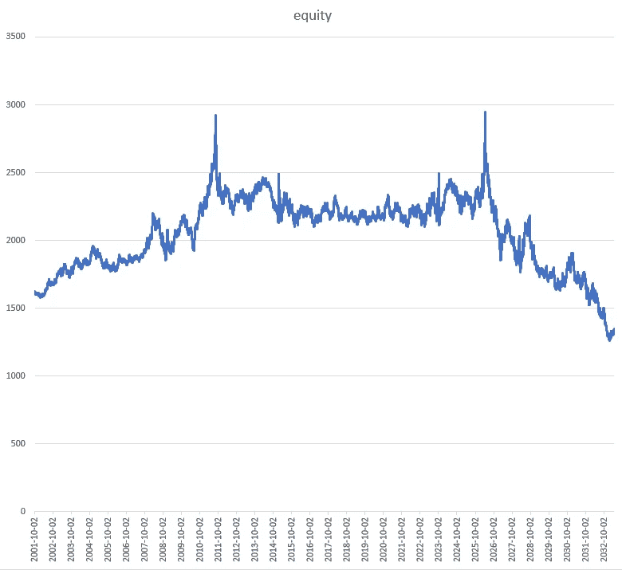

# 基于密码的网格交易策略

> 原文：<https://medium.datadriveninvestor.com/grid-trading-strategy-on-crypto-1a6d2da081c2?source=collection_archive---------4----------------------->

Image by Hawksey from Pixabay

Dexbot 是一个做市机器人，旨在分散的比特币交易所进行交易。它配备了(除其他外)网格交易策略——“T2”交错订单。

几周前，我开始关注 Dexbot，并阅读了所有我能找到的关于它的信息，包括可以在 [Github](https://github.com/Codaone/DEXBot/wiki/The-Staggered-Orders-strategy) 上找到的代码(用 Python 写的)。我加入了 Telegram 上的几个讨论组，发现内阁(负责开发 Dexbot)是一个愉快而聪明的团队。论坛上的一些参与者(这在交易界是完全常见的)就不那么乐观了。

Dexbot 缺乏的是对交易策略进行回溯测试的尝试，在我看来，这是一个严重的错误。我相信我已经说服内阁至少提供一个基本的背部测试工具是明智的。很难想象，在没有对任何给定策略的历史数据进行回溯测试的情况下，基于量化的对冲基金或投资银行会进行任何交易。

这并不是说回溯测试可以预测未来的表现。主要的困难在于，很容易就能通过修改参数来适应数据，而且在任何情况下，市场行为都在不断变化。

主要困难在于，在 Bitshares 区块链上似乎不容易获得历史订单数据。在任何情况下，如果没有对 Bitshares 的深入了解。我决定，我必须用普通的老 OHLC 数据来凑合，每天都这样。微小的数据非常昂贵，除非你自己去收集，而我既没有时间也没有耐心。无论如何，许多人声称市场数据是分形的，在这种情况下，时间尺度是不相关的。

这是一个不完美的妥协，但尽管如此，我相信我的努力已经产生了宝贵的见解。

交错订单策略:

> 以一定的时间间隔下达大量的买入和卖出订单，涵盖从极低价格到极高价格的订单簿如果这个概念对你来说是新的，你会在各种外汇交易网站上讨论这种“网格交易”策略。
> 
> “只要用户打算执行该策略，该范围就应该涵盖所有可能的价格。这可能是从-100 倍到+100 倍(-99%到+10000%)。
> 
> “利润将来自价格变动，而这种策略会给价格变动带来摩擦。它赋予市场深度，让它们看起来更好。它从不“亏本卖”，而总是盈利。”

参数:

> **价差**:你的最高出价和最低要价之间的价差(%)
> 
> **增量**:以多少增量下单(%)
> 
> **下限**:你认为价格会跌到多低？买入订单将从中间价向下至该价格。以基础资产衡量的报价资产价格。
> 
> **上限**:你预计价格会涨到多高？卖单将在中间价至该价格之间发出。以基础资产衡量的报价资产价格。

还有各种进一步的皱纹和选择，但要点如上。

就 Bitshares 和 Dexbot 而言，其目标是创造流动性，而不是获取流动性。Dexbot 获得资助的目的是增加各种 Bitshares 加密货币对的流动性，并(希望)让用户从中获利。

在回溯测试中，我不得不忽略流动性是被吸收还是被制造。

事后看来，我创建了两个订单列表:买入和卖出，并选择了一个与我的历史数据一致的范围。我从买入开始，在我的区间的高点和低点之间，创建了 500 个买入订单。然后，我创建了一个包含 500 个卖出订单的列表，每个卖出订单的价格比每个买入订单的价格高 1%。对于一个旨在创造流动性的系统来说，这似乎足够公平。虽然 1%的利差在传统市场中已经很大了，但在流动性不足的加密市场中可能还不算太离谱。

我假设基础货币和报价货币的浮动相等，以此开始测试。Dexbot 针对的是现金或现货市场:而不是远期或期货市场。因此，如果您有足够的基础货币，您只能购买报价货币。你只能卖出你实际拥有的报价货币。虽然我相信，如果你希望利用杠杆，有或将会有各种保证金安排。我选择忽略杠杆和做空。交错订单策略的文献和说明也是如此。

我使用固定分数位置大小。对于报价货币的购买和销售，我选择了基础货币 1%的下注规模。换句话说，每笔交易的规模是基础货币当时价值的 1%,每天根据损益进行调整。

出于本文的目的，我使用了 2001 年 10 月 2 日至 2019 年 8 月 17 日期间美元/瑞士法郎的每日 OHLC 数据。在此期间，美元兑瑞郎持续下跌，从 1.6174 跌至 0.9779。只是为了好玩，也因为交错排列的顺序在均值回归环境中效果最好，我对数据进行了加倍处理，将反转后的序列添加到真实数据序列的末尾。

设置好订单网格后，我每天循环查看每日数据。使用 python list comprehension，我每天添加 python 订单列表来买卖列。list comprehension 将每天 500 个买入和 500 个卖出订单的整个列表与数据中记录的最高价和最低价进行了比较。如果这些订单中的任何一个落在当天的低点和高点之间，它们将被添加到当天的回溯测试中执行。

我毫不怀疑有更优雅和计算成本更低的方法来实现同样的事情，但这种方法足以满足我的目的。

然后，我再次循环查看每日数据，执行订单并记录最终的股票曲线。日复一日，基础货币和报价货币随着订单的执行而增加或减少。每天结束时，权益曲线估值以收盘价为基础，得出以基础货币表示的账户价值。换句话说，持有的基础货币是加上按当时汇率换算成基础货币的报价。

首先采用真实数据(美元/瑞士法郎至 2019 年)有 20，000 次往返。没有考虑滑点或费用(你需要自己查找费用，但不用说它们会对结果产生影响)。

不幸的是，第一次测试的结果并不十分令人鼓舞。他们大致匹配买入和持有。如果考虑到滑点和成本，后验测试就会低于买入并持有。如果基础货币和报价货币的期间利息已经加入买入和持有数字，情况就更是如此。毫无疑问，这将创造出大量流动性，但我对交易员如何获利有点质疑。

第二个测试(扩展系列)看到瑞士法郎对美元回到起点:它开始和结束于美元=瑞士法郎 1.6174。不幸的是，正如我所料，该系统发现自己低于其起始价格。你可以在下面看到一个系统公平的图表。

更早更粗糙的回溯测试也得出了大致相同的结论。在之前的尝试中，我简单地假设如果价格上涨就每天卖出，如果价格下跌就每天买入。我没有为网格而烦恼，并认为网格会增加一些我错过的魔力。它没有，但也许我仍然错过了一些重要的假设或关键参数？

我非常希望我的编码或者我的分析是错误的。也许到现在为止，内阁中的某一位成员已经找到了比我更好的解决方案，这将证明我是错的。

我尝试了其他参数和其他价格系列，但没有一个让情况变得更乐观。

在某个阶段，我将公开我的代码，以便其他人可以发现我的尝试是否合理，或者我是否犯了明显的错误和错误的结论。