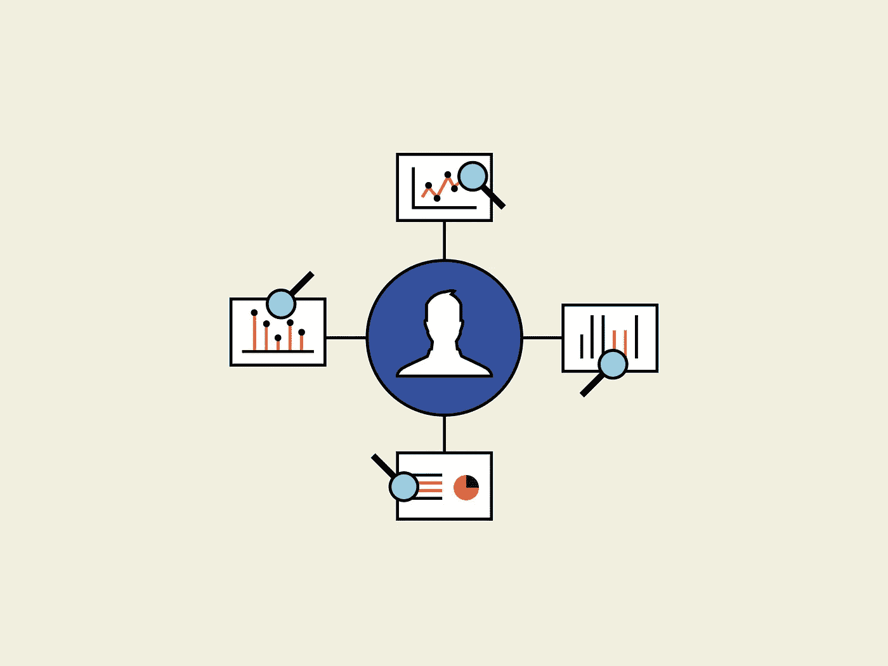
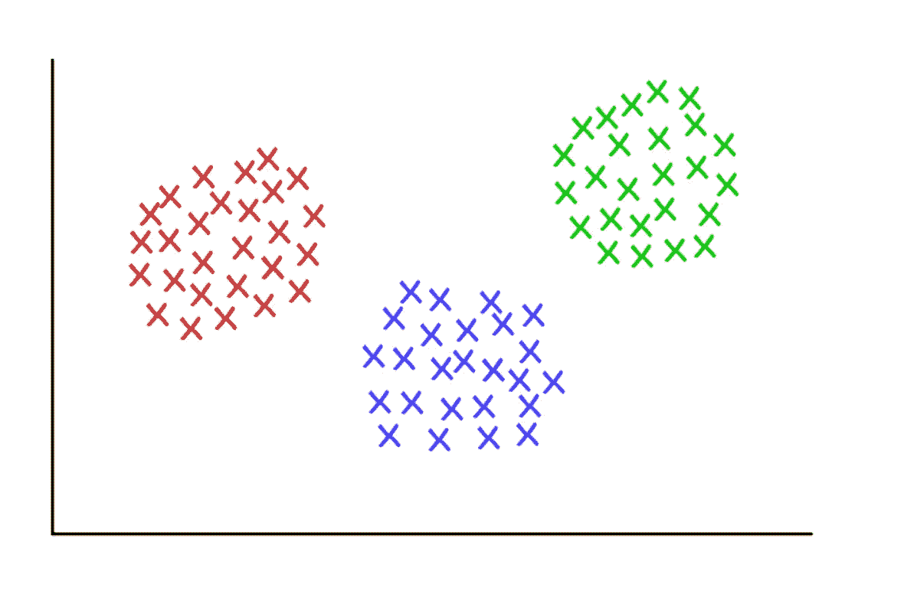
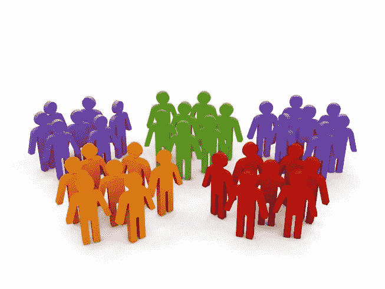
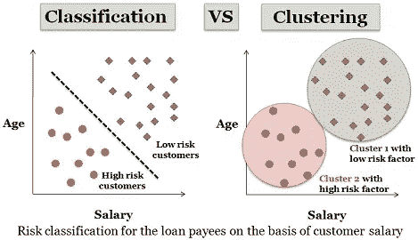

# 使用机器学习发展你的业务:三个主要类别

> 原文：<https://medium.datadriveninvestor.com/growing-your-business-using-machine-learning-the-three-main-categories-17ee2d6e3878?source=collection_archive---------3----------------------->

机器学习是人工智能的一个子集，它处理数学模型和算法，以帮助机器从数据中学习。

企业在其生命周期中创建了大量数据，这些数据可用于帮助企业发展。通过采用数据驱动的方法，公司开始注意到他们以前可能没有注意到的趋势。

Businesses generate loads of data throughout their lifetime (Source: Reavan, Inc.)

机器学习可以让收集大量产品和用户数据的企业发现这些创收趋势。

企业可以使用的机器学习主要有三类:回归算法、聚类算法和分类算法。让我们深入了解每一项。

## 观看这篇文章的视频

如果你更想看关于这个话题的视频，那么我做了一个 YouTube 视频来配合这篇文章。看看这个。

A video I made to complement this article

# 类别 1:回归算法

想知道某个访问者来到你的网站或应用程序时可能会做什么？这就是回归算法可以派上用场的地方，它试图预测给定的一组数据可能会发生什么。

例如，假设你经营一家移动应用公司，你有一个应用程序，允许用户轻松跟踪他们的支出，并在月底创建一份报告。你收集每个用户的数据，以及他们在应用上做什么。

Collecting user data for further analysis (Source: Dogtown Media)

你收集的数据比如“用户是否经历了入职流程”、“用户是否使用了某个功能”、“用户在平台停留了多长时间”等等很多类似的数据点。

然后，你跟踪哪些用户变成了高利润的客户。

你现在有了一个充满自变量的数据集(“用户是否使用某个功能”、“用户在平台上停留多长时间”)和你的因变量(“高利润客户”)。

现在，您可以让基于回归的机器学习算法了解数据中更有可能带来高利润客户的趋势，并且给定一个新客户，它可以根据独立变量预测他们成为高利润客户的可能性。

回归算法包括简单线性回归、多元线性回归、多项式回归、逻辑回归等等。您可以决定使用哪一种来开展您的业务。

Linear regression vs. Logistic regression (Source: DZone)

因此，快速概括一下，您可以使用回归算法来预测客户在给定一些数据的情况下的行为。算法从以前的数据中学习，所以拥有一个大的数据集非常重要，这样你就可以开始利用大数定律。

随着时间的推移，随着更多的数据涌入你的网站/应用程序，你的回归算法会变得更好，你能够获得关于用户行为的更好的数据。

你也可以在离线业务中进行回归分析。如果你收集了关于你的消费者的数据，他们做了什么特别的事情以及关于他们的数据，你可以开始注意到谁从你的企业购买更多的趋势，并开始向这些受众做更多的广告。

# 类别 2:聚类算法

想知道你的企业中存在哪些客户群体？你有一个单一的购买群体吗？还是有来自不同领域的客户，他们都有你的产品正在解决的独特问题？

聚类算法可以帮助你解决这些问题。顾名思义，聚类算法可以将数据“聚类”成组。

Clustering data into separate groups (Source: Medium)

例如，假设您经营一家销售服装和化妆品的电子商务网站，您想确定哪些类型的客户会在您的网站上购买。您希望使用这些信息为您网站上的每个群体创建自定义内容营销，这样您就可以提高流量和销售额。

您收集的数据包括年龄、性别、位置、在网站上花费的时间、他们来自哪里、购买产品的价格等。，关于你的每一个顾客。然后使用聚类算法(如 K-Means 聚类算法)来确定存在哪些组。

假设你发现你的电子商务网站有三个主要的客户群。

Different customer segments can exist for your business (Source: Purple)

第一组来自脸书的广告，她们是年轻的女性顾客，她们只购买低价商品。现在你知道如何正确地瞄准脸书，以推动更多的流量和销售，你创造广告创意或选择加入针对年轻女性的低价项目。

第二组来自你的邮件列表，没有明显的年龄描述，但是，他们在你的博客上花了很多时间，他们倾向于购买价格较高的物品。现在你知道把你的邮件列表发到你的博客上，让他们尽可能多地阅读你的内容。在内容中，您可以放置购买一些高价商品的链接。

第三个群体来自 Instagram，他们是年轻男性，在你的网站上花的时间很少，他们购买低价商品。现在，如果你经营一个服装和化妆品品牌，你可能会惊讶为什么会有男性顾客。也许你最初关于男性不购买服装和化妆品的假设是错误的。或者他们来是因为他们的女朋友说服他们给他们买东西。在这一点上，这取决于你更深入地研究，并找出它是什么。一旦你确定了是什么让年轻男性成为你品牌的顾客，你就可以开始直接向他们推销正确的信息，这将增加你公司的收入。

# 类别 3:分类算法

现在你已经知道了你的企业有哪些客户群，你想知道如何对网站上的新访客进行分类，这样你就可以调整内容以最大限度地满足他们的需求。

在这种情况下，分类算法可以派上用场。顾名思义，分类算法将新的数据点“分类”到某个类别/组中。

Classification vs. Clustering in visual terms (Source: Tech Differences)

让我们假设你正在运行一个移动应用程序，它允许用户创建音乐视频并发布给他们的朋友分享。您已经发现，有三种不同类型的用户对平台的发展做出了贡献。

现在，给定一个新用户和一些关于他们的数据，我们需要能够尽我们所能将他们分类到一个特定的组中。这将使我们受益，因为一旦我们知道新用户属于哪个类别，我们就可以调整平台以适应特定群体的需求和愿望，这样特定用户就可以在平台上推动更多增长，因为平台本身适应了他或她的需求和愿望。

您可以使用 K-Nearest Neighbors 算法来决定该新用户属于哪个聚类，然后基于该分类，您可以调整平台以增加该新用户推动您的移动应用程序增长的机会。

一般来说，企业将首先收集有关其客户或潜在客户或任何他们希望获得更多信息的数据，找出哪些群体存在，找出每个群体的需求和希望，然后将新用户分类到这些群体中，以便他们可以根据特定群体的需求和希望调整他们的产品。

# 结论

机器学习是人工智能(AI)的一个子集，可以用来完成复杂的商业目标。

然而，最重要的部分是你的企业收集数据。如果没有数据来推动算法，你就无法获得任何关于业务增长的有意义的见解。我强烈建议在你的软件中加入某种数据收集系统，或者雇佣员工为你的线下业务收集数据。

## 联系我进一步讨论

如果你想讨论如何在自己的业务中使用机器学习，请随时联系我，几乎每个社交媒体平台上都有@sunnychopper，或者在 ishy.singh@gmail.com 给我发电子邮件。

我喜欢谈论商业战略以及机器学习如何帮助促进商业流程。