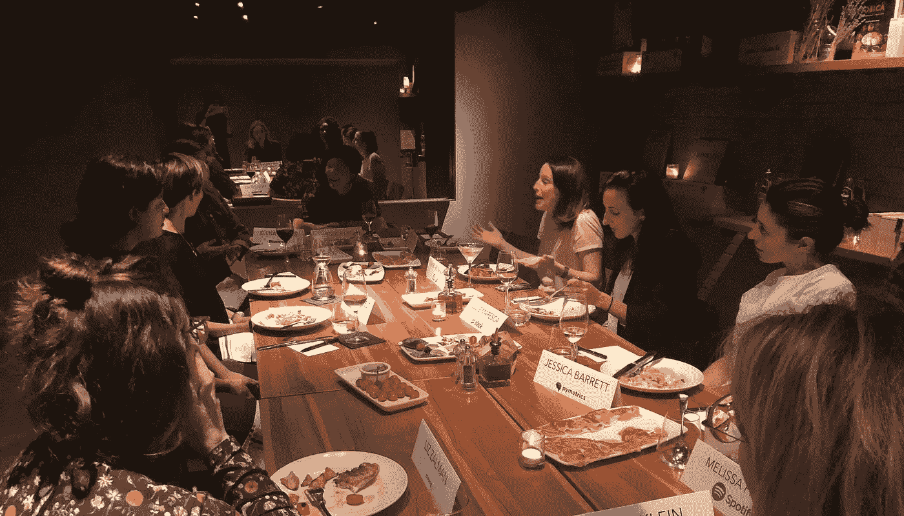

# 作为风投的成长黑客板经验

> 原文：<https://medium.datadriveninvestor.com/growth-hacking-board-experience-as-a-vc-2ba945be1172?source=collection_archive---------13----------------------->

A recent Women in Enterprise Sales Leaders Dinner

我最近参加了一个很棒的会议，在一次分组会议上，我主要讨论了如何成为一名有效的风投董事会成员。

在风险投资中，一个人的价值很大程度上来自于在这个行业呆了很长时间，这提供了基于观察趋势、异常值和多年来和许多投资组合公司的不同情况进行模式匹配的能力。这就像一个真正伟大的外科医生，他看过很多医学案例，或者一个出庭律师，他审理过很多案例。但是一个风投的价值往往在这方面被不成比例地衡量。你的“击球”次数越多，创始人和风投董事会的同行就越觉得你拥有内在的知识和智慧。

当我向一位小组成员询问如何提高曝光率的战术诀窍时，她回答说“努力工作，多读书”……这个答案让我非常不满意。我不认为许多女性风投需要被提醒更加努力😑；如果有书籍和博客涵盖了这些现实生活中的场景，那么我们就都准备好了。

这种挫败感让我思考:**作为职业生涯早期的风投，除了等待 30 年之外，我们如何更聪明地在董事会获得曝光率和专业知识？**一定有什么方法可以获得这种体验，思考这些给了我一个想法。

**我正在开始一个小实验。**我正在联系我在纽约的 4 个最亲密的风投朋友，每个季度一起吃一次饭。我们每个人都会带来一个匿名的董事会级场景来一起讨论。我们将讨论我们将如何处理它们，不同选项的利弊，我们将向谁寻求建议，以及解决方案可能是什么——是招聘、销售、走向市场、管理，等等。我们将保持公司细节的高层次，并进行充分的清理，这样就不会有私人信息被分享(所以对我的创始人来说——你没什么可担心的)，但同时通过真实世界的情况进行讨论，以便我们都能从经验中学习，成为更有经验的董事会成员。

**如果你愿意的话，这里的意图实际上是作为一个风险投资研究小组，来加速我们自己的风险投资学习曲线。**和我的一位住院医生朋友相似，她和她的住院医生一起参加了一个“论文俱乐部”,在那里他们会讨论最新的医学论文；在商学院，随着 MBA 学生学习案例研究——我希望我们也能“成长黑掉”风险投资体系:以一种有条不紊的方式，受益于一群值得信赖的朋友，并与他们一起积累集体知识。当然，这不是直接经验的完美替代品……但我不愿意等 30 年，希望获得更好地为我的创始人服务所需的专业知识。

如果你对参加这些安全的董事会晚宴感兴趣，[请告诉我](mailto:jess@work-bench.com)。企业初创公司的创始人们，我们在 Work-Bench 举办企业 CEO 晚宴，帮助你们所有人开诚布公地谈论你们试图在董事会层面处理的事情。如果你作为一名风险投资人过去做过类似的事情，[我也很想听听你的意见](mailto:jess@work-bench.com)。

*我留给你们的一个临别想法是，除了黑进董事会的经历之外，我们所有人在*[*Work-Bench*](http://www.work-bennch.com)*试图重新思考企业风险投资的另一种方式是，在一年的所有非董事会会议期间，非常专注于企业 GTM 支持。我们发现，当早期企业初创公司试图扩大规模时，这往往非常有影响力，这也是我们的创始人非常欣赏的:)我们将在未来的帖子中进一步阐述一些有趣的经验和 Work-Bench 的方法。*

*非常感谢* [*乔纳森·莱尔*](https://twitter.com/@fendien)*[*希瑟·哈尼特*](https://twitter.com/heatherhartnett?lang=en)*[*爱丽儿·温顿*](https://twitter.com/arielrwinton?lang=en) *的编辑和脑波。***