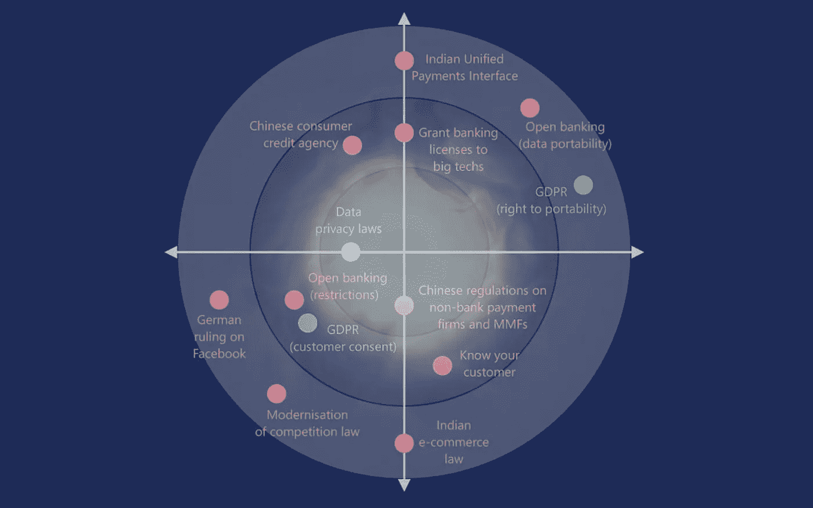
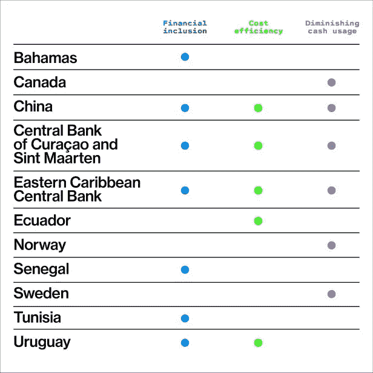
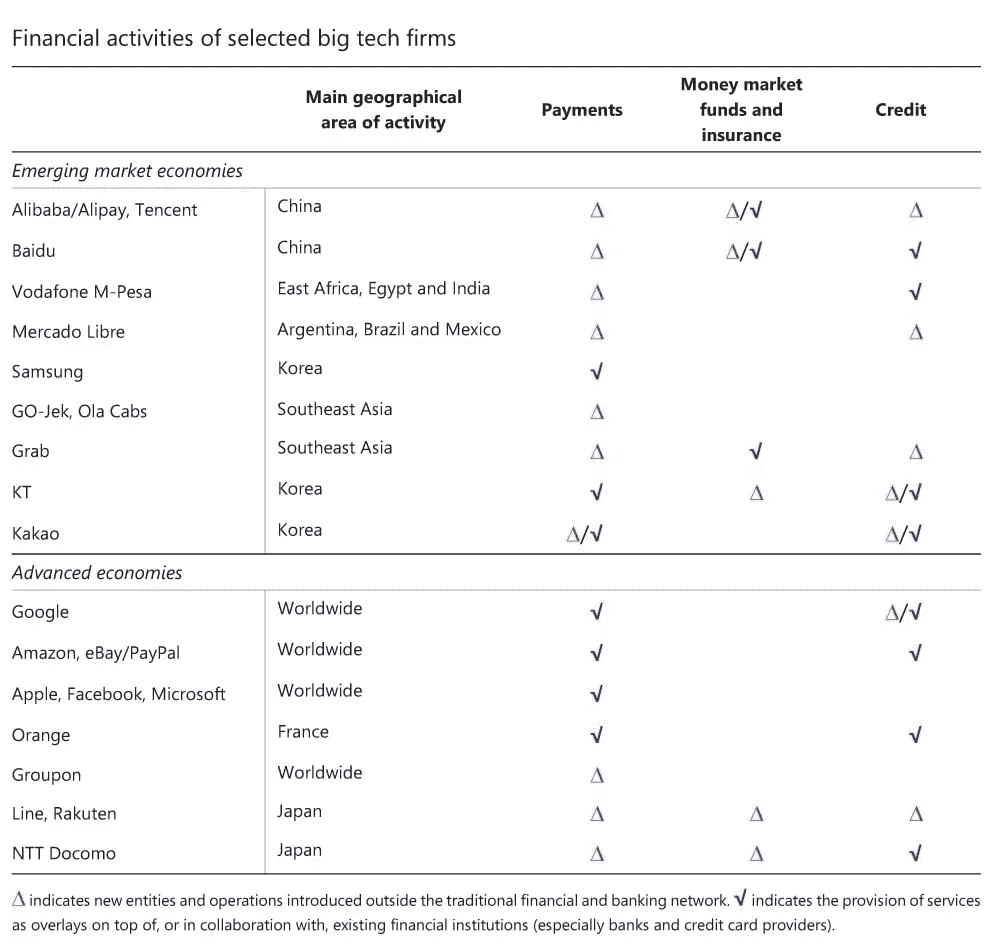
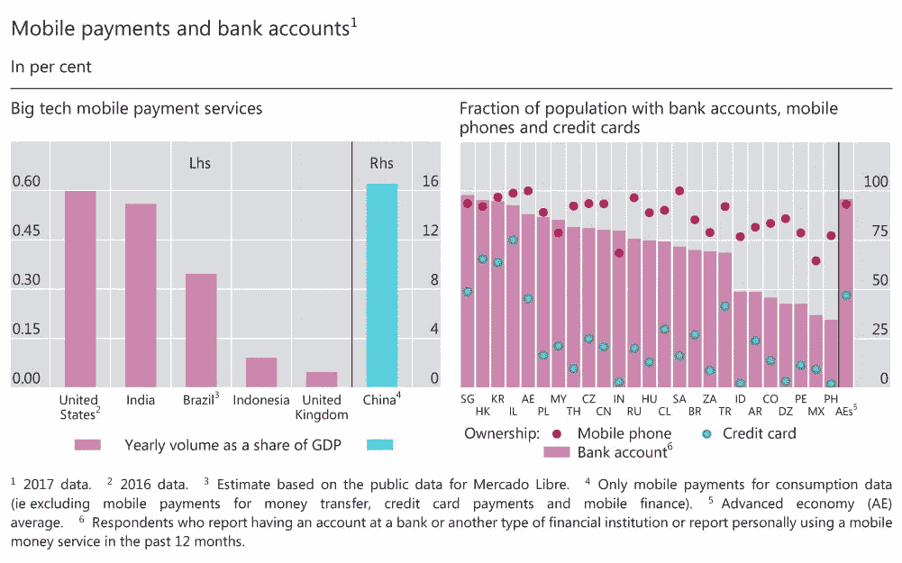
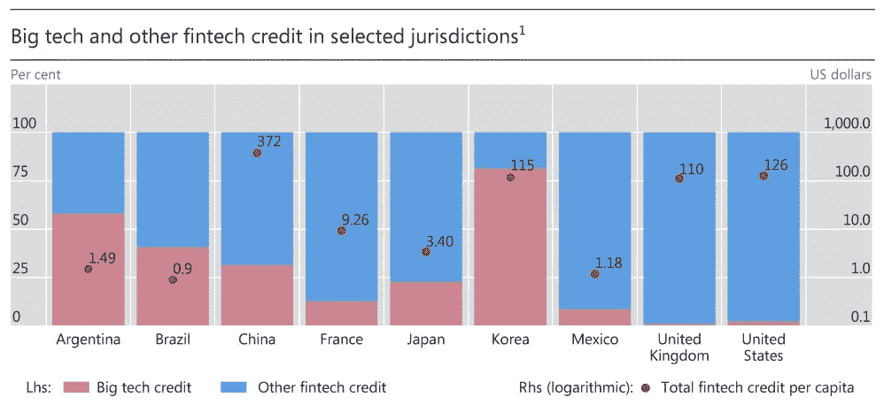
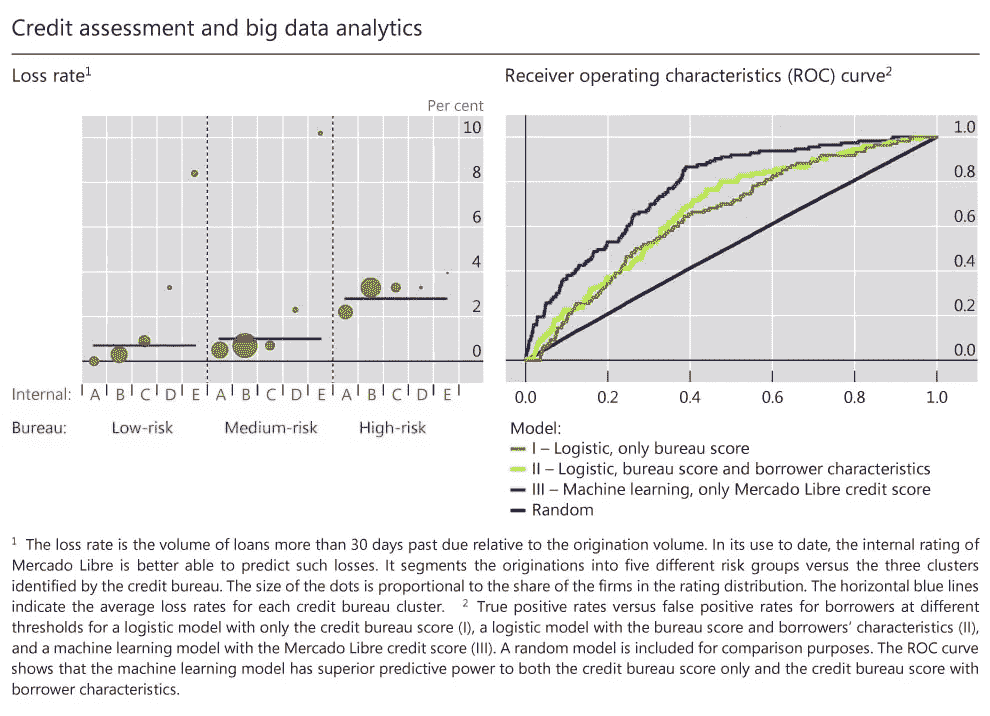
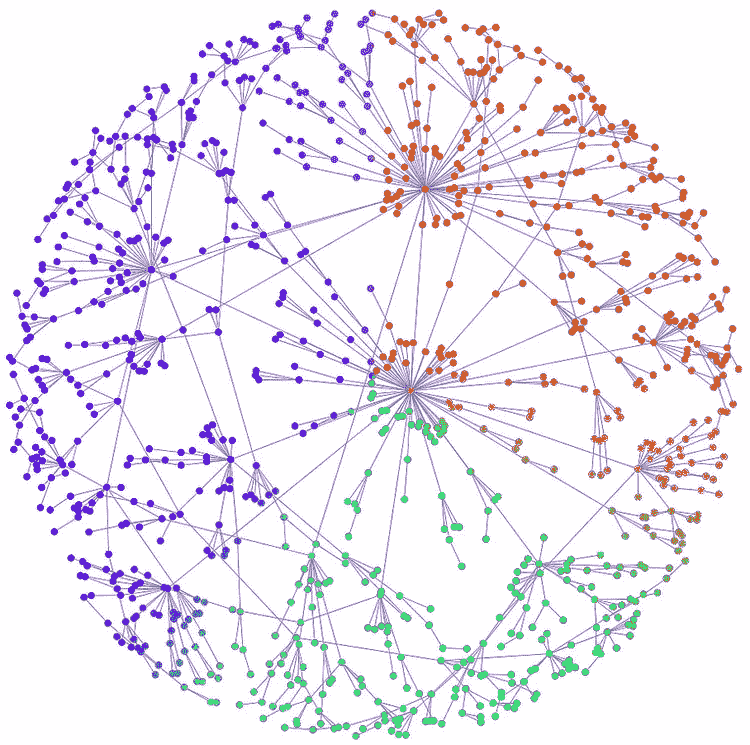
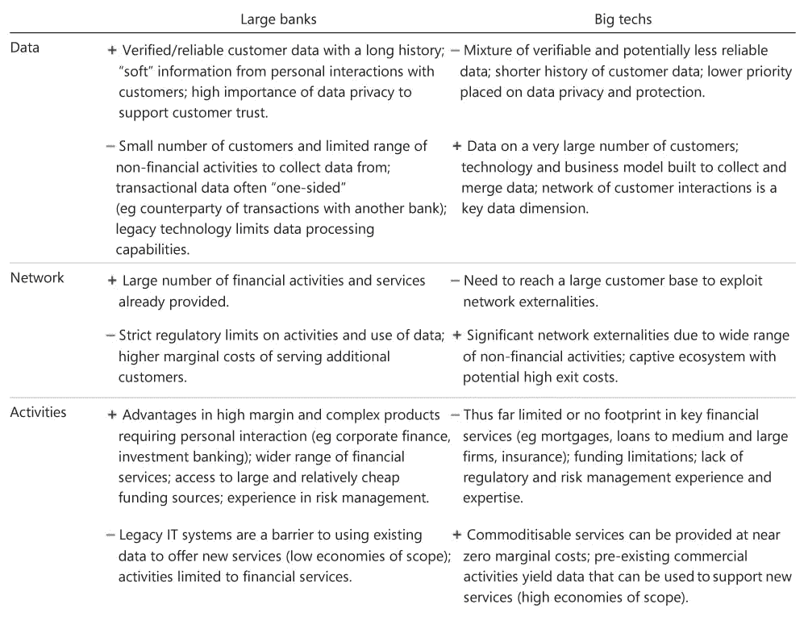
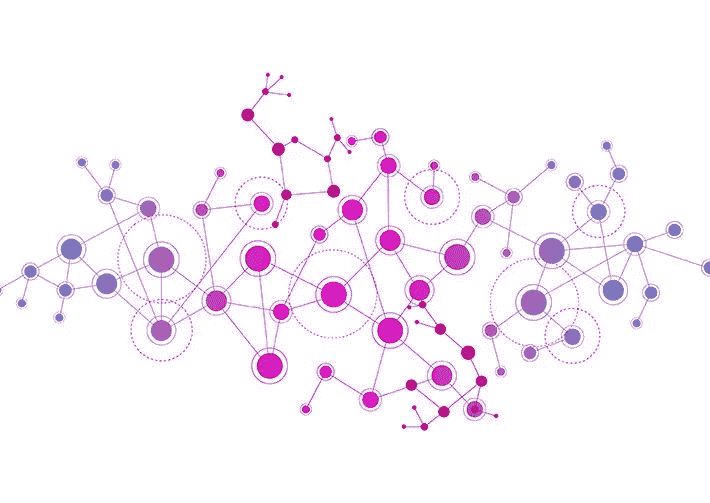

# 超流体市场和金融 DNA 的增长

> 原文：<https://medium.datadriveninvestor.com/growth-in-superfluid-markets-financial-dna-c0bf5b7be022?source=collection_archive---------9----------------------->

# **客户情报&金融服务的增长**

# 市场力

**全球数字货币是一种范式转变**

 [## 分散金融的出现|数据驱动的投资者

### 当前的全球金融体系为拥有资源、知识和财富的人创造了巨大的财富

www.datadriveninvestor.com](https://www.datadriveninvestor.com/2019/03/14/the-emergence-of-decentralized-finance/) 

全球数字货币 Libra 上个月发布了白皮书，但尚未推出，它有可能使商业银行去中介化，并切断它们的收入来源。

**各国央行表达对 DC 的兴趣** 受到脸书天秤座挑战的各国央行正在涉足数字货币，并考虑进入零售市场。

像阿里巴巴、亚马逊、脸书、谷歌和腾讯这样的科技公司正在推出能够补充和加强其商业活动的金融服务。

# 竞争细分市场

**支付服务** Big techs 最初提供支付服务是为了加强电子商务平台上买家和卖家之间的信任。

**大型科技公司的信用评估:大数据&人工智能** 一些大型科技公司在其电子商务平台的基础上，开始涉足贷款业务。Big techs 的贷款决策与使用机器学习和网络分析(人工智能)等高级分析方法处理大量信息(大数据)有关。从大型技术平台直接获得的与金融服务相关的大数据包括(I)交易(销量和平均售价)；㈡声誉相关信息(索赔率、处理时间、评论和投诉)；以及(iii)行业特定特征(销售季节性、需求趋势和宏观经济敏感性)。这也可以通过使用通过社交媒体和其他渠道获得的非传统数据来丰富。

**大科技公司的信用评估:大数据&人工智能** 一些大科技公司在其电子商务平台的基础上，开始涉足贷款业务。Big techs 的贷款决策与使用机器学习和网络分析(人工智能)等高级分析方法处理大量信息(大数据)有关。从大型技术平台直接获得的与金融服务相关的大数据包括(I)交易(销量和平均售价)；㈡声誉相关信息(索赔率、处理时间、评论和投诉)；以及(iii)行业特定特征(销售季节性、需求趋势和宏观经济敏感性)。这也可以通过使用通过社交媒体和其他渠道获得的非传统数据来丰富。

大型科技股评分系统的预测能力在很大程度上源于对网络结构的利用。初步证据表明，使用越来越多的粒度数据和机器学习有助于提高预付款前景的预测能力，特别是对于银行通常服务不足的小商户。

# 成功因素

大技术的 DNA
**D**数据分析、 **n** 网络外部性和交织的 **a** 活动(“DNA”)构成了大技术商业模式的关键特征。这三个要素相辅相成。大型科技公司平台的“网络外部性”与这样一个事实有关，即用户从参与平台一端的活动中获得的好处，会随着另一端用户数量的增加而增加。网络外部性带来更多的用户和更多的用户价值。它们允许大型技术生成更多数据，这是数据分析的关键输入。对大量数据的分析增强了现有的服务并吸引了更多的用户。更多的用户，反过来，提供了临界质量的客户，以提供更广泛的活动，从而产生更多的数据。因此，在提供更广泛服务的平台上，网络外部性更强，是大型科技公司生命周期中的重要元素。

**竞争格局:大型银行 VS 大型科技公司** 尽管大型银行拥有许多客户，并提供广泛的服务(理财或保险产品、抵押贷款的分销)，但迄今为止，它们在利用 DNA 反馈回路方面不如大型科技公司有效。

除了支付，银行还没有利用具有强大网络外部性的活动。一个原因是大多数司法管辖区要求银行和商业分离。因此，银行主要只能访问账户交易数据。

此外，遗留 IT 系统不容易通过例如应用编程接口(API)链接到各种其他服务。将他们的先进技术与更丰富的数据和更强烈的客户关注相结合，大技术公司已经擅长于开发和营销新产品和服务。

**增强金融 DNA** 传统金融机构的 DNA 需要进行重组，以与大型技术竞争，加强更强的客户关注(CX)、改进的数据获取和处理(AI/ML)，以及通过开放 API 和 fintech 开发网络外部性和生态系统。

# 预计结果

建立有助于数据获取的合作生态系统，由于效率的提高和更低的供应壁垒，导致现代超流金融市场的可持续增长，这反过来又通过扩展包容性加强了网络外部性和活动的发展。