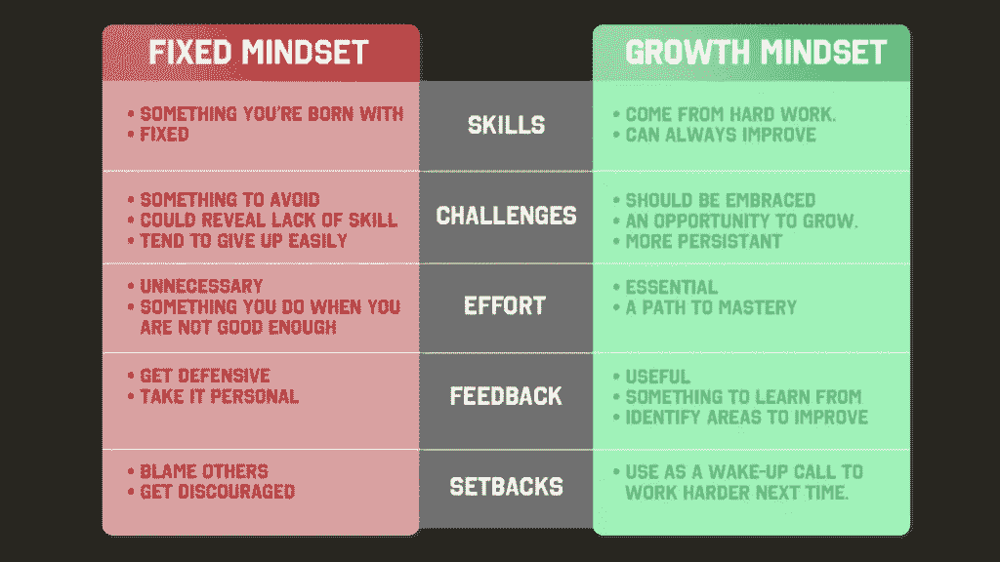

# “成长思维”与自费企业

> 原文：<https://medium.datadriveninvestor.com/growth-mindset-and-the-self-funded-enterprise-6982adb86ffd?source=collection_archive---------14----------------------->

几年前，我加入了数百万教师、家长、学生和商业专业人士的行列，他们从阅读和消化斯坦福心理学教授卡罗尔·德韦克的畅销书《心态:新成功心理学》中受益匪浅。虽然她的理论背后的研究花了几十年的时间来汇编，她的书自 2006 年以来一直在印刷，但她在书中开创的概念在过去几年里在教育、育儿和商业方面经历了复合影响，最近看到了曲棍球棒的扩张。

虽然我不会在这里对这本书进行全面的评论(到目前为止，有数百甚至数千篇来自知名来源的非常全面的评论)，但在我构建这篇文章的观点时，有必要涵盖一些全球性的观点，即最佳自举企业及其创始人往往表现出德韦克可能会称为异常强烈的“增长心态”。事实上，在我公司所有最成功的交易中，企业在最关键的时刻表现出罕见的增长导向的能力，对于为公司及其员工创造非凡的成果至关重要。在许多情况下，过去的客户依赖于一种不断扩张的增长思维，使他们在交易后获得更大的成功。

在《思维模式》中，德韦克对智商偏见进行了打击，并阐明了为什么努力工作和持续改进比静态智力和“天赋”等先天特征更重要。她通过描述她的研究中的两种主要心态来实现这一点:固定心态和增长心态。

**固定心态的特征**

*   与一个信念有关，那就是属性是刻在石头上的。
*   每天都产生证明自己(或公司，视情况而定)的紧迫感，因为结果是你足够优秀的“证据”(因为属性是静态的)。
*   在固定思维占主导地位的地方，任务中的“失败”会导致个人怀疑自己的天赋和智力，并很快扩展到破坏性的观点，如“我是并将永远是一个失败者”、“我很愚蠢”或“我的公司永远不会成功”。
*   “导致想要看起来聪明的欲望，因此倾向于(1)逃避挑战，(2)防御或轻易放弃，(3)认为努力没有结果或更糟，(4)忽视有用的负面反馈，以及(5)对他人的成功感到威胁。因此，思维固定的个人/公司可能会过早停滞不前，实现不了他们的全部潜力。”

**成长型思维的特征**

*   这与一个信念有关，即属性是你可以通过专注的努力、专注和坚持来发展和提高的东西。
*   有了成长的心态，一个人的基本才能/能力，以及相对优势/劣势，就代表了学习和发展的起点。
*   在成长心态盛行的地方，“失败”照亮了需要改进的地方，并被视为一个拥抱的机会，而不是一个值得羞耻或失望的缺点。
*   尽管个人和企业可能在基本才能、资质、兴趣和气质上有很大差异，但成长思维呈现了一个令人兴奋和解放的事实，即每个人(和每个公司)都可以通过决心、努力和韧性来改变和成长。
*   ”会产生学习的欲望，因此倾向于(1)迎接挑战，(2)面对挫折坚持不懈，(3)将努力视为成功之路，(4)从批评中学习，以及(5)从他人的成功中寻找教训和灵感。因此，具有增长思维的个人/公司通常会比那些思维固定的人取得更高的成就。”

正如我在[之前的文章](https://www.linkedin.com/pulse/free-solo-tech-bootstrapper-5-clear-parallels-mike-firmage/)中所讨论的，引导程序是独一无二的。在没有安全网的情况下，建立一个可持续发展的企业所需要的风险承受能力、信念、愿景和职业道德的结合，是篝火晚会和 Ted 演讲的内容(尽管通常不会公开，因为创业者有太多事情要做！).它还会导致某些领域的巨大增长思维，有时会导致盲点，甚至是其他领域的固定思维。正如德韦克所强调的，心态的一个关键区别对我们每个人和所有企业都适用:你可以在某些领域拥有增长的心态，而在其他领域拥有固定的心态。打开未来最大“上升空间”的关键在于识别你可能被“固定”(或卡住)在哪里，然后在你努力改变方向的过程中应用成长思维。

例如，我的许多客户拥有/经营产品第一的企业，公司成功的基础来自于识别产品市场适应性的巨大能力，然后不断地将增长思维应用于产品增量改进的问题。这种产品驱动的增长思维通常会持续到一个特殊产品的成功将企业推向“第一世界问题”,即需要将注意力集中到其他地方(例如..招聘、培训、销售等。)为了继续扩大业务规模。不幸的是，这些必要的注意力转移会导致心态的逐渐偏离，从而减缓进步。在许多情况下，这种不适可能会持续下去，直到各方齐心协力，加倍致力于以增长的心态运营。自举的一个不幸的现实是，时间和资源是有限的，而投资的领域几乎是无限的；像这样的资源/约束缺口往往会导致一个地区的增长重心发生强烈转移，从而引发其他地区的相关萎缩(有时甚至是近乎保护主义的思维定势)。在未来的帖子和视频中，我将深入探讨过去客户的众多例子，但现在，我将在一些领域结束，在这些领域，我看到了有意转向增长思维的转变，这对自筹资金、业主经营的企业来说非常重要。我将首先描述一些常见的领域，在这些领域，自费企业往往需要一种增长的心态来释放他们的最大潜力，然后将列出其他领域，这些领域也将在未来的帖子中详细讨论(我已经远远超过了我自己强加的 1000 字的限制！).

*   **客户的声音和产品:**自举企业往往拥有如此伟大的产品来推动他们的成功，其中一个原因在于创始人戴着许多帽子，尤其是在早期。这些创始人通常以集 CEO、CTO、产品执行副总裁、销售副总裁、客户成功负责人和首席洗瓶师于一身的身份开始他们的旅程。虽然这种交集会产生压力、不眠之夜以及从未在任何一个领域表现出色的感觉，但产品通常会在这样的环境中茁壮成长。这是因为它创造了几乎即时的反馈循环，推动了产品创新，并在产品和客户之间建立了几乎有机的联系。在这里，创始人确切地知道客户在寻找什么功能，因为她经常写客户成功的入场券，知道如何快速实现反馈，因为她做编程和设计，然后知道如何将改进带回给客户，因为她也是销售主管。这是一个具有挑战性，但往往美丽而优雅的组织设计，因为它的效率和执行，产品和销售执行之间的无缝连接。然而，当企业在足够长的时间内做得足够好时，情况就会发生变化。新的团队成员进入了许多职能角色，这通常会使他们更难找到相同的持续增长方向以及连接客户、产品、销售和领导的无缝反馈回路。此外，新的竞争对手将进入市场，产品和销售执行将变得更加困难，这就需要从根本上转变回组织内部的客户声音/理解和实施。
*   **技术债务:**即使在早期，许多成功的自举公司发现自己处于一种被动状态，在这种状态下，他们根据客户需求以高度战略性的方式构建自己的功能集、团队和基础设施。在这种情况下，一个常见的结果是，产品目前为客户提供了很好的服务，并且通常具有顶级或接近顶级的功能/模块集。然而，这些公司中的许多发现，在对优秀功能进行被动构建的过程中，付出的代价是技术债务，平台构建在数据库、服务器和后端开发结构之上，这些结构不是最新的/现代的，没有考虑到当前的行业最佳实践，并且没有随着客户群的增长、真正的企业级客户的出现以及平台需求要求偿还技术债务而进行扩展。具有增长思维的自举企业最终会认识到产生的开发债务，改造/重建以修复，并重组其开发流程以防止未来产生技术债务。新流程将包括处理平台工作，以保持市场领先的功能集和可用性，以及后端开发，确保平台可扩展性向前发展。同样，我将在未来发表一个完整的帖子来讨论这一点以及科技创业者成长心态的其他组成部分。

除了上述领域之外，类似的动态经常出现在以下领域的自举企业中:

*   销售和营销，包括价格优化
*   客户成功
*   会计和金融
*   法律和公司组织
*   数据分析、客户细分、减少流失以及相关的 KPI 参与/优化
*   人力资源，特别是与高级管理人员扩充和中级管理人员增加有关的人力资源
*   使用的系统和工具(人力资源、会计、销售、营销、分析工具)

正如我前面提到的，我将在以后深入研究这些领域。从过去的反馈和经验来看，我知道每一个都代表着许多创业者的改进和价值扩张空间，所以我也会尝试在未来以增长思维为导向的帖子中加入来自过去客户和以前成功交易的相关评论。最后，我可能会开始添加一些视频，回答朋友、同事和读者在我之前的帖子中发送的问题。让我知道你最想在这篇文章中讨论什么(你可以通过 mike@agilitygrowth.com[联系我)或者你想让我写的其他问题，还有……一如既往，*我喜欢与志同道合的金融人士、企业家和其他人交流。如果你愿意，请随时和我联系。*](mailto:mike@agilitygrowth.com)

*最初发表于*[*【http://agilitygrowth.com】*](http://agilitygrowth.com/growth-mindset-and-the-self-funded-enterprise/)*。*