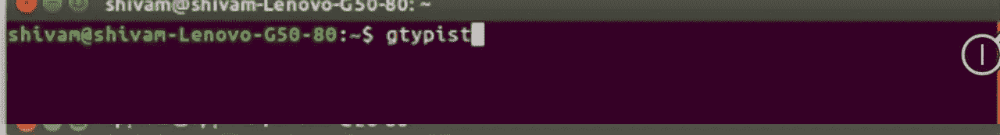
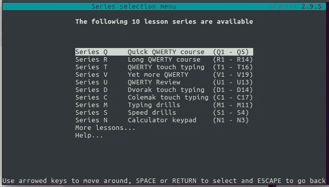

# Gtypist(GNU 打字员)/触摸打字

> 原文：<https://medium.datadriveninvestor.com/gtypist-gnu-typist-2d25d08756a3?source=collection_archive---------1----------------------->

Qwerty Keypad

触摸打字是一个人成为专业程序员的最重要的因素。如果一个人不擅长打字，那么成为一名程序员的道路是艰难的，没有第二条路可以避免。

互联网上有很多学习工具，YouTube 上也有很多打字课程。很少有辅导中心还声称能让你在一个月内成为打字高手。对于学生来说，很容易去那里，并试图在他们的假期学习，但对其他人来说，这可能不是那么容易。

GNU 打字员 ( **gtypist** )来了**。是万能打字导师。你可以在自己的电脑上学习打字，不需要任何互联网的帮助。该软件可在“gtypist.html”免费获得。**

它是 Ubuntu Linux 和其他操作系统的强大的打字指导。对于初学者和想提高打字技巧的个人来说，这非常容易。Gtypist 附带了几个英语(QWERTY、Dvorak 和 Colemak 键盘)、捷克语、俄语和西班牙语以及德语、法语和挪威语的打字教程。

要操作该软件，您需要在终端输入“gtypist”。

Terminal

在此之后，gtypist 将开始在计算机上运行，您可以通过它进行学习。

gtypist.

有各种系列，如 Q、R、T 和 V 通常用于学习 QWERTY 触摸打字，然后 D & C 系列分别用于 Dvorak 和 Colemak 触摸打字。在这个系列之后，M 代表打字练习，S 代表速度练习。Gtypist 也通过计算器键盘。德语、西班牙语、俄语和其他语言的打字教程可以通过'*更多课程…'访问。*

Gtypist 清楚地指导我们如何从底层打字。它首先告诉我们手指的位置，然后告诉我们手指对于不同键的移动。最初，很难根据字母移动手指，但过一段时间后，我们可以很容易地向任何方向移动手指。

# 学习 Qwerty 触摸打字需要多少时间/我们应该投入多少时间？？？

这完全取决于个人练习和学习的能力。如果我们谈论我的个人经历，我过去每天花 1 小时打一个月，现在我可以每分钟打 20 个字，这非常慢，但更多的练习会让我打得比现在快得多。

在 gtypist 中，错误率不能超过 3%。但据观察，初学者在最初的一段时间里并没有做到这一点，但最终他们会克服它。在 Q 系列中，有关于 qwerty 触摸打字的课程，如果任何人完成了课程的一部分，那么他们不应该直接跳到下一部分。对我来说，我总是试图连续 3 次达到 3%或以下的错误率，否则我不会进入下一部分的课程。这给了我这部分课程的完美。最后，练习是掌握触摸打字的唯一方法。

要了解更多关于 GNU 打字员的信息，请访问“gtypist.html”，它会带你到 GNU 打字员手册，也可以查看[https://www.gnu.org/software/gtypist/index.html](https://www.gnu.org/software/gtypist/index.html)。